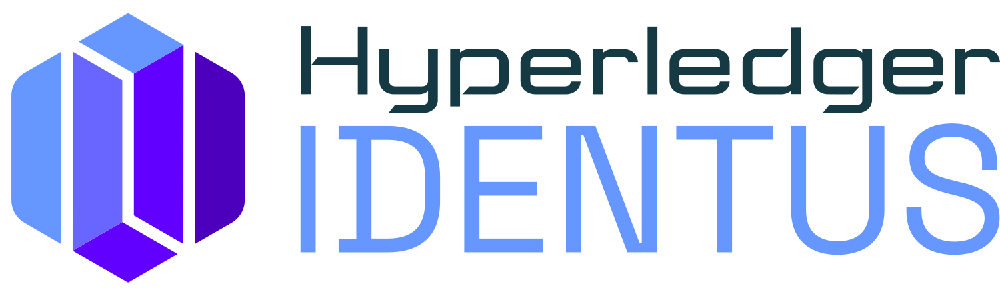

<p align="center">
  <a href="https://www.hyperledger.org/projects/identus">
    
  </a>
  <br>
  <i> <font size="18">Cloud Agent</font> </i>
  <br>
  <br>
  <a href='https://coveralls.io/github/hyperledger/identus-cloud-agent?branch=main'></a>
  <a href="https://github.com/hyperledger/identus-cloud-agent/actions/workflows/unit-tests.yml">  </a>
  <a href="https://github.com/hyperledger/identus-cloud-agent/actions/workflows/integration-tests.yml">  </a>
  <a href="https://github.com/hyperledger/identus-cloud-agent/actions/workflows/performance-tests.yml">  </a>
  <a href="https://scala-steward.org">
      
  </a>


</p>
<hr>

## Overview

The Cloud Agent is a W3C/Aries standards-based cloud agent written in Scala that provides self-sovereign identity services to build products and solutions based on it. The term "cloud" indicates that it operates on servers and is not intended for use on mobile devices.

Cloud Agent supports standard-based protocols built on top of DIDComm V2 for issuing, verifying, and holding verifiable credentials using both JWT and Hyperledger AnonCreds (coming soon) formats.

In order to use the Cloud Agent, you establish a business logic controller responsible for communicating with the agent (initiating HTTP requests and processing webhook notifications). This controller can be created using any programming language capable of sending and receiving HTTP requests.

As a result, you can concentrate on crafting self-sovereign identity solutions using well-known web development tools, without the need to delve into the intricacies of lower-level cryptography and identity protocol internals.

## User documentation

All documentation, tutorials and API references for the Identus ecosystem can be found at [https://hyperledger.github.io/identus-docs/](https://hyperledger.github.io/identus-docs/)

## Features

* Rest API
* DIDComm V2
* W3C-compliant `did:prism` and `did:peer` methods
* Credential types
  * JWT-VC
  * SD-JWT-VC
  * AnonCreds
* HTTP events notification
* Cardano as a distributed ledger
* Secrets management with Hashicorp vault
* Multi-tenancy

## Example use cases

* A government issues verifiable credentials (VCs) to its citizens to prove their identity and access government services.
* An enterprise issues VCs to its employees to prove their employment and access enterprise services.
* A Web3 authentication service based on verifiable presentations (VPs).

## Getting started

### Understanding SSI

Before starting to use the Cloud Agent, it is important to understand the basic concepts of self-sovereign identity (SSI). The following resources provide a good introduction to SSI:

* [Identus SSI introduction](https://docs.atalaprism.io/docs/category/concepts/)
* [Linux Foundation Course: Getting Started with SSI](https://www.edx.org/learn/computer-programming/the-linux-foundation-getting-started-with-self-sovereign-identity)

### Architecture

The next diagrams offer a concise architectural overview, depicting a Cloud Agent instance, a controller, the interconnections linking the controller and agent, as well as the external routes to other agents and public ledgers across the Internet.

#### Identus Ecosystem Architecture


#### Identus Cloud Agent Architecture


### Running the Cloud Agent locally on MacOS or Linux
#### Prerequisites

- Java (OpenJDK 21)
- SBT (latest version)
- Git (for cloning the repository)
- Docker (for running the PostgreSQL database, Hashicorp Vault, APISIX, and  PRISM Node)

#### Compile, Test, create the docker image of the Cloud Agent

To compile, test and publish local the image of the Cloud Agent, you can use the following commands:

```bash
sbt clean compile test docker:publishLocal
```

### Installation and usage

Cloud Agent is distributed as a Docker image to be run in a containerized environment. Versions after v1.31.0 can be found [here](https://github.com/hyperledger/identus-cloud-agent/pkgs/container/identus-cloud-agent) and before v1.31.0, [there](https://github.com/orgs/input-output-hk/packages/container/package/prism-agent).

The following sections describe how to run the Cloud Agent in different configurations.

#### Configuration

The Cloud Agent can be configured to use different types of ledger, secret storage and DID persistence. Any combination of options is available, but the most common configurations are:

| Configuration  | Secret Storage | DIDs persistence | Prism Node                                      |
|----------------|----------------|------------------|-------------------------------------------------|
| Dev            | PostgreSQL     | No               | In-memory                                       |
| Pre-production | PostgreSQL     | Yes              | Distributed Ledger testnet (preview or preprod) |
| Production     | Hashicorp      | Yes              | Distributed Ledger mainnet                      |

To start playing with Cloud Agent, we recommend using the Dev configuration. Pre-production and production configurations are intended for real-world use cases and require additional more complex configurations of the Distributed Ledger stack setup.

> If you're interested in a hosted version of Cloud Agent, please, contact us via the [Identus site](https://www.hyperledger.org/projects/identus).

#### System requirements

System requirements can vary depending on the use case. The following are the minimum requirements for running the Cloud Agent with the Dev configuration:

* Linux or MacOS operating system
* Docker (with docker-compose support)
* Modern x86 or ARM-based CPU
* \>=2GB RAM

#### Running locally in demo mode

To run Identus locally you should follow the instructions in the [Quickstart guide](https://hyperledger.github.io/identus-docs/docs/quick-start/)

If the Cloud Agent is started successfully, all the running containers should achieve `Healthy` state, and Cloud Agent Rest API should be available at the specified port, for example:
* `http://localhost:8080/cloud-agent` for the `issuer` instance
* `http://localhost:8090/cloud-agent` for the `holder` instance

You can check the status of the running containers using the [health endpoint](https://docs.atalaprism.io/agent-api/#tag/System/operation/systemHealth):
```bash
$ curl http://localhost:8080/cloud-agent/_system/health
{"version":"1.19.1"}
```

#### Compatibility between Cloud Agent and  PRISM Node

There could be some incompatibilities between the most latest versions of Cloud Agent and  PRISM Node. Please, use the following table to check the compatibility between the versions:

| Cloud Agent | PRISM Node |
|-------------|------------|
| >=1.9.2     | 2.2.1      |
| <1.9.2      | 2.1.1      |

> Please note: it is not guaranteed that the latest version of Cloud Agent will work with the latest version of PRISM Node. We recommend using the versions from the table above.

### Following the Cloud Agent tutorials

The following tutorials will help you get started with the Cloud Agent and issue your first credentials:

* [Creating, updating and deactivating Decentralized Identifiers (DIDs)](https://docs.atalaprism.io/tutorials/category/dids/)
* [Setting up connections between agents using out-of-band (OOB) protocol](https://docs.atalaprism.io/tutorials/connections/connection)
* [Issuing verifiable credentials (VCs)](https://docs.atalaprism.io/tutorials/credentials/issue)
* [Presenting VC proofs](https://docs.atalaprism.io/tutorials/credentials/present-proof)

## Contributing

Please read our [contributions guidelines](./CONTRIBUTING.md) and submit your PRs. We enforce [developer certificate of origin (DCO) commit signing](./DCO.md).

We also welcome issues submitted about problems you encounter in using Cloud Agent.

## License

[Apache License Version 2.0](LICENSE)

<hr>

**Love the repo? Give our repo a star :star: :arrow_up:.**
