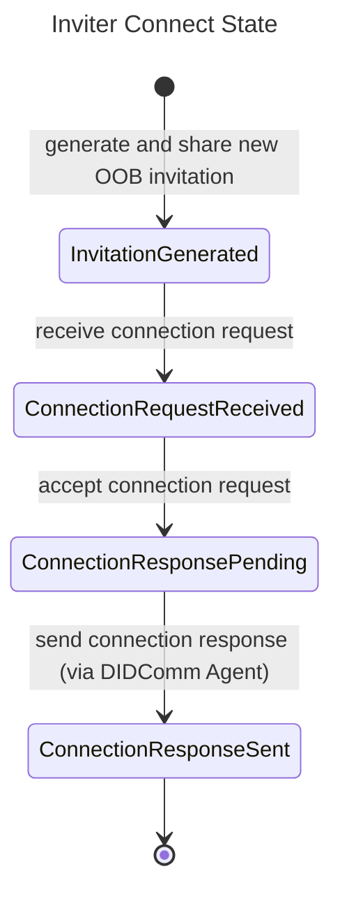
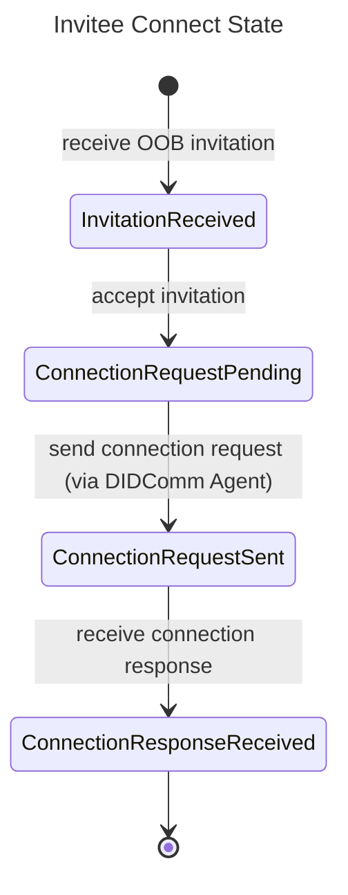

```mermaid
---
title: Inviter Connect State
---
stateDiagram-v2
  [*] --> InvitationGenerated: generate and share new OOB invitation
  InvitationGenerated --> ConnectionRequestReceived: receive connection request
  ConnectionRequestReceived --> ConnectionResponsePending: accept connection request
  ConnectionResponsePending --> ConnectionResponseSent: send connection response (via DIDComm Agent)
  ConnectionResponseSent --> [*]
```
---

```mermaid
---
title: Invitee Connect State
---
stateDiagram-v2
  [*] --> InvitationReceived: receive OOB invitation
  InvitationReceived --> ConnectionRequestPending: accept invitation
  ConnectionRequestPending --> ConnectionRequestSent: send connection request (via DIDComm Agent)
  ConnectionRequestSent --> ConnectionResponseReceived: receive connection response
  ConnectionResponseReceived --> [*]
```