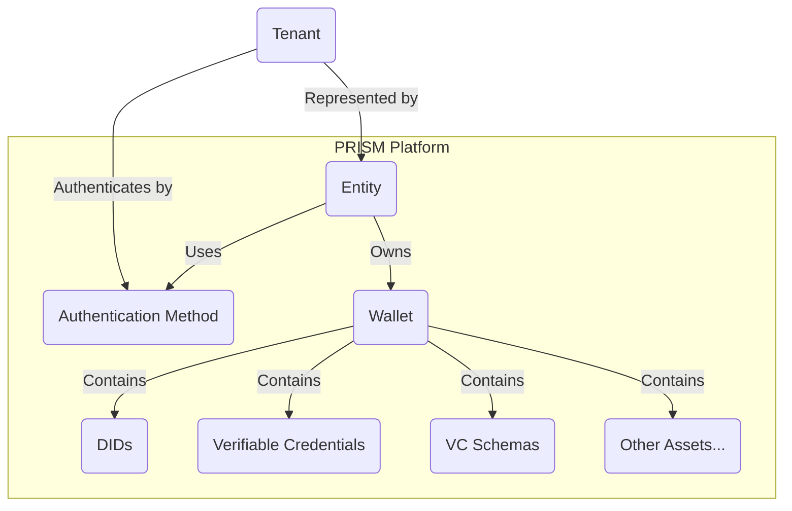
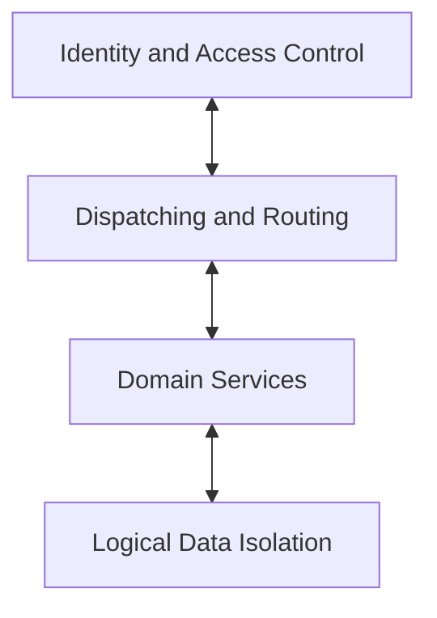
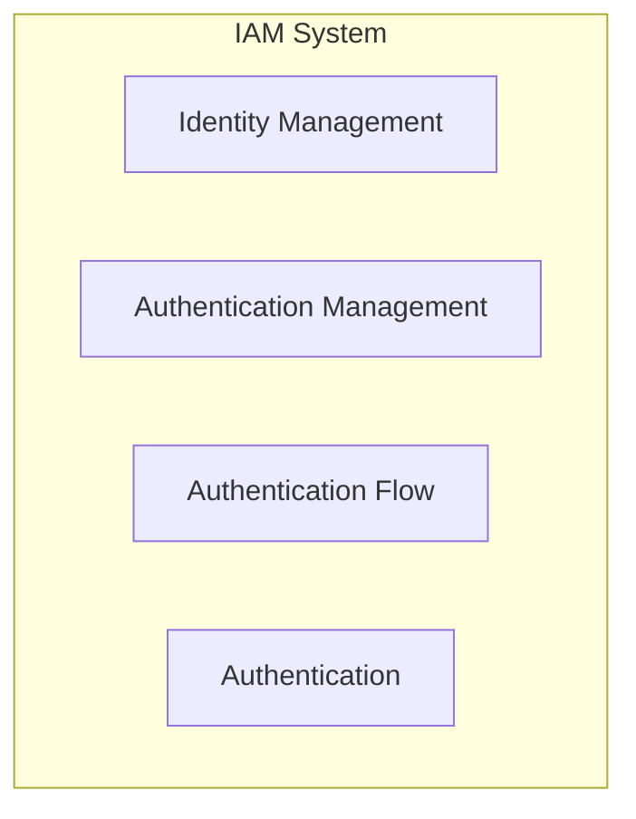
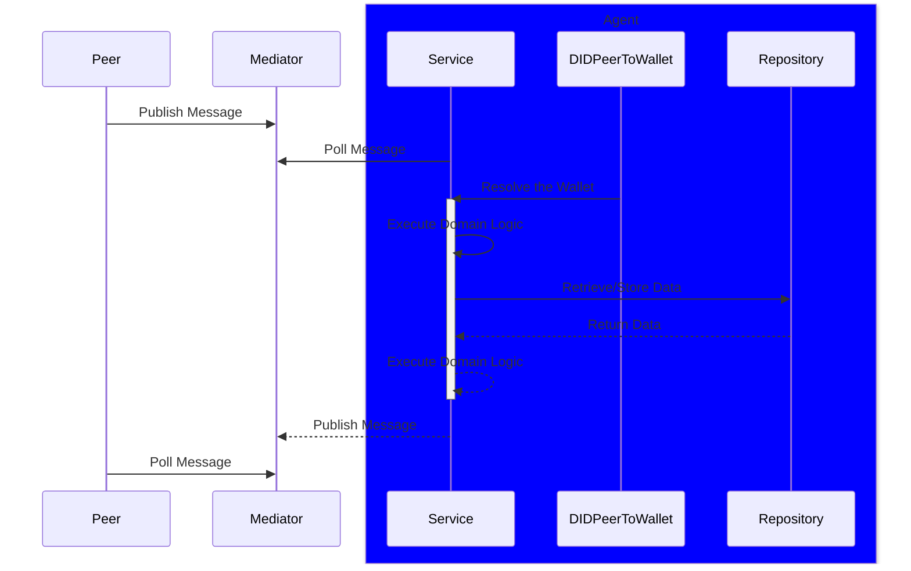
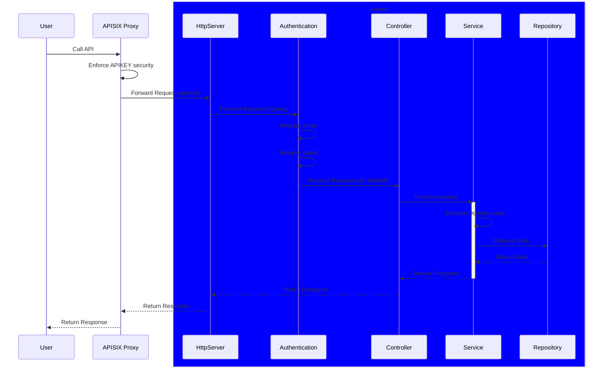
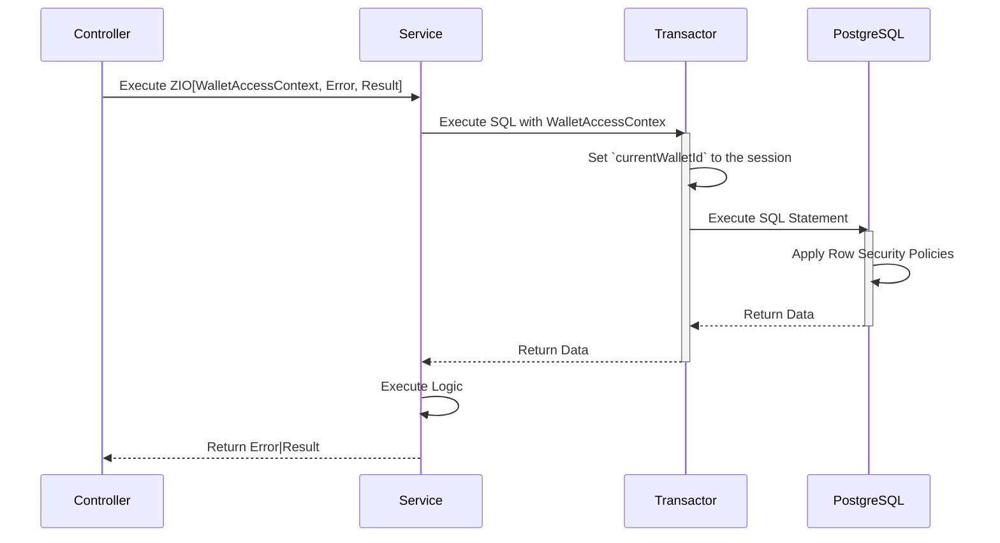

# Multi-tenancy

Multi-tenancy is a capability of the PRISM Cloud Agent to support multiple tenants in a single instance of the Agent.

## Purpose

- Scalability: PRISM's multi-tenancy support allows the platform to scale effortlessly to accommodate growing users, entities, and organizations.
- Resource Efficiency: It optimizes resource utilization by enabling the sharing of infrastructure components, enhancing cost-effectiveness.
- Data Isolation: Multi-tenancy ensures that the data, such as DIDs (Decentralized Identifiers), connections, VCs (Verifiable Credentials), keys, and more, of one tenant is completely isolated from others, preserving data privacy and security.
- Enhanced Collaboration: Shared Wallets enable collaboration between entities while maintaining data segregation.
- Granular Control: Administrators have granular control over the resources and permissions assigned to each Entity

## Concepts

### Tenant

A Tenant is a logical entity representing an organization or a group of users within the PRISM platform.
Each tenant is represented by an Entity, the primary Entity for managing and interacting with the tenant's digital assets.

### Wallet

A Wallet is a central component of PRISM's multi-tenancy model.
It serves as the container for storing and managing a tenant's digital assets, including DIDs, connections, VCs, keys, and more.
Wallets are logically isolated to ensure that the data associated with one Entity remains separate and secure from others.

### WalletAccessContext

The WalletAccessContext is a context that is used to execute the business logic for the Wallet.
The WalletAccessContext is created for each request and contains the following information:
- `walletId` - the id of the Wallet
  The WalletAccessContext is passed as a requirement (R) parameter to the ZIO monad.

### Entity

An Entity represents a user or any other identity within the PRISM platform.
Each Entity owns a Wallet, making it the primary Entity for managing and interacting with its digital credentials and assets.
Entities can also share Wallets, enabling collaborative use of resources.

### Authentication Method

Each Entity is associated with an Authentication Method, which serves as a secure means of verifying the identity and access rights of the Entity.
This method ensures the Entity's identity is authenticated during interactions with the platform, enhancing security.

### Logical Isolation
Logical Isolation is a core principle of PRISM's multi-tenancy model.
It ensures that the digital assets, transactions, and data of one Entity are logically separated from those of other Entities, maintaining the highest level of data privacy and security.

### Shared Wallets
PRISM's multi-tenancy capabilities allow for the sharing of Wallets among multiple Entities.
This feature facilitates collaborative work and resource sharing while preserving data isolation within the shared Wallet.
The Entity can own only one Wallet. It is possible to share it with other Entities, but multiple Entities cannot own it.

### Tenant Management
Tenant Management is the process of onboarding, provisioning, and managing Entities and Wallets within the PRISM platform.
Administrators can configure permissions, resources, and access control for each Entity, ensuring efficient and secure multi-tenancy operations.

### DIDComm Connections
DIDComm Connections are the secure communication channels between peers within the SSI ecosystem.
PRISM's multi-tenancy model ensures that the connections of one Entity are logically isolated from those of other Entities, preserving data privacy and security.
Based on the DID-Peer of the message recipient, the corresponding Wallet processes the Message.

## Relation Diagram

The following diagram illustrates the relationship between the key components of PRISM's multi-tenancy model.




## Agent Administrator

The Agent Administrator is a user with the `admin` role that has the following capabilities:
- Manage the Entities and Wallets
- Manage the Authentication Methods (API Key authentication)

### Authentication

The Agent Administrator is authenticated using the Admin API Key authentication method.
The HTTP header `x-admin-api-key` must be added to the request with the value of the issued secret.
The secret is configured in the `application.conf` file and can be overridden using the environment variable `ADMIN_TOKEN`.

### Configuration
The configuration part of the Agent Administrator is the following:
```hocon
agent {
    authentication {
        admin {
            token = ``admin``
            token = ${?ADMIN_TOKEN}
        }
    }
}
```

### Protected Endpoints

Entity Management - to create, update, delete the Entity, associate the Wallet with the Entity, and associate the `apikey` with the Entity
Wallet Management - to create and delete the Wallet

## High-level Overview

Multi-tenancy capability is implemented in the PRISM Cloud Agent using the following abstractions:
- Identity and Access Control system (Identity Management, Authentication, Authorization)
- Dispatching and Routing system (DIDComm, DID-to-Wallet mapping)
- Domain Model and Services (Wallet, DID, VC, Connection, etc.)
- Logical Data Isolation (Row Based Policies in PostgreSQL, the Vault policies and naming conventions)

The following diagram illustrates the high-level overview of the multi-tenancy model.



### Identity and Access Control (IAM)

IAM is an abstraction layer that provides the following capabilities:
- Identity Management (register the Entity for the tenant and associate the Wallet with the Entity)
- Authentication Management (authenticate the Entity and issue the Credentials)
- Authentication Flow (authenticate the Entity using the Credentials)
- Authorization (resolving the Wallet for the Entity and enforcing the policies to the Domain Services)

The following diagram illustrates the capabilities of the IAM abstraction layer:



### Backward Compatibility

The Agent can be configured to provide backward compatibility with the previous `single-tenant` mode.
In this mode, the Agent uses the `Default Entity` and the `Default Wallet` for all interactions with the Agent over the REST API and DIDComm.

The `Default Entity` and `Default Wallet` are the regular entities and wallets with the following IDs:
- Default Entity id=`00000000-0000-0000-0000-000000000000`
- Default Wallet id=`00000000-0000-0000-0000-000000000000`

One of the following configurations are used to enable the backward compatibility mode:
- Disable the API Key Authentication: `API_KEY_ENABLED=false`
- Enable the API Key Authentication and authenticate any `apikey` as a Default Entity: `API_KEY_ENABLED=false`, `API_KEY_AUTHENTICATE_AS_DEFAULT_USER=true`

To set up the Agent's behavior for bootstrapping the Default Wallet, the following configuration is used:

```hocon
agent {
defaultWallet {
// A configuration for initializing default wallet.
//
// Once the default wallet is initialized, the Agent will use persisted configurations
// from its storage and may ignore these parameters.
enabled = true
enabled = ${?DEFAULT_WALLET_ENABLED}

        // Wallet seed to be used for the default wallet. If not provided, it will be generated.
        seed = ${?DEFAULT_WALLET_SEED}

        // Webhook url of the default wallet.
        // If provided, webhook notification will be created when Wallet is initialized.
        // If not provided, webhook will not be created.
        // If provided after the default wallet has been initialized, it will not have any effect.
        webhookUrl = ${?DEFAULT_WALLET_WEBHOOK_URL}
        webhookApiKey = ${?DEFAULT_WALLET_WEBHOOK_API_KEY}

        authApiKey = ``default``
        authApiKey = ${?DEFAULT_WALLET_AUTH_API_KEY}
    }
}
```

### API Key Authentication

API Key Authentication is an existing implementation of the IAM system in the PRISM Platform.
This implementation uses the HTTP header `apikey` as the Credentials depends on the external system to issue the API Key to authenticate the Entity.
Identity Management and Authentication Management is provided by the Agent (Entity Management API).

It can be used for local development and testing purposes and in the current PRISM infrastructure.

API Key Authentication provides `autoProvisioning` feature that automatically registers the Entity and Wallet for the tenant during the first interaction with the Cloud Agent over the REST API.
Using `autoProvisioning` feature assumes that the external system is trusted and the issued `apikey's belongs to the corresponding tenant.
This feature should not be used in `production` to enforce the control over the Tenant Management.

#### Configuration
The following configuration is used to tune up the API Key Authentication. The parameters are also available as the environment variables.

```hocon
    agent {
      authentication {
            apiKey {
                # salt is used to hash the api key
                salt = ``JLXTS4J2qkMOgfO8``
                salt = ${?API_KEY_SALT}
    
                # enabled is used to enable/disable the api key authentication
                # if apikey authentication is disabled, the alternative authentication method is used
                # if the alternative authentication method is not configured, apikey authentication is disabled the default user is used
                enabled = true
                enabled = ${?API_KEY_ENABLED}
    
                # authenticateAsDefaultUser is used to authenticate the api key as the default user
                # if authenticateAsDefaultUser is disabled, the api key is authenticated to the Entity that owns the api key
                authenticateAsDefaultUser = false
                authenticateAsDefaultUser = ${?API_KEY_AUTHENTICATE_AS_DEFAULT_USER}
    
                # autoProvisioning is used to enable/disable the auto-provisioning logic
                # if auto-provisioning is disabled, the Entity and the Wallet must be created using the REST API
                # if auto-provisioning is enabled, the Entity and the Wallet are created automatically when the api key is used
                autoProvisioning = true
                autoProvisioning = ${?API_KEY_AUTO_PROVISIONING}
            }
    }
  }
```

#### Local Development and Testing

For local development, the engineer usually must deal with more than one Entity and Wallet according to the roles: Issuer/Holder/Verifier.

To set up the environment in the old fashion (three independent Agents), the engineer needs to configure the following:
- Disable the API Key Authentication: `API_KEY_ENABLED=false`
- Enable the Default Entity and Wallet: `API_KEY_AUTHENTICATE_AS_DEFAULT_USER=true`

If the engineer needs to use the API Key Authentication, the following configuration can be used:
- Enable the API Key Authentication: `API_KEY_ENABLED=true`
- Enable the Default Entity and Wallet: `API_KEY_AUTHENTICATE_AS_DEFAULT_USER=true`
- Enable authentication for the Default Entity: `API_KEY_AUTHENTICATE_AS_DEFAULT_USER=true`

To set up the environment in the multi-tenant mode (single Agent), the engineer needs to configure the following:
- Enable the API key Authentication: `API_KEY_ENABLED=true`
- Disable authentication for the Default Entity: `API_KEY_AUTHENTICATE_AS_DEFAULT_USER=false`
- define the `apikey's for the roles: Issuer/Holder/Verifier. For instance: `issuer-apikey`, `holder-apikey`, `verifier-apikey`
- optionally, disable the creation of the Default Wallet: `DEFAULT_WALLET_ENABLED=false`

To provision the Entities and Wallets for the Tenants (Issuer/Holder/Verifier) the engineer has the following options:
- use Entity Management and Wallet Management REST API and register the Entities and Wallets for the Tenants
- enable the `autoProvisioning` feature and use the API Key Authentication to register the Entities and Wallets for the Tenants automatically

Each case is configured for the particular needs of the engineer.
The option with the multi-tenancy enabled and `autoProvisioning` is probably the most convenient for local development and testing.

To enforce the additional verification of the `apikey` the engineer can pre-configure the instance of the APISIX Gateway with the following configuration:

`apisix.yaml`
```yaml
plugins:
- name: proxy-rewrite
- name: key-auth

consumers:
- username: Issuer
  plugins:
  key-auth:
  key: ``issuer-api-key``
- username: Holder
  plugins:
  key-auth:
  key: ``holder-api-key``
- username: Verifier
  plugins:
  key-auth:
  key: ``verifier-api-key``
- username: Admin
  plugins:
  key-auth:
  key: ``admin-api-key``

routes:
- uri: /prism-agent/*
  upstream_id: 4
  plugins:
  proxy-rewrite:
  regex_uri: [``^/prism-agent/(.*)``, ``/$1``]
  key-auth: {}

# other routes configuration
```

#### Staging and Production

Depending on the needs, agent instances in production run in single-tenant or multi-tenant modes.
Single-tenant mode is used for small deployments with limited tenants and to ensure physical data isolation.
Multi-tenant mode is used for large deployments with many tenants and ensures logical data isolation.

In the single-tenant mode with APISIX Gateway, the configuration is the following following configuration can be used:
- Enable the Default Wallet: `DEFAULT_WALLET_ENABLED=true`
- Enable the API Key Authentication: `API_KEY_ENABLED=true`
- Enable authentication for the Default Entity: `API_KEY_AUTHENTICATE_AS_DEFAULT_USER=true`

In this case, each tenant has the Default Entity and the Default Wallet, and the API Key Authentication is used to authenticate the Entity, and a dedicated instance of the PRISM Cloud Agent is used for each tenant.

In the multi-tenant mode with APISIX Gateway the following configuration is required:
- disable the Default Wallet: `DEFAULT_WALLET_ENABLED=false`
- enable the API Key Authentication: `API_KEY_ENABLED=true`
- disable authentication for the Default Entity: `API_KEY_AUTHENTICATE_AS_DEFAULT_USER=false`

For the `staging` environment, the `autoProvisioning` feature can automatically register the Entities and Wallets for the Tenants.
For the `production` environment, the `autoProvisioning` feature should be disabled to enforce control over Tenant Management.

## Dispatching and Routing

Dispatching and Routing is an abstraction layer that provides the following capabilities:
- DIDComm Routing (resolve the DID to the Wallet)
- DIDComm Dispatching (dispatch the Message to the Wallet)

The following diagram illustrates the capabilities of the Dispatching and Routing abstraction layer:



`DIDPeerToWallet` component stores the mapping between the DID Peer and the Wallet.
For each Message received from the peer, the corresponding Wallet is resolved, and the Message is dispatched to the Wallet.
The table with the mapping is stored in the PostgreSQL database and is maintained by the Agent when the new DID Peer is created.

## REST API Sequence Diagram

The following diagram illustrates the sequence of the REST API calls for the multi-tenant mode.



The `Authentication` is an abstraction layer that provides the following capabilities:
- authenticate the Entity using the Credentials (for instance, API Key)
- authenticate the Admin using the Admin Credentials (for instance, Admin API Key)
- resolve the Wallet for the Entity
- provide the `autoProvisioning` capability (if it's enabled)

As the `Authentication` layer is abstract, it's possible to implement other authentication methods and flows (for instance, OAuth2, JWT token, Password, etc.) and configure the Agent's behavior using the environment variables.

There is a strict boundary between the `Authentication` and `Domain Services` layers:
- The `Authentication` layer is responsible for the authentication and authorization of the Entity and resolving the `walletId` for the Entity
- The `Authentication` layer is unaware of the Wallet and internal domain logic.
- The `Domain Services` layer is responsible for the execution of the internal domain logic and is not aware of the authentication and authorization of the Entity.
- The `Domain Serevice` layer is unaware of the Entities, Authentication method, and flows and uses the `WalletAccessContext` to execute the domain logic.

## Service Layer

The Service Layer is an abstraction layer that provides the following capabilities:
- Execute the Domain Logic
- Enforce the Wallet's policies (`walletId`)

Each instance of the Domain Service has the methods to execute the Domain Logic with `walletId` as the parameter.
The `walletId` value is wrapped up in `WalletAccessContext` and is provided to the Domain Services methods as the ZIO monad's requirement (R) parameter.

The methods that don't contain the `WalletAccessContext` requirement in the method signature are:
- public methods that don't require the `walletId` to execute the Domain Logic (get DIDDoc, get credential definition, get schema, etc.)
- internal methods that are used by the background jobs to execute the Domain Logic (for instance, DIDComm message processing)

## Logical Data Isolation

Logical Data Isolation is a core principle of PRISM's multi-tenancy model.
Logical Data Isolation for the PostgreSQL is implemented based on the [ADR](https://staging-docs.atalaprism.io/adrs/adr/20230518-data-isolation-for-multitenancy/)

### PostgreSQL

Implementation of Logical Data Isolation in the PostgreSQL database has the following requirements:
- Each table has the `walletId` column or (@Pat to add another case)
- Each table has enabled the Row Level Security (RLS) policy that filters the data by the `walletId` column
- `appUser` is configured for the PostgreSQL connection and is used to enforce the RLS policy
- `contextAwareTask` `TransactorLayer` is used to execute the SQL statement

The following diagram illustrates the Logical Data Isolation for PostgreSQL:



### Vault

In the multi-tenant mode, the Vault stores the secrets of the Wallets.
The `walletId` prefix in the key path is used to isolate the secrets of the Wallets.
