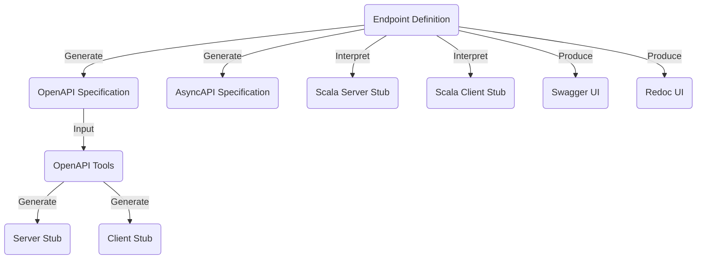
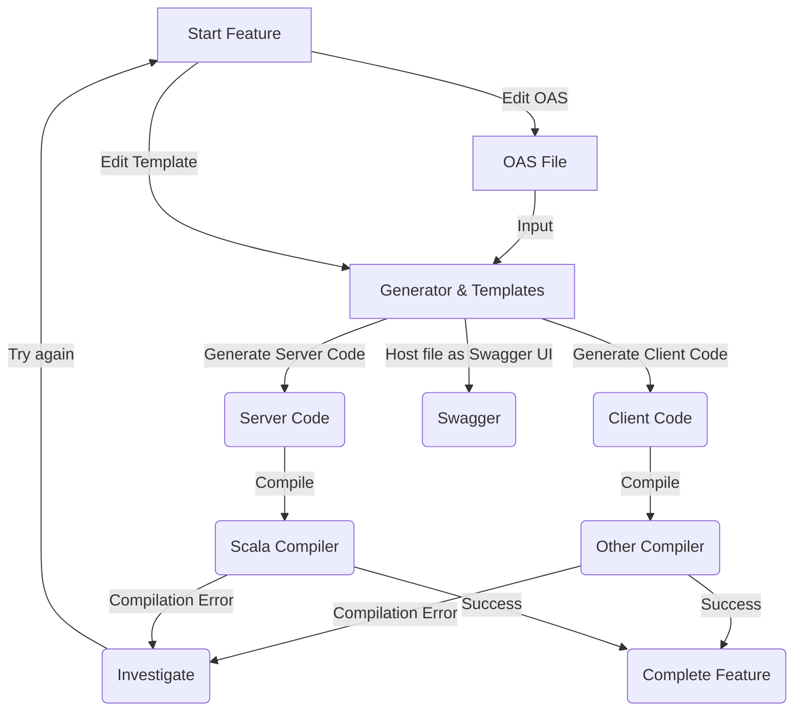
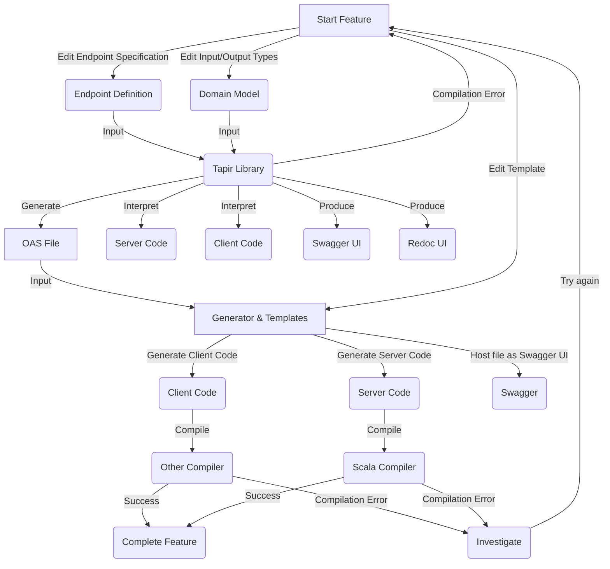

# Using tapir library as a DSL for OpenAPI specification

- Status: [ proposed ] <!-- optional -->
- Deciders: [ Yurii Shynbuiev, David Poltorak, Benjamin Voiturier, Ilya Peresadin ] <!-- optional -->
- Date: [2022-10-05 when the decision was last updated] <!-- optional. To customize the ordering without relying on Git creation dates and filenames -->
- Tags: [ OpenAPI, DLS, Tapir, code generation, REST API] <!-- optional -->

Related ADR/AIP: [Introduce REST HTTP for existing Node services](https://input-output.atlassian.net/wiki/spaces/AV2/pages/3454500948/AIP+-+001)

Technical Story: [description | ticket/issue URL] <!-- optional -->

## Context and Problem Statement
Prism Platform v2 will contain the REST API. The decision was made by technical director (@Bart) and technical architects (@Ben)
to follow "OpenAPI specification first" approach and generate stubs, server side and client side code based on OAS.
Following this strategy we currently have 4-5 OAS files (Castor, Pollux, Mercury, Configuration).

The following tool was selected for code generation: [OpenAPI Tools](https://github.com/OpenAPITools/openapi-generator)

[Tapir](https://tapir.softwaremill.com/en/latest/index.html) is proposed to enforce a type safety and introduce DSL in Scala for OAS files.

Technology stack that is going to be used in Prism v2 backend: Scala3 + ZIO + ZIO ecosystem

Akka framework after version 2.6.x cannot be used because [Lightbend changed the license type to BSL 1.1](https://www.lightbend.com/blog/why-we-are-changing-the-license-for-akka). 

Looks like Akka 2.6.x still can be used according to [License FQA](https://www.lightbend.com/akka/license-faq)

Currently, we have a code generation for Akka that is wrapped up into ZIO. Code generation mustache templates for ZIO-http are not available in OpenAPI tools. 

Mustache templates and code generation doesn't work out of the box, so the original templates where copied to the project and fixed by @Shota and @Pat. 
Current templates and generator contains constraints that were reported by [@Pat](https://docs.google.com/document/d/1WhUtflM_o-5uSx9LW76lycz2kbk071cVZiv6EtVwhAQ/edit#heading=h.ywcvgffenpz) and [@Shota](https://input-output-rnd.slack.com/archives/G018JE9NHAM/p1664563129397819), this requires engineering time to adopt the OAS for a code generation. @Ben says that we can live with these constraints

Generally, OAS files are written by the engineers with different experience and different view on formatting, schemas, normalization, datatype. For instance, in current templates don't have 
- a consistent way for paginating the entities
- standard Responses for 4xx and 5xx errors
- normalized data types (we use ```anyOf```, ```allOf```)
- query parameters convention for filtering the entities
- some data types are duplicated in both Castor and Pollux OAS

As OAS specification evolves it's getting harder to manage it because of the size of the file.
To mitigate this issue @Pat proposed to use well-known tools:
"Knowing that there are tools like [dhall](https://dhall-lang.org/#) or [CUE](https://cuelang.org/docs/integrations/openapi/) that allow us to write large configuration in yaml (or json) in a typesafe / reuseable way, I'm not hesitant to go contract-first."(c)

Quality and formatting of autogenerated code depend on the template (not all templates are good enough). Making the good code from existing templates require additional time of engineers.

### OpenAPI code generator constraints for Akka server
#### @Pat
- oneOf is not supported. It combines everything from the list if it’s an object, discard if it’s a primitive
- allOf is not supported as stated in the documentation, but testing locally it worked
- Have to handwrite the serialization layer
#### @Shota
- Undefined type ```AnyType```. You can have additionalProperties (```components/schemas/<schema name>/properties/additionalProperties```) in the schema, when you add it, it will generate a type for <schema name> that has another type called AnyType inside, this type is not defined, it just does not exist in generated code so the compilation will fail, if you gate a compilation error in your sources with some AnyType that is not defined, look for additionalProperties in your schema
- Values of type object without properties don’t serialize with spray json. You can have ```componets/schemas/<schema name>/properties/<property name>``` and every property has a type, like string, int, etc.., you can have type as object, but if you do so, you must provide object properties as well like in example below, if you don’t add it, it will generate this object type with Any in scala, and then the Akka marshaller will fail, because we use SprayJson there, and it does not support Reader and Writer for type Any (basically it can’t serialize type Any into json), you could probably define Writer and Reader for type Any to be an empty object, but I personally don’t see a reason to have value of type object and not define what properties it is going to have anyway.
- ```requestBody``` in every path must be explicitly ```required:true```. It is ```false``` by default, if not marked as ```true``` it will generate a service functions that accepts ```Option[Type]``` instead of ```Type``` but endpoints are always expecting ```Type``` even if required is ```false```, not ```Option[Type]```, then when you try to generate sources you will get compilation error ```expecting Type got Option[Type]```

## Decision Drivers <!-- optional -->

- enforce type-safety to endpoint definitions using Scala compiler and Tapir DSL, add CI for endpoints definitions
- make endpoint definitions convenient for engineers by reusing common abstractions and definitions
- introduce a standard types, schemas and approaches for all endpoint definitions: query, pagination, responses, etc
- reuse endpoint definitions for creating server and client stubs in Scala
- align the server side of REST API with the current technology stack (ZIO + ecosystem)
- have a control over the codebase and data types
- reduce time-of-maintenance of the code (either OAS should be adapted for generator or mustache templates should be fixed) 
- functional way of implementation of non-functional requirement (metrics, tracing, logging)
- straight forward generation of Swagger UI, Redoc documentation and Async API documentation based on endpoint definitions

## Considered Options

- use OpenAPI tools (edit OAS manually, generate server stub for Akka and client stubs for any other languages) 
- use OpenAPI tools, but generate code for other server-side library (Play, Finch, Lagom)
- use Tapir library (edit endpoint definitions as Scala code, reuse endpoint definitions for server stubs, generate OAS based on endpoint definitions, generate client stubs for any other language)

## Decision Outcome

Chosen option:"use Tapir library" till the end of the year, evaluate this solution in 2023

All endpoint definition are written in Tapir DSL. 

OpenAPI specification generated based on endpoint definition and is published as an artefact. (must be a part of CI)

Server side is interpreted using ZIO-HTTP interpreter to be aligned with the give technology stack.

Client side stubs are generated using OpenAPI tools and OpenAPI specification file. (must be a part of CI)

For server-side code the flow is following:


### Positive Consequences <!-- optional -->

- Type-safety and OAS configuration as a code will speed up development
- Generated OpenAPI specification is unified according to the single standard (Tapir generator)
- Errors in the types and endpoint definitions will be found in compile-time
- Code generations will be replaced with interpretation with higher guarantees of stability
- Engineers will save time for feature implementation instead of investigating the issues with AOS files or templates
- Better management of OAS spec and control over the documentation (Swagger UI, Redoc, Async API for WebSockets)

### Negative Consequences <!-- optional -->
- Not all engineers will be able to edit the endpoint definitions in Tapir DLS, so either only engineer with Scala knowledge will do this, or knowledge sharing and workshops "How to use Tapir" are required.
- OAS is going to be generated from the model defined by DLS, so the granular/manual control over the spec will be replaced by Tapir generator
- There is a risk that Tapir might have some hidden surprises and constraints

### Option 1 & 2: Feature Implementation Workflow

### Option 3: Feature Implementation Workflow

## Pros and Cons of the Options <!-- optional -->

### Option 1: use OpenAPI tools and mustache templates for Akka server

[example | description | pointer to more information | …] <!-- optional -->

- Good, because @Pat and @Shota already stabilized the templates, and we have a working solution
- Good, because any engineer from CoreDID and Product Foundry team is able to contribute to the documentation
- Good, because the same source of truth (OAS file) is used to generate Server and Client stub (less integration problems for client stubs)
- Bad, because there are known constraints in the mustache templates that can slow down engineering
- Bad, because Akka changed the licence and version 2.6.x will not be supported in 1 year.
- Bad, because it's hard to keep the same standard for OAS that are written by different engineers
- Bad, because all OAS files are merged together at infrastructure level which is slightly complex solution for this task.
- Bad, because Akka Framework is not in ZIO ecosystem (it's not a good practice to use both frameworks)

### Option 2: use OpenAPI tools and mustache templates for alternative Scala server libraries (Finch, Lagom, Play )

[example | description | pointer to more information | …] <!-- optional -->
- All ```good``` and ```bad``` are the same as in Option 1
- Bad, because we don't know if the mustache templates are good enough for Scala 3
- Bad, because we need to evaluate if engineering team have the experience in Finch, Lagom or Play

### Optoin 3: use Tapir as DSL for OpenAPI specification

[example | description | pointer to more information | …] <!-- optional -->

- Good, because type-safety and DLS will save the engineering time by providing a quick feedback loop in compile time
- Good, because generated OAS will be aligned with the common standards
- Good, because engineers can define and reuse the abstractions in FP way
- Good, because entities (inputs/outputs) will be reused by Scala backend library
- Good, because the endpoint definition will be reused in Scala Server or Client stub
- Good, because there is no need to generate the code, stubs are interpreted by the library
- Good, because ZIO-HTTP will be used, which is aligned with the current stack
- Good, because Open API, Swagger, Redoc, Async API document/site generations are supported
- Bad, because only Scala engineers will be able to edit the documentation
- Bad, because the granular control over OAS YAML file will be lost (OAS file is generated automatically)
- Bad, because we need to spend 3-5 day to transform OAS files into Tapir DSL

## How to migrate from the current state to Tapir?
### Current state: OpenAPI Tools + mustache templates for Akka server
### Desired state: Endpoint Definitions in Tapir + ZIO-HTTP
Estimated migration time is 4-6 days which we don't really want to waste.

So, engineering team can proceed with keeping the existing endpoints in the current state and even work on the new endpoints using generated server stubs for Akka.

At the same time OAS file can be translated to Tapir step-by-step and the endpoint definitions can be [interpreted by Tapir library as Akka routes](https://tapir.softwaremill.com/en/latest/server/akkahttp.html), and attached to the server endpoint in the same way as generated endpoints.

This transitions period might take 2-3 weeks till engineering team get enough knowledge of using Tapir.

Then all the endpoints are translated to Tapir, it will be possible to switch the interpreter from Akka to [ZIO-HTTP library](https://tapir.softwaremill.com/en/latest/server/ziohttp.html).

## Links <!-- optional -->

- [OpenAPI Tools](https://github.com/OpenAPITools/openapi-generator)
- [Goals of Tapir library](https://tapir.softwaremill.com/en/latest/goals.html)
- [Tapir](https://tapir.softwaremill.com/en/latest/index.html)