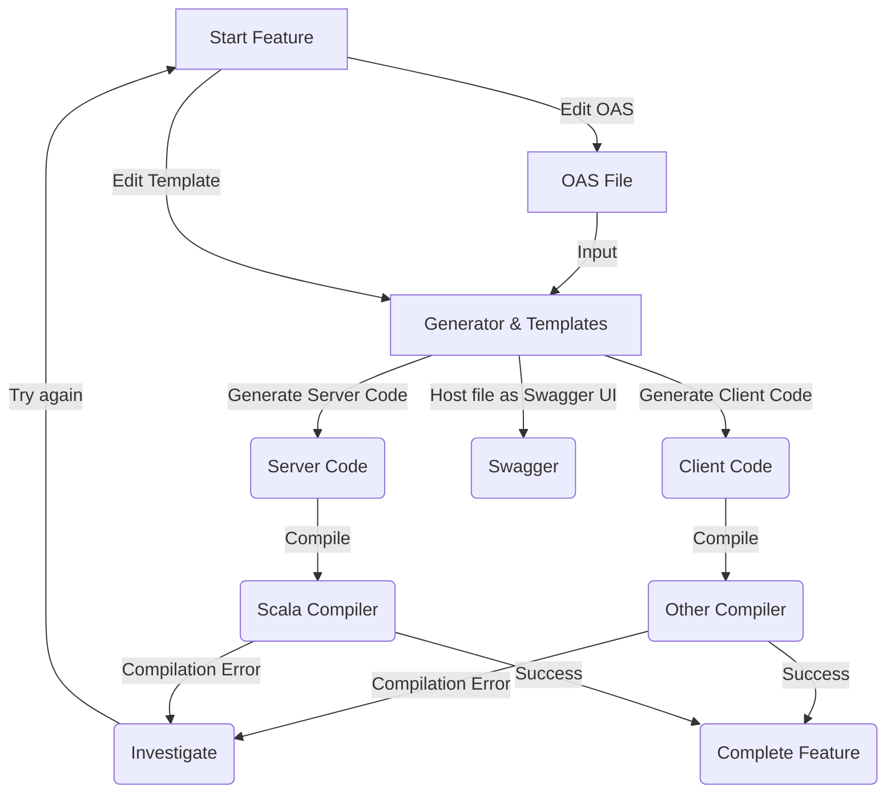
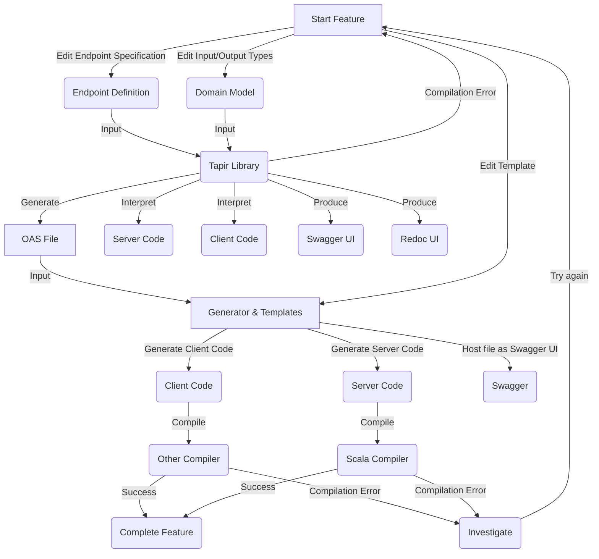

# Using tapir library as a DSL for OpenAPI specification

- Status: [ proposed ] <!-- optional -->
- Deciders: [ Yurii Shynbuiev, David Poltorak, Benjamin Voiturier, Ilya Peresadin ] <!-- optional -->
- Date: [2022-10-05 when the decision was last updated] <!-- optional. To customize the ordering without relying on Git creation dates and filenames -->
- Tags: [ OpenAPI, DLS, Tapir, code generation, REST API] <!-- optional -->

Technical Story: [description | ticket/issue URL] <!-- optional -->

## Context and Problem Statement
Prism V2 will contain the REST API. The decision was made by technical director (@Bart) and technical architects (@Ben)
to follow "OpenAPI specification first" approach and generate stubs, server side and client side code based on OAS.
Following this strategy we currently have 4-5 OAS files (Castor, Pollux, Mercury, Configuration).

The following tool was selected for code generation: [OpenAPI Tools](https://github.com/OpenAPITools/openapi-generator)

[Tapir](https://tapir.softwaremill.com/en/latest/index.html) is proposed to enforce a type safety and introduce DSL in Scala for OAS files.

Technology stack that is going to be used in Prism v2 backend: Scala3 + ZIO + ZIO ecosystem

Akka framework cannot be used because [Lightbend changed the license type to BSL 1.1](https://www.lightbend.com/blog/why-we-are-changing-the-license-for-akka)

[Describe the context and problem statement, e.g., in free form using two to three sentences. You may want to articulate the problem in form of a question.]

## Decision Drivers <!-- optional -->
[p] - pros, [c] - cons

- [c] currently we have a code generation for Akka that is wrapped up into ZIO, code generation for ZIO http is unstable and needs engineering time to fix it
- [c] mustache templates and code generation doesn't work out of the box and require engineering time to fix the compilation issues
- [c] code generation already have a constraints that were reported by [@Pat](https://docs.google.com/document/d/1WhUtflM_o-5uSx9LW76lycz2kbk071cVZiv6EtVwhAQ/edit#heading=h.ywcvgffenpz) and [@Shota](https://input-output-rnd.slack.com/archives/G018JE9NHAM/p1664563129397819), this requires engineering time to adopt the OAS for a code generator.
- [c] OAS files are don't have a common standard for REST API: response formats, common type system, approach to authentication, pagination, query parameters 
- [c] as OAS evolves it getting harder to manage it because of the size of the file 
- [c] quality and formatting of autogenerated code depend on the template (not all templates are good enough)
- [p] Tapir is a library that allows you to write OAS in a type-safe manner, so compiler checks if your OAS corresponds to your definition of the endpoint (short feedback loop + CI for OAS)
- [p] OAS defined using Tapir can be [interpreted to server/client stubs, OAS file, Swagger UI and Redoc UI](https://tapir.softwaremill.com/en/latest/)
- [p] Using Tapir engineers are able to define the domain models and responses in a type-safe manner (OAS will be generated based on case classes)
- [p] Using Tapir it's easy to bind the endpoint to the logic and create a stubs
- [p] Tapir enforces the standards from the beginning by defining the datatypes
- [p] Tapir uses 'tagless final' functional patter to interpret the server/client logic
- [Goals of Tapir](https://tapir.softwaremill.com/en/latest/goals.html)

## Considered Options

- keep using OpenAPI tools (edit OAS manually, adopt templates, etc) 
- use Tapir library to enforce type-safety, compilation check and quick implementation of any stub

## Decision Outcome

Chosen option: "use Tapir library", because in solves the challenges of managing OAS manually, enforces the standards and introduces type-safety and compilation checks to OAS

### Positive Consequences <!-- optional -->

- OAS is going to be close to reality and defined according to the standard
- OAS is going to be verified by CI and common mistakes will be found in compile time
- Code generations will be replaced with interpretation with higher guarantees of stability
- Engineers will not spend time on refactoring, fixing templates, investigate and fix compilation errors, adjust the file according to known constraints
- Better management of OAS spec and control over the documentation
- Quick and easy server stubbing for the routes
- Possibility to deliver REST API in incremental way (route by route, feature by feature)
- Swagger and Redoc documentation is ready out of the box
- AsyncAPI for WS is also supported (for the future)

### Negative Consequences <!-- optional -->

- OAS is going to be generated from the model defined by DLS, so the granular/manual control over the spec will be replaced by Tapir generator

[OAS First OpenAPI Yaml File Workflow](https://mermaid.ink/img/pako:eNpdksFuwjAMhl_FymHKJPYCPUyCUraeekg5UQ5Wa0q0Nq3SlAkR3n0GMtYupzj-_OeP44sou4pEJGqL_RHydWGA13anHFoHG0I3WtrD29s7-KTSDrKl8rB8YMsdR7DRzS-Rmn50HpKgMinLqe0bdPRMJrsPMmTRdRZenulhzyU-ZAgU2RNZiNmjh5WchK9BBWZ83GgyLvCxnISBj-983LU9m_aQxTJzx7vk_cQGLJty6HRnILG2sx7SGaDGsqRh8JBP7Xx2g4MDywEOoL6xrvmGbephLUMUrlk9GvS0o6QqscH_btQUm7uRqTnR4HTNrw90-qBzewasURsP25nMn2d5U2yI-xb-OSiIhWjJtqgrHozL7awQ3KWWChHxtkL7VYjCXJnD0XXqbEoROTvSQox9xU7WGnmeWhEdsBno-gNchcLt)](https://mermaid-js.github.io/mermaid-live-editor/edit#pako:eNpdksFuwjAMhl_FymHKJPYCPUyCUraeekg5UQ5Wa0q0Nq3SlAkR3n0GMtYupzj-_OeP44sou4pEJGqL_RHydWGA13anHFoHG0I3WtrD29s7-KTSDrKl8rB8YMsdR7DRzS-Rmn50HpKgMinLqe0bdPRMJrsPMmTRdRZenulhzyU-ZAgU2RNZiNmjh5WchK9BBWZ83GgyLvCxnISBj-983LU9m_aQxTJzx7vk_cQGLJty6HRnILG2sx7SGaDGsqRh8JBP7Xx2g4MDywEOoL6xrvmGbephLUMUrlk9GvS0o6QqscH_btQUm7uRqTnR4HTNrw90-qBzewasURsP25nMn2d5U2yI-xb-OSiIhWjJtqgrHozL7awQ3KWWChHxtkL7VYjCXJnD0XXqbEoROTvSQox9xU7WGnmeWhEdsBno-gNchcLt)

[OAS First with Tapir Workflow](https://mermaid.ink/img/pako:eNp1k8Fu2zAMhl-F0GFQgRa75zAgtd3NwAIPlYMdkh40m3GF2ZJByx2Cuu8-xlYTp01ycUB-_EX-lF5F4UoUC1GRbp8hj7cW-LfeKK_JwwNq3xM-wd3dNxiS0nhIbNk6Yz2oFguzM4X2xtkBklgeUzHujDWH-E3Qmwmktu3916z3_IF832I3QLySsWu0sbDidupQlcRT2VgxQJ7IXLeG4Kf5Q5r2gYpXH6gpnCdT-DtaJO1xgOV5IrUeqSXkGhVJhfSCBBEff3OViyIZ1QZ5wgvcL3JlX_A56rdU_3RVsdw6vQY9xvIRS1d8RiLXtKYeXYWEyNEA64lYbrKlggdTvy8kjJx8NjnHpq3HqUMy2QQjHMGXY7p74pKjRTAzYYD7C56MLZ74mRlszgVvopGfJmIki2Tmn0fJMUIBy-bc2eTpGaD6osCO70s-b-eH6zzsWA50Byfn-Va97yEccz83-LAoqQpd64_dqKt7SGVqX7DzpuLpA51OdE570BXf4OO2gsypZ3lQrJF9C88qKIhb0SDx7S_5Hb4eYlvBLjW4FQv-W2r6uxVb-8ac7r1Te1uIhaceb0XfltxJbDQ_30Ysdrru8O0_qcg2yA)](https://mermaid-js.github.io/mermaid-live-editor/edit#pako:eNp1k8Fu2zAMhl-F0GFQgRa75zAgtd3NwAIPlYMdkh40m3GF2ZJByx2Cuu8-xlYTp01ycUB-_EX-lF5F4UoUC1GRbp8hj7cW-LfeKK_JwwNq3xM-wd3dNxiS0nhIbNk6Yz2oFguzM4X2xtkBklgeUzHujDWH-E3Qmwmktu3916z3_IF832I3QLySsWu0sbDidupQlcRT2VgxQJ7IXLeG4Kf5Q5r2gYpXH6gpnCdT-DtaJO1xgOV5IrUeqSXkGhVJhfSCBBEff3OViyIZ1QZ5wgvcL3JlX_A56rdU_3RVsdw6vQY9xvIRS1d8RiLXtKYeXYWEyNEA64lYbrKlggdTvy8kjJx8NjnHpq3HqUMy2QQjHMGXY7p74pKjRTAzYYD7C56MLZ74mRlszgVvopGfJmIki2Tmn0fJMUIBy-bc2eTpGaD6osCO70s-b-eH6zzsWA50Byfn-Va97yEccz83-LAoqQpd64_dqKt7SGVqX7DzpuLpA51OdE570BXf4OO2gsypZ3lQrJF9C88qKIhb0SDx7S_5Hb4eYlvBLjW4FQv-W2r6uxVb-8ac7r1Te1uIhaceb0XfltxJbDQ_30Ysdrru8O0_qcg2yA)

---
Options and fields below will not be a part of the ADS. I will remove these later. Feel free to use these sections for argumentation.
## Pros and Cons of the Options <!-- optional -->

### [option 1]

[example | description | pointer to more information | …] <!-- optional -->

- Good, because [argument a]
- Good, because [argument b]
- Bad, because [argument c]
- … <!-- numbers of pros and cons can vary -->

### [option 2]

[example | description | pointer to more information | …] <!-- optional -->

- Good, because [argument a]
- Good, because [argument b]
- Bad, because [argument c]
- … <!-- numbers of pros and cons can vary -->

### [option 3]

[example | description | pointer to more information | …] <!-- optional -->

- Good, because [argument a]
- Good, because [argument b]
- Bad, because [argument c]
- … <!-- numbers of pros and cons can vary -->

## Links <!-- optional -->

- [OpenAPI Tools](https://github.com/OpenAPITools/openapi-generator)
- [Goals of Tapir library](https://tapir.softwaremill.com/en/latest/goals.html)
- [Tapir](https://tapir.softwaremill.com/en/latest/index.html)