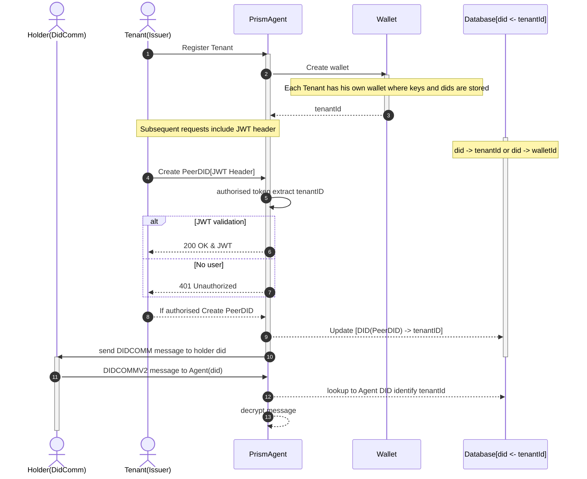

# Routing Requests to the Correct Tenant

- Status: draft [ accepted | deprecated | superseded by [xxx](yyyymmdd-xxx.md)]
- Deciders: Yurii Shynbuiev,David Poltorak, Benjamin Voiturier, Shailesh Patil
- Date: [2023-05-09] 
- Tags: multi-tenant, routing, message

## Context and Problem Statement
Prism agent in multi-tenancy is still a single agent running, however, some of the resources are now shared between the tenants of the agent.
Each tenant has their own keys, with their own DIDs, connections. Transports and most of the settings are still shared between agents.
All the API endpoints are same from outside

Multi-tenancy, message routing can be used to ensure that messages are delivered only to the intended recipient or tenants, and not to unauthorized tenants.

Backend services: Prism Agent use PostgreSQL. Authentication and authorization

