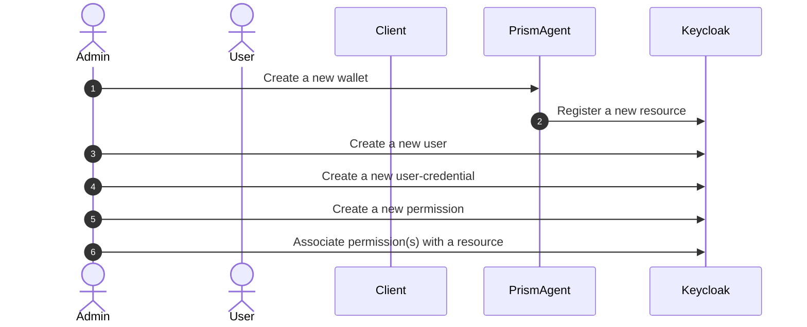
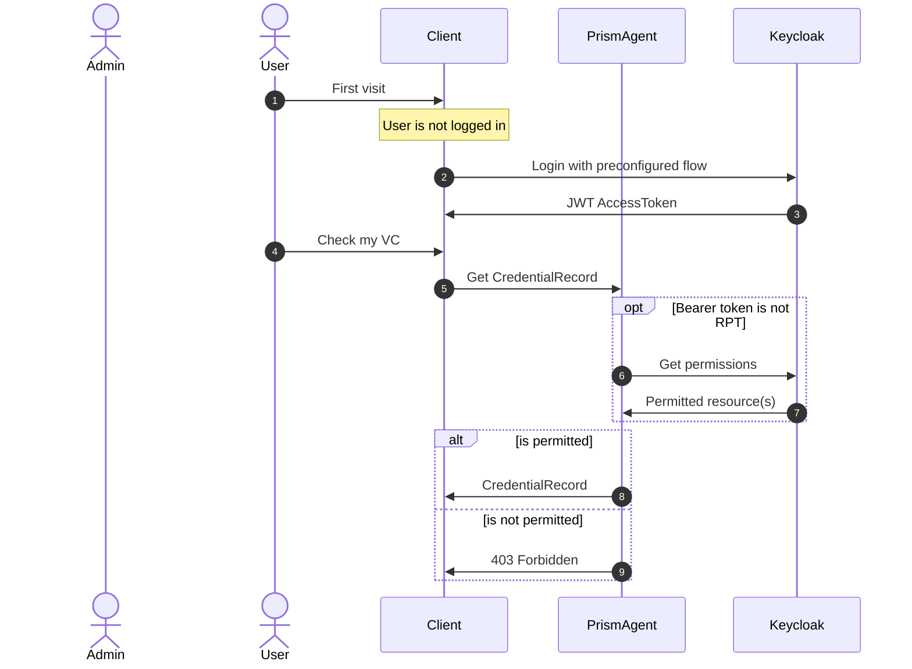

# Use keycloak authorisation service for managing wallet permissions

- Status: accepted
- Decider: Pat Losoponkul, Yurii Shynbuiev, David Poltorak, Milos Dzepina
- Date 2023-09-26
- Tags: multitenancy, authorisation, authentication

Technical Story: [External IAM provider integration for Authentication and Authorisation Layers MVP | https://input-output.atlassian.net/browse/ATL-5149]

## Context and Problem Statement

As we move forward with multi-tenancy, it's essential to give extra attention to authentication and authorisation.
Currently, our authentication and authorisation processes are managed by a simple built-in IAM implementation within the cloud agent.
While this setup is straightforward and functional, it's a somewhat basic and proprietary approach.
Transitioning to an industry-standard IAM system like Keycloak represents an important step towards a more robust authentication and authorisation framework.

Within our multi-tenant cloud agent, we have some key concepts:
wallets (representing resources), entities (representing users), and authentication methods.
These models are integrated into our current IAM implementation within the agent allowing a loose coupling of users and resources, as well as resource access.

As we consider the shift towards an external IAM system, several important questions arise:

1. Where to draw the boundary of AuthN/AuthZ across different components?
2. How to ensure smooth communication of wallet permissions across these components?
3. What will be the impact on the process of onboarding new users and wallets?

These questions are essential as we explore the integration options of an external IAM  that suits our needs.

## Decision Drivers

- Complexity to implement, operate and maintain
- Must allow self-hosted option as well as future SaaS offering
- Must allow flexible management of resources, users and permissions
- Should adhere to standards in AuthN/AuthZ space
- Should promote clear boundary between application and IAM concerns

## Considered Options

1. Keycloak for authentication and associate the wallet permissions on the Agent.

   In this option, the agent validates the JWT from Keycloak, extracting the payload and obtain the user identity.
   Then, the agent stores the user's associated wallet information in its database.
   Keycloak's responsibility lies solely in user authentication, as permissions management is internally managed by the agent.

2. Keycloak for authentication and embed custom permission claims in the `access-token`.

   In this option, the agent validates the JWT from Keycloak, extracting the payload containing custom claims related to the user's accessible wallets.
   Wallet permissions are managed in Keycloak as user metadata, which needs to be configured to include this claim in the issued JWT.

3. Keycloak for authentication and authorisation service  managing permissions.

   In this option, the agent handles wallet resources on Keycloak using the [Protection API](https://www.keycloak.org/docs/latest/authorization_services/index.html#_service_protection_api).
   Wallet permissions are managed through Keycloak's [authorisation service](https://www.keycloak.org/docs/latest/authorization_services/index.html).
   When users intend to use the agent, it verifies wallet permissions by checking the Keycloak permission endpoint.
   Similarly, Keycloak can also issue a self-contained JWT directly to users contains all the permission claims required by the agent.

## Decision Outcome

Use Keycloak authorisation service for managing wallet permissions.
Keycloak authorisation service offers a robust abstraction based on an industry-standard specification called UMA (User-Managed Access).
It allows us to define resources, resource owners, permissions, and policies with ease.
These concepts are tried and tested, and Keycloak provides them right out of the box, making it a suitable choice.
It is also the only option to adhere to the standard.

In this setup, applications are responsible for managing their resources and rely on
Keycloak for managing permissions on those resources.
To determine whether a user can access a specific resource, the application can simply utilise Keycloak's permission endpoint.

### On-boarding sequence diagram

### Authorisation sequence diagram

Optionally, users or downstream applications can directly call Keycloak permission endpoint to get a RPT (requesting-party token)
to obtain a self-contained `access-token` which already include permissions.

__Endpoint references__

- Agent checks the user permissions using [permission endpoint](https://www.keycloak.org/docs/22.0.0/authorization_services/#_service_obtaining_permissions)
  - [optional] Client may also directly call this endpoint on keycloak
- Agent registers a new resource using [resource endpoints](https://www.keycloak.org/docs/22.0.0/authorization_services/#_service_protection_resources_api)
  - [obtain a token for the resource endpoints](https://www.keycloak.org/docs/22.0.0/authorization_services/#_service_protection_whatis_obtain_pat)
- Admin manages the wallet permissions using both
  - [Permission API](https://www.keycloak.org/docs/22.0.0/authorization_services/#_service_protection_permission_api_papi)
  - [Policy API](https://www.keycloak.org/docs/22.0.0/authorization_services/#_service_authorization_uma_policy_api)

### Positive Consequences

- Good separation between IAM and application concerns
- Powerful and proven abstraction for managing permissions
- Implementation is ready out of the box
- Easy to migrate to different IAM vendor that supports UMA specification

### Negative Consequences

- Require additional network call to obtain a permission token
- Involves more moving parts in managing wallet permissions
- Each IAM systems may have a slight variations to the UMA endpoints

## Pros and Cons of the Options

### Keycloak for authentication and associate the wallet permissions on the Agent

- Good, because permission logic is on application and allowing any IAM solution to be used regardless of authorisation feature
- Bad, because permissions are managed on the application and IAM boundary is blurred
- Bad, because engineering effort is spent on non-differentiating value in order to have feature parity with other authorisation system

### Keycloak for authentication and embed custom permission claims in the `access-token`

- Good, because the `access-token` is self-contained and doesn't require extra network call
- Good, because IAM systems are more likely to support custom claims feature
- Bad, because the custom claims are directly linked to user instead of resource preventing flexible mangement of permission

## Links

- [Keycloak authorisation service](https://www.keycloak.org/docs/latest/authorization_services/index.html)
