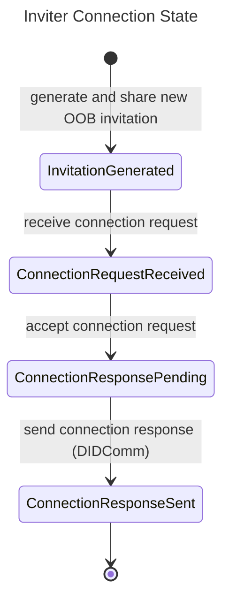
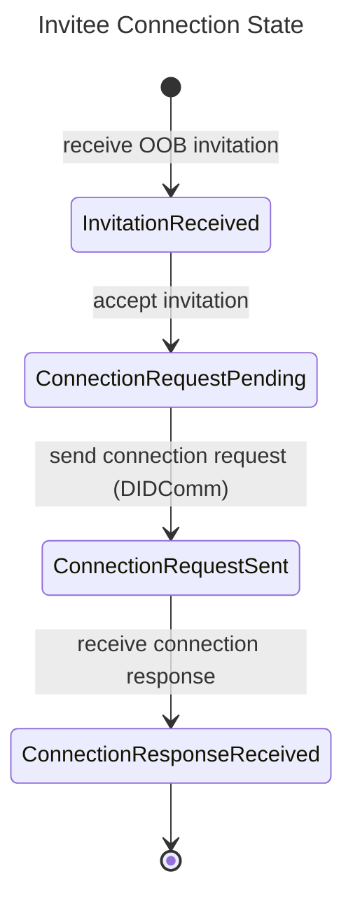

# Connections

A connection is a stateful relationship between two parties that enables secure communication.

The [Connection protocol](/docs/concepts/glossary#connection-protocol) is required to establish secure connections between agents,
allowing them to exchange information and interact.

## Roles

The connection protocol has two roles:

1.  [Inviter](/docs/concepts/glossary#inviter): A subject that initiates a connection request by sending a [connection invitation](/docs/concepts/glossary#connection-invitation).
2.  [Invitee](/docs/concepts/glossary#invitee): A subject that receives a connection invitation and accepts it by sending a [connection request](/docs/concepts/glossary#connection-request).

## Prerequisites

1. Inviter and Invitee PRISM Agents up and running

## PRISM Agent endpoints overview

The protocol uses the following REST API endpoints:

1. [`/connections`](/agent-api/#tag/Connections-Management):
   - [`POST`](/agent-api/#tag/Connections-Management/operation/createConnection): Creates a new connection and returns an invitation 
   - [`GET`](/agent-api/#tag/Connections-Management/operation/getConnections): Returns a list of connections
2. [`GET /connections/{connectionId}`](/agent-api/#tag/Connections-Management/operation/getConnection): Returns an existing connection record by id
3. [`POST /connection-invitations`](/agent-api/#tag/Connections-Management/operation/acceptConnectionInvitation): Accepts an externally received invitation

:::info
Please check the full [PRISM Agent API](/agent-api) specification for more detailed information.
:::

## Inviter Flow

1.  Generate and share a new Out-of-Band (OOB) invitation (connection gets created in `InvitationGenerated` state)
2.  Receive a connection request from the Invitee (connection moves to `ConnectionRequestReceived` state)
3.  Accept the connection request (connection moves to `ConnectionResponsePending` state)
4.  Send the connection response via the DIDComm Agent (connection achieves `ConnectionResponseSent` state)

The following diagram represents the Inviter's Connection state transitions:



## Invitee Flow

1.  Receive the OOB invitation (`InvitationReceived` state)
2.  Accept the invitation (connection is created in `ConnectionRequestPending` state)
3.  Send the connection request via [DIDComm](/docs/concepts/glossary#didcomm) (connection achieves `ConnectionRequestSent` state)
4.  Receive the connection response (connection achieves `ConnectionResponseReceived` state)

The following diagram represents the Invitee's Connection state transitions:


## Sequence diagram

The following diagram shows the end-to-end flow for establishing a connection between an inviter and an invitee.


## Command line example

The following example demonstrates how you could use two PRISM Agent APIs to set up a connection between them.

### Inviter creates an invitation

```shell
curl -X 'POST' \
	'http://localhost:8080/prism-agent/connections' \
	-H 'Content-Type: application/json' \
	-H "apikey: $API_KEY" \
	-d '{ "label": "Connect with Alice" }' | jq
```

Example response:
```json
{
  "connectionId": "1893e207-4cba-4792-8179-067c78d2acc2",
  "createdAt": "2023-02-02T17:14:13.593647Z",
  "invitation": {
    "from": "did:peer:inviter-did",
    "id": "1893e207-4cba-4792-8179-067c78d2acc2",
    "invitationUrl": "https://domain.com/path?_oob={RAW_INVITATION}",
    "type": "https://didcomm.org/out-of-band/2.0/invitation"
  },
  "kind": "/connections/1893e207-4cba-4792-8179-067c78d2acc2",
  "label": "Connect with Alice",
  "self": "Connection",
  "state": "InvitationGenerated"
}
```

### **Invitee** accepts OOB invitation

Replace `{RAW_INVITATION}` with the value of the '_oob' query string parameter from the invitation URL above
```shell
curl -X 'POST' \
	'http://localhost:8090/prism-agent/connection-invitations' \
	-H 'Content-Type: application/json' \
	-H "apikey: $API_KEY" \
	-d '{ "invitation": "{RAW_INVITATION}" }' | jq
```

Example response:
```json
{
  "connectionId": "755a457a-878e-4292-a3f2-cb83601f802e",
  "createdAt": "2023-02-02T18:05:58Z",
  "invitation": {
    "from": "did:peer:inviter-did",
    "id": "1893e207-4cba-4792-8179-067c78d2acc2",
    "invitationUrl": "https://domain.com/path?_oob={RAW_INVITATION}",
    "type": "https://didcomm.org/out-of-band/2.0/invitation"
  },
  "kind": "/connections/755a457a-878e-4292-a3f2-cb83601f802e",
  "myDid": "did:peer:invitee-did",
  "self": "Connection",
  "state": "ConnectionRequestPending",
  "theirDid": "did:peer:inviter-did",
  "updatedAt": "2023-02-02T18:05:59Z"
}
```

### Invitee retrieves the list of connections

```shell
curl -X 'GET' 'http://localhost:8090/prism-agent/connections' \
    -H "apikey: $API_KEY" | jq
```

Example output:
```json
{
  "contents": [
    {
      "connectionId": "755a457a-878e-4292-a3f2-cb83601f802e",
      "createdAt": "2023-02-02T18:05:58Z",
      "invitation": {
        "from": "did:peer:issuer-did",
        "id": "1893e207-4cba-4792-8179-067c78d2acc2",
        "invitationUrl": "https://domain.com/path?_oob={RAW_INVITATION}",
        "type": "https://didcomm.org/out-of-band/2.0/invitation"
      },
      "kind": "/connections/755a457a-878e-4292-a3f2-cb83601f802e",
      "myDid": "did:peer:holder-did",
      "self": "Connection",
      "state": "ConnectionResponseReceived",
      "theirDid": "did:peer:issuer-did",
      "updatedAt": "2023-02-02T18:06:14Z"
    }
  ],
  "kind": "Collection",
  "self": "/collections"
}
```

### Inviter retrieves the list of connections

```shell
curl -X 'GET' 'http://localhost:8080/prism-agent/connections' \
    -H "apikey: $API_KEY" | jq
```

Example response:
```json
{
  "contents": [
    {
      "connectionId": "1893e207-4cba-4792-8179-067c78d2acc2",
      "createdAt": "2023-02-02T17:14:13Z",
      "invitation": {
        "from": "did:peer:issuer-did",
        "id": "1893e207-4cba-4792-8179-067c78d2acc2",
        "invitationUrl": "https://domain.com/path?_oob={RAW_INVITATION}",
        "type": "https://didcomm.org/out-of-band/2.0/invitation"
      },
      "kind": "/connections/1893e207-4cba-4792-8179-067c78d2acc2",
      "label": "Connect with Alice",
      "myDid": "did:peer:issuer-did",
      "self": "Connection",
      "state": "ConnectionResponseSent",
      "theirDid": "did:peer:holder-did",
      "updatedAt": "2023-02-02T18:06:16Z"
    }
  ],
  "kind": "Collection",
  "self": "/collections"
}
```

:::info
Please check the full [PRISM Agent API](/agent-api) specification for more detailed information.
:::
