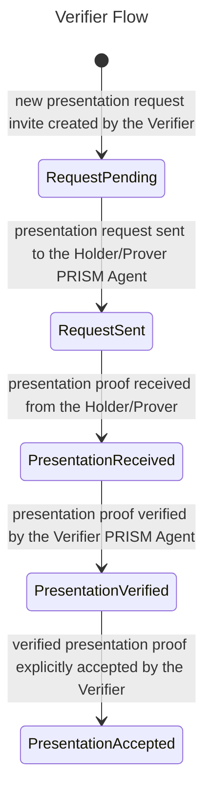
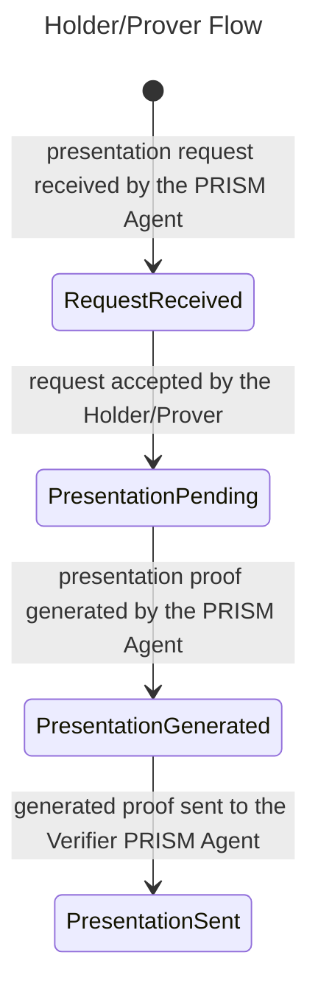

import Tabs from '@theme/Tabs';
import TabItem from '@theme/TabItem';

# Present proof (Connectionless)

The [Present Proof Protocol](/docs/concepts/glossary#present-proof-protocol) allows:
- a [Verifier](/docs/concepts/glossary#verifier) to request a verifiable credential presentation from a Holder/Prover
- a [Holder/Prover](/docs/concepts/glossary#holder) responds by presenting a cryptographic proof to the Verifier

The protocol provides endpoints for a Verifier to request new proof presentations from Holder/Provers and for a Holder/Prover to respond to the presentation request using a specific verifiable credential they own.

## Roles

The present proof protocol has two roles:

1. Verifier: A subject requesting a proof presentation by sending a request presentation message, then verifying the presentation.
2. Holder/Prover: A [subject](/docs/concepts/glossary#subject) that receives a [proof presentation](/docs/concepts/glossary#proof-presentation) request, prepares a proof, and sends it to the verifier by sending a proof presentation message.

## Prerequisites

Before using the Proof Presentation protocol, the following conditions must be present:

1. Holder/Prover and Verifier Cloud Agents must be up and running
2. The Holder/Prover should hold a [verifiable credential (VC)](/docs/concepts/glossary#verifiable-credential) received from an [Issuer](/docs/concepts/glossary#issuer) see [Issue](./issue.md).

## Overview

This protocol supports the presentation of verifiable claims between two Agents, the Holder/Prover and the Verifier.

The protocol consists of the following main parts:

1. The Verifier creates a new proof presentation request invite using the [`/present-proof/presentations/invitation`](/agent-api/#tag/Present-Proof/operation/createOOBRequestPresentationInvitation) endpoint. This returns a unique out-of-band (OOB) invite code which can be used to intiated a presentation request.
2. The Holder/Prover receives the OOB invite code (via some communication channel), and accepts the invitation, triggering a presentation request.
3. The Holder/Prover receives the presentation request from the Verifier and can retrieve the list of existing requests using the [`/present-proof/presentations`](/agent-api/#tag/Present-Proof/operation/getAllPresentation) endpoint.
4. The Holder/Prover can then review and accept a specific request using the [`/present-proof/presentations/{presentationId}`](/agent-api/#tag/Present-Proof/operation/updatePresentation) endpoint, providing the identifier of the `credential` record to use in the proof presentation.
5. The Verifier receives the proof presentation from the Holder/Prover and can accept it using the [`/present-proof/presentations/{presentationId}`](/agent-api/#tag/Present-Proof/operation/updatePresentation) endpoint, specifying `presentation-accept` as the action type.

## Endpoints

| Endpoint                                                                                          | Method | Description                                                                                                                                           | Role                    |
|---------------------------------------------------------------------------------------------------|--------|-------------------------------------------------------------------------------------------------------------------------------------------------------|-------------------------|
| [`/present-proof/presentations/invitation`](/agent-api/#tag/Present-Proof/operation/createOOBRequestPresentationInvitation) | POST   | Creates a new proof presentation request invitation.                                                                                                   | Verifier                |
| [`/present-proof/presentations`](/agent-api/#tag/Present-Proof/operation/getAllPresentation)      | GET    | Retrieves the collection of all the existing presentation proof records - sent or received.                                                           | Verifier, Holder/Prover |
| [`/present-proof/presentations/{id}`](/agent-api/#tag/Present-Proof/operation/getPresentation)    | GET    | Retrieves a specific presentation proof record by `id`.                                                                                               | Verifier, Holder/Prover |
| [`/present-proof/presentations/{id}`](/agent-api/#tag/Present-Proof/operation/updatePresentation) | PATCH  | Updates an existing presentation proof record to, e.g., accept the request on the Holder/Prover side or accept the presentation on the Verifier side. | Verifier, Holder/Prover |

:::info
For more detailed information, please, check the full [Cloud Agent API](/agent-api).
:::

## Verifier interactions

This section describes the interactions available to the Verifier with the Cloud Agent.

### Creating and sending a Presentation Request

The Verifier needs to create a proof presentation request invite to start the process.
To do this, he makes a `POST` request to the [`/present-proof/presentations/invitation`](/agent-api/#tag/Present-Proof/operation/createOOBRequestPresentationInvitation) endpoint with a JSON payload that includes the following information:

1. `challenge` and `domain`: The Verifier provides the random seed challenge and operational domain, and the Holder/Prover must sign the generated proof to protect from replay attacks.

<Tabs groupId="vc-formats">
<TabItem value="jwt" label="JWT">

```bash
curl -X 'POST' 'http://localhost:8070/cloud-agent/present-proof/presentations/invitation' \
  -H 'accept: application/json' \
  -H 'Content-Type: application/json' \
 -H "apikey: $API_KEY" \
  -d '{
        "proofs":[],
        "options": {
          "challenge": "11c91493-01b3-4c4d-ac36-b336bab5bddf",
          "domain": "https://prism-verifier.com"
        }
      }'
```

</TabItem>
<TabItem value="anoncreds" label="AnonCreds">

```bash
curl -X 'POST' 'http://localhost:8070/cloud-agent/present-proof/presentations/invitation' \
  -H 'accept: application/json' \
  -H 'Content-Type: application/json' \
 -H "apikey: $API_KEY" \
  -d '{
        "anoncredPresentationRequest": {
          "requested_attributes": {
            "attribute1": {
              "name": "Attribute 1",
              "restrictions": [
                {
                  "cred_def_id": "credential_definition_id_of_attribute1"
                }
              ],
              "non_revoked": {
                 "from": 1635734400,
                 "to": 1735734400
               }
            }
          },
          "requested_predicates": {
            "predicate1": {
              "name": "age",
              "p_type": ">=",
              "p_value": 18,
              "restrictions": [
                {
                  "schema_id": "schema_id_of_predicate1"
                }
              ],
              "non_revoked": {
                "from": 1635734400
               }
            }
          },
          "name": "Example Presentation Request",
          "nonce": "1234567890",
          "version": "1.0"
        },
        "credentialFormat": "AnonCreds" 
      }'
```
</TabItem>
<TabItem value="sdjwt" label="SDJWT">

a. `SD-JWT` The absence of the `cnf` key claim in the SD-JWT Verifiable Credential (VC) means that the Holder/Prover is unable to create a presentation and sign the `challenge` and `domain` supplied by the verifier

```bash
curl -X 'POST' 'http://localhost:8070/cloud-agent/present-proof/presentations/invitation' \
  -H 'accept: application/json' \
  -H 'Content-Type: application/json' \
 -H "apikey: $API_KEY" \
  -d '{
        "proofs":[],
        "credentialFormat": "SDJWT",
         "claims": {
            "emailAddress": {},
            "givenName": {},
    `       "region": {},
            "country": {}`
         }
      }'
```

b. `SD-JWT` The presence of the `cnf` key as a disclosable claim in the SD-JWT Verifiable Credential (VC) allows the Holder/Prover to create a presentation and sign the `challenge` and `domain` given by the verifier.
```bash
curl -X 'POST' 'http://localhost:8070/cloud-agent/present-proof/presentations/invitation' \
  -H 'accept: application/json' \
  -H 'Content-Type: application/json' \
 -H "apikey: $API_KEY" \
  -d '{
        "proofs":[],
        "options": {
          "challenge": "11c91493-01b3-4c4d-ac36-b336bab5bddf",
          "domain": "https://prism-verifier.com"
        },
        "credentialFormat": "SDJWT",
         "claims": {
            "emailAddress": {},
            "givenName": {},
            "region": {},
            "country": {}
         }
      }'
```
SDJWT Specific attributes
1. `credentialFormat`: SDJWT.
2. `claims`: The claims to be disclosed  by Holder/Prover.

</TabItem>
</Tabs>

Upon execution, a new presentation request invite gets created. This invite is an out-of-band code which must be delivered to the Holder/Prover through some alternative messaging layer. Once a the invte is accepted, the Verifier Cloud Agent will send the presentation request message to the Holder/Prover via DIDComm. The record state then is updated to `RequestSent`.

The Verifier can retrieve the list of presentation records by making a `GET` request to the [`/present-proof/presentations`](/agent-api/#tag/Present-Proof/operation/getAllPresentation) endpoint:
```bash
curl -X 'GET' 'http://localhost:8070/cloud-agent/present-proof/presentations' \
  -H 'accept: application/json' \
  -H "apikey: $API_KEY"
```

### Accept presentation proof received from the Holder/prover

Once the Holder/Prover has received a proof presentation request, he can accept it using an appropriate verifiable credential. The Cloud Agent of the Verifier will receive that proof and verify it. Upon successful verification, the presentation record state gets updated to `PresentationVerified`.

The Verifier can then explicitly accept the specific verified proof presentation to change the record state to `PresentationAccepted` by making a `PATCH` request to the [`/present-proof/presentations/{id}`](/agent-api/#tag/Present-Proof/operation/updatePresentation) endpoint:

```bash
curl -X 'PATCH' 'http://localhost:8070/cloud-agent/present-proof/presentations/{PRESENTATION_ID}' \
  -H 'Content-Type: application/json' \
  -H "apikey: $API_KEY" \
  -d '{
        "action": "presentation-accept"
      }'
```



## Holder/Prover

This section describes the interactions available to the Holder/Prover with his Cloud Agent.

### Reviewing and accepting a received presentation request

The Holder/Prover can retrieve the list of presentation requests received by its Cloud Agent from different Verifiers making a `GET` request to the [`/present-proof/presentations`](/agent-api/#tag/Present-Proof/operation/getAllPresentation) endpoint:

```bash
curl -X 'GET' 'http://localhost:8090/cloud-agent/present-proof/presentations' \
  -H 'accept: application/json' \
  -H "apikey: $API_KEY"
```

The Holder/Prover can then accept a specific request, generate the proof, and send it to the Verifier Cloud Agent by making a `PATCH` request to the [`/present-proof/presentations/{id}`](/agent-api/#tag/Present-Proof/operation/updatePresentation) endpoint:

<Tabs groupId="vc-formats">
<TabItem value="jwt" label="JWT">

```bash
curl -X 'PATCH' 'http://localhost:8090/cloud-agent/present-proof/presentations/{PRESENTATION_ID}' \
  -H 'Content-Type: application/json' \
  -H "apikey: $API_KEY" \
  -d '{
        "action": "request-accept",
        "proofId": ["{CRED_RECORD_ID}"]
      }'
```

The Holder/Prover will have to provide the following information:
1. `presentationId`: The unique identifier of the presentation record to accept.
2. `proofId`: The unique identifier of the verifiable credential record to use as proof.

</TabItem>
<TabItem value="anoncreds" label="AnonCreds">

```bash
curl -X 'PATCH' 'http://localhost:8090/cloud-agent/present-proof/presentations/{PRESENTATION_ID}' \
  -H 'Content-Type: application/json' \
  -H "apikey: $API_KEY" \
  -d '{
        "action": "request-accept",
        "anoncredPresentationRequest":{
          "credentialProofs":[
             {
                "credential":"3e849b98-f0fd-4cb4-ae96-9ea527a76267",
                "requestedAttribute":[
                   "age"
                ],
                "requestedPredicate":[
                   "age"
                ]
              }
          ]
        }
      }'
```
</TabItem>

<TabItem value="sdjwt" label="SDJWT">

```bash
curl -X 'PATCH' 'http://localhost:8090/cloud-agent/present-proof/presentations/{PRESENTATION_ID}' \
  -H 'Content-Type: application/json' \
  -H "apikey: $API_KEY" \
  -d '{
        "action": "request-accept",
        "proofId": ["{CRED_RECORD_ID}"]
        "claims": {
          "emailAddress": {},
          "givenName": {},
          "address": {
            "region": {},
            "country": {}
          }
        },
        "credentialFormat": "SDJWT"
      }'
```

The Holder/Prover will have to provide the following information:
1. `presentationId`: The unique identifier of the presentation record to accept.
2. `proofId`: The unique identifier of the verifiable credential record to use as proof.
3. `credentialFormat`: SDJWT.
4. `claims`: The Verifier requests specific claims to disclose. The path of these claims must match exactly with those in the SD-JWT Verifiable Credential (VC).
- 📌 **Note:**  When a SD-JWT Verifiable Credential (VC) has nested claims such as region and country within an address object, as shown in the example above, it falls under the Holder's responsibility to supply the correct nested JSON structure for the claims attribute(s) that is being disclosed.
- 📌 **Note:** The holder or prover of the claims is only required to disclose the attribute names and the correct JSON path. The actual values are not necessary. A special JSON placeholder `{}`, can be used instead.

</TabItem>

</Tabs>

The Holder/Prover will have to provide the following information:
1. `presentationId`: The unique identifier of the presentation record to accept.
2. `anoncredPresentationRequest`: A list of credential unique identifier with the attribute and predicate the credential is answering for.

The record state is updated to `PresentationPending` and processed by the Holder/Prover Cloud Agent. The agent will automatically generate the proof presentation, change the state to `PresentationGenerated`, and will eventually send it to the Verifier Agent, and change the state to `PresentationSent`.



## Sequence diagram

TODO

<!--
The following diagram shows the end-to-end flow for a verifier to request and verify a proof presentation from a Holder/prover.

<Tabs groupId="vc-formats">
<TabItem value="jwt" label="JWT">


</TabItem>
<TabItem value="anoncreds" label="AnonCreds">


</TabItem>
</Tabs>
-->
