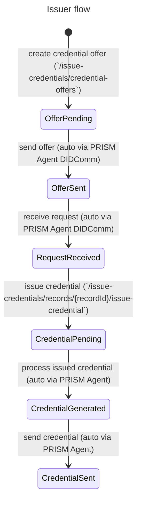
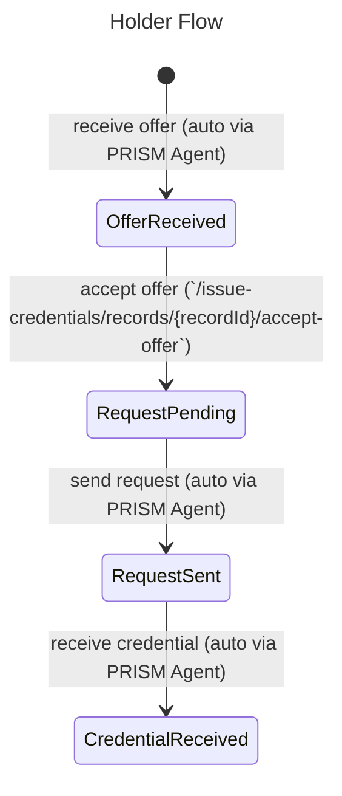
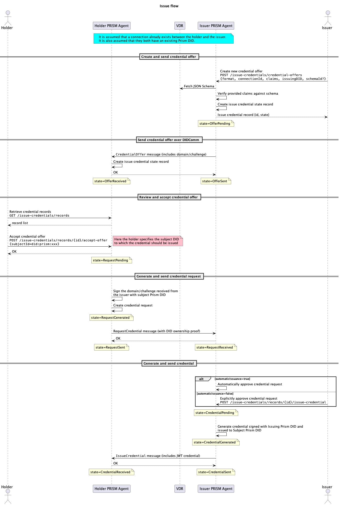
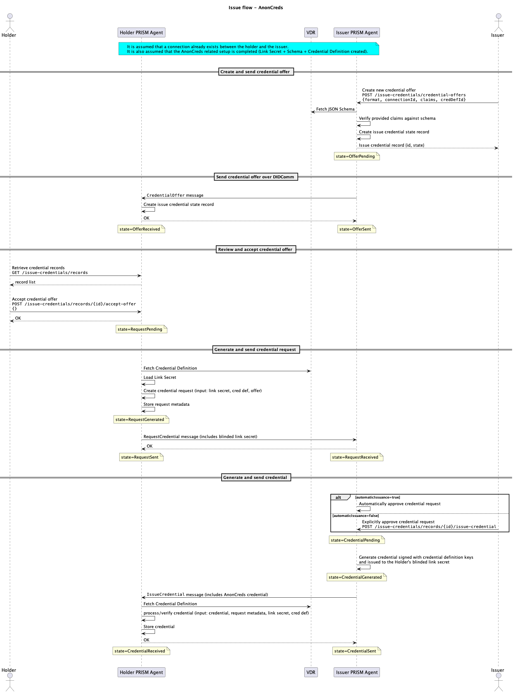

import Tabs from '@theme/Tabs';
import TabItem from '@theme/TabItem';

# Issue credentials (DIDComm)

In the Identus Platform, the [Issue Credentials Protocol](/docs/concepts/glossary#issue-credentials-protocol) allows you to create, retrieve, and manage issued [verifiable credentials (VCs)](/docs/concepts/glossary#verifiable-credentials) between a VC issuer and a VC holder.

## Roles

In the Issue Credentials Protocol, there are two roles:

1. The [Issuer](/docs/concepts/glossary#issuer) is responsible for creating a new credential offer, sending it to a Holder, and issuing the VC once the offer is accepted.
2. The [Holder](/docs/concepts/glossary#holder) is responsible for accepting a credential offer from an issuer and receiving the VC.

The Issuer and Holder interact with the Identus Cloud Agent API to perform the operations defined in the protocol.


## Prerequisites

Before using the Issuing Credentials protocol, the following conditions must be present:

<Tabs groupId="vc-formats">
<TabItem value="jwt" label="JWT">

1. Issuer and Holder Cloud Agents up and running
2. A connection must be established between the Issuer and Holder Cloud Agents (see [Connections](../connections/connection.md))
3. The Issuer must have a published PRISM DID, and the [DID document](/docs/concepts/glossary#did-document) must have at least one `assertionMethod` key for issuing credentials (see [Create DID](../dids/create.md) and [Publish DID](../dids/publish.md))
4. The Holder must have a PRISM DID, and the DID document must have at least one `authentication` key for presenting the proof.

</TabItem>
<TabItem value="anoncreds" label="AnonCreds">

1. Issuer and Holder Cloud Agents up and running
2. A connection must be established between the Issuer and Holder Cloud Agents (see [Connections](../connections/connection.md))
3. The Issuer must have created an AnonCreds Credential Definition as described [here](../credentialdefinition/create.md).

</TabItem>
<TabItem value="sdjwt" label="SDJWT">

- 📌 **Note:** Currently we only support `Ed25519` curve
1. Issuer and Holder Cloud Agents up and running
2. A connection must be established between the Issuer and Holder Cloud Agents (see [Connections](../connections/connection.md))
3. The Issuer must have a published PRISM DID, and the [DID document](/docs/concepts/glossary#did-document) must have at least one `assertionMethod` key for issuing credentials and the curve must be `Ed25519` (see [Create DID](../dids/create.md) and [Publish DID](../dids/publish.md))
4. The Holder must have a PRISM DID, and the DID document must have at least one `authentication` key for presenting the proof and the curve must be `Ed25519`.

</TabItem>
</Tabs>

## Overview

The protocol described is a VC issuance process between two Identus Cloud Agents, the Issuer and the Holder.

The protocol consists of the following main parts:

1. The Issuer creates a new credential offer using the [`/issue-credentials/credential-offers`](/agent-api/#tag/Issue-Credentials-Protocol/operation/createCredentialOffer) endpoint, which includes information such as the schema identifier and claims.
2. The Holder can then retrieve the offer using the [`/issue-credentials/records`](/agent-api/#tag/Issue-Credentials-Protocol/operation/getCredentialRecords) endpoint and accept the offer using the [`/issue-credentials/records/{recordId}/accept-offer`](/agent-api/#tag/Issue-Credentials-Protocol/operation/acceptCredentialOffer) endpoint.
3. The Issuer then uses the [`/issue-credentials/records/{recordId}/issue-credential`](/agent-api/#tag/Issue-Credentials-Protocol/operation/issueCredential) endpoint to issue the credential, which gets sent to the Holder via [DIDComm](/docs/concepts/glossary#didcomm). The Holder receives the credential, and the protocol is complete.

The claims provide specific information about the individual, such as their name or qualifications.

This protocol is applicable in various real-life scenarios, such as educational credentialing, employment verification, and more.
In these scenarios, the Issuer could be a school, an employer, etc., and the Holder could be a student or an employee.
The VCs issued during this protocol could represent a diploma, a certificate of employment, etc.

## Endpoints

| Endpoint                                                                                                                           | Description                                                                              | Role           |
|------------------------------------------------------------------------------------------------------------------------------------|------------------------------------------------------------------------------------------|----------------|
| [`/issue-credentials/credential-offers`](/agent-api/#tag/Issue-Credentials-Protocol/operation/createCredentialOffer)               | This endpoint allows you to create a new credential offer                                | Issuer         |
| [`/issue-credentials/records`](/agent-api/#tag/Issue-Credentials-Protocol/operation/getCredentialRecords)                          | This endpoint allows you to retrieve a collection of all the existing credential records | Issuer, Holder |
| [`/issue-credentials/records/{recordId}`](/agent-api/#tag/Issue-Credentials-Protocol/operation/getCredentialRecord)                | This endpoint allows you to retrieve a specific credential record by its `id`            | Issuer, Holder |
| [`/issue-credentials/records/{recordId}/accept-offer`](/agent-api/#tag/Issue-Credentials-Protocol/operation/acceptCredentialOffer) | This endpoint allows you to accept a credential offer                                    | Holder         |
| [`/issue-credentials/records/{recordId}/issue-credential`](/agent-api/#tag/Issue-Credentials-Protocol/operation/issueCredential)   | This endpoint allows you to issue a VC for a specific credential record.                 | Issuer         |


:::info
Please check the full [Cloud Agent API](/agent-api) specification for more detailed information.
:::

## Issuer interactions

This section describes the Issuer role's available interactions with the Cloud Agent.

### Creating a Credential Offer

To start the process, the issuer needs to create a credential offer.
To do this, make a `POST` request to the [`/issue-credentials/credential-offers`](/agent-api/#tag/Issue-Credentials-Protocol/operation/createCredentialOffer) endpoint with a JSON payload that includes the following information:

<Tabs groupId="vc-formats">
<TabItem value="jwt" label="JWT">

1. `claims`: The data stored in a verifiable credential. Claims get expressed in a key-value format. The claims contain the data that the issuer attests to, such as name, address, date of birth, and so on.
2. `issuingDID`: The DID referring to the issuer to issue this credential from
3. `connectionId`: The unique ID of the connection between the holder and the issuer to offer this credential over.
4. `schemaId`: An optional field that, if specified, contains a valid URL to an existing VC schema.
   The Cloud Agent must be able to dereference the specified URL (i.e. fetch the VC schema content from it), in order to validate the provided claims against it.
   When not specified, the claims fields is not validated and can be any valid JSON object.
   Please refer to the [Create VC schema](../schemas/create.md) doc for details on how to create a VC schema.
5. `credentialFormat`: The format of the credential that will be issued - `JWT` in this case. When not specified, the default value is `JWT`.


:::note
The `issuingDID` and `connectionId` properties come from completing the pre-requisite steps listed above
:::

Once the request initiates, a new credential record for the issuer gets created with a unique ID. The state of this record is now `OfferPending`.

```shell
# Issuer POST request to create a new credential offer
curl -X 'POST' \
  'http://localhost:8080/cloud-agent/issue-credentials/credential-offers' \
    -H 'accept: application/json' \
    -H 'Content-Type: application/json' \
    -H "apikey: $API_KEY" \
    -d '{
          "claims": {
            "emailAddress": "alice@wonderland.com",
            "givenName": "Alice",
            "familyName": "Wonderland",
            "dateOfIssuance": "2020-11-13T20:20:39+00:00",
            "drivingLicenseID": "12345",
            "drivingClass": 3
          },
          "credentialFormat": "JWT",
          "issuingDID": "did:prism:9f847f8bbb66c112f71d08ab39930d468ccbfe1e0e1d002be53d46c431212c26",
          "connectionId": "9d075518-f97e-4f11-9d10-d7348a7a0fda",
          "schemaId": "http://localhost:8080/cloud-agent/schema-registry/schemas/3f86a73f-5b78-39c7-af77-0c16123fa9c2"
        }'
```

</TabItem>
<TabItem value="anoncreds" label="AnonCreds">

1. `claims`: The data stored in a verifiable credential. AnonCreds claims get expressed in a flat, "string -> string", key-value pair format. The claims contain the data that the issuer attests to, such as name, address, date of birth, and so on.
2. `connectionId`: The unique ID of the connection between the holder and the issuer to offer this credential over.
3. `credentialDefinitionId`: The unique ID of the [credential definition](../credentialdefinition/credential-definition.md) that has been created by the issuer as a prerequisite. Please refer to the [Create AnonCreds Credential Definition](../credentialdefinition/credential-definition.md) doc for details on how to create a credential definition.
:::note
📌 Note: If the credential definition was created via HTTP URL endpoint, then this credential definition will be referenced to that credential via HTTP URL, and if this credential definition was created via DID URL endpoint, then it will be referenced via DID URL, How to create credential definition for HTTP URL or DID URL is explained in [credential definition creation guide](../credentialdefinition/create.md)
:::
4. `credentialFormat`: The format of the credential that will be issued - `AnonCreds` in this case.  
5. `issuingDID`: The DID referring to the issuer to issue this credential from
:::note
The `connectionId` and `credentialDefinitionId` properties come from completing the pre-requisite steps listed above
:::

Once the request initiates, a new credential record for the issuer gets created with a unique ID. The state of this record is now `OfferPending`.

```shell
# Issuer POST request to create a new credential offer
curl -X 'POST' \
  'http://localhost:8080/cloud-agent/issue-credentials/credential-offers' \
    -H 'accept: application/json' \
    -H 'Content-Type: application/json' \
    -H "apikey: $API_KEY" \
    -d '{
          "claims": {
            "emailAddress": "alice@wonderland.com",
            "givenName": "Alice",
            "familyName": "Wonderland",
            "dateOfIssuance": "2020-11-13T20:20:39+00:00",
            "drivingLicenseID": "12345",
            "drivingClass": "3"
          },
          "credentialFormat": "AnonCreds",
          "issuingDID": "did:prism:9f847f8bbb66c112f71d08ab39930d468ccbfe1e0e1d002be53d46c431212c26",
          "connectionId": "9d075518-f97e-4f11-9d10-d7348a7a0fda",
          "credentialDefinitionId": "5d737816-8fe8-3492-bfe3-1b3e2b67220b"
        }'
```

</TabItem>

<TabItem value="sdjwt" label="SDJWT">

1. `claims`: The data stored in a verifiable credential. Claims get expressed in a key-value format. The claims contain the data that the issuer attests to, such as name, address, date of birth, and so on.
2. `issuingDID`: The DID referring to the issuer to issue this credential from
3. `connectionId`: The unique ID of the connection between the holder and the issuer to offer this credential over.
4. `schemaId`: An optional field that, if specified, contains a valid URL to an existing VC schema.
   The Cloud Agent must be able to dereference the specified URL (i.e. fetch the VC schema content from it), in order to validate the provided claims against it.
   When not specified, the claims fields is not validated and can be any valid JSON object.
   Please refer to the [Create VC schema](../schemas/create.md) doc for details on how to create a VC schema.
5. `credentialFormat`: The format of the credential that will be issued - `SDJWT` in this case.


:::note
The `issuingDID` and `connectionId` properties come from completing the pre-requisite steps listed above
:::

- 📌 **Note:** Claims can also include the `exp` Expiration Time attribute, which is part of JWT claims. `exp` attribute is disclosable if specified and can have a value in epoch time (in seconds), indicating when the SDJWT credential expires for more details
[RFC5719](https://datatracker.ietf.org/doc/html/rfc7519#page-9)

Once the request initiates, a new credential record for the issuer gets created with a unique ID. The state of this record is now `OfferPending`.

```shell
# Issuer POST request to create a new credential offer
curl -X 'POST' \
  'http://localhost:8080/cloud-agent/issue-credentials/credential-offers' \
    -H 'accept: application/json' \
    -H 'Content-Type: application/json' \
    -H "apikey: $API_KEY" \
    -d '{
          "claims": {
            "emailAddress": "alice@wonderland.com",
            "givenName": "Alice",
            "familyName": "Wonderland",
            "dateOfIssuance": "2020-11-13T20:20:39+00:00",
            "drivingLicenseID": "12345",
            "drivingClass": 3,
            "exp" : 1883000000
          },
          "credentialFormat": "SDJWT",
          "issuingDID": "did:prism:9f847f8bbb66c112f71d08ab39930d468ccbfe1e0e1d002be53d46c431212c26",
          "connectionId": "9d075518-f97e-4f11-9d10-d7348a7a0fda",
          "schemaId": "http://localhost:8080/cloud-agent/schema-registry/schemas/3f86a73f-5b78-39c7-af77-0c16123fa9c2"
        }'
```

</TabItem>
</Tabs>


### Sending the Offer to the Holder

The next step for the Issuer is to send the offer to the holder using DIDComm.
To do this, the Issuer agent will process the offer and send it to the holder agent.
This process is automatic. The state of the Issuer's record will change to `OfferSent`.

### Issuing the Credential

Once the holder has approved the offer and sent a request to the Issuer,
the Issuer will receive the request via DIDComm and update the record state to `RequestReceived.`

The Issuer can then use the [`/issue-credentials/records/{recordId}/issue-credential`](/agent-api/#tag/Issue-Credentials-Protocol/operation/issueCredential) endpoint to issue the credential to the holder.

```shell
# Issuer POST request to issue the credential
# make sure you have `issuer_record_id` extracted from created credential offer
# and the record achieved `RequestReceived` state
curl -X POST \
    "http://localhost:8080/cloud-agent/issue-credentials/records/$issuer_record_id/issue-credential" \
    -H "Content-Type: application/json" \
    -H "apikey: $API_KEY"
```

When this endpoint gets called, the state of the record will change to `CredentialPending,` and after processing, it will change to `CredentialGenerated.`

Finally, the Issuer agent will send the credential to the holder via DIDComm,
and the state of the record will change to `CredentialSent`.
At this point, the Issuer's interactions with the holder are complete.



## Holder interactions

This section describes the Holder role's available interactions with the Cloud Agent.

### Receiving the VC Offer

The Holder will receive the offer from the Issuer via DIDComm,
and a new credential record with a unique ID gets created in the `OfferReceived` state.

This process is automatic for the Cloud Agent.

You could check if a new credential offer is available using [`/issue-credentials/records`](/#tag/Issue-Credentials-Protocol/operation/getCredentialRecords) request and check for any records available in `OfferReceived` state:
```shell
# Holder GET request to retrieve credential records
curl "http://localhost:8090/cloud-agent/issue-credentials/records" \
    -H "Content-Type: application/json" \
    -H "apikey: $API_KEY"
```


### Approving the VC Offer

To accept the offer, the Holder can make a `POST` request to the [`/issue-credentials/records/{recordId}/accept-offer`](/agent-api/#tag/Issue-Credentials-Protocol/operation/acceptCredentialOffer) endpoint with a JSON payload that includes the following information:

<Tabs groupId="vc-formats">
<TabItem value="jwt" label="JWT">

1. `holder_record_id`: The unique identifier of the issue credential record known by the holder's Cloud Agent.
2. `subjectId`: This field represents the unique identifier for the subject of the verifiable credential. It is a short-form PRISM [DID](/docs/concepts/glossary#decentralized-identifier) string, such as `did:prism:subjectIdentifier`.

```shell
# Holder POST request to accept the credential offer
curl -X POST "http://localhost:8090/cloud-agent/issue-credentials/records/$holder_record_id/accept-offer" \
    -H 'accept: application/json' \
    -H 'Content-Type: application/json' \
    -H "apikey: $API_KEY" \
    -d '{
          "subjectId": "did:prism:subjectIdentifier"
     }'
```

</TabItem>
<TabItem value="anoncreds" labal="AnonCreds">

1. `holder_record_id`: The unique identifier of the issue credential record known by the holder's Cloud Agent.

```shell
# Holder POST request to accept the credential offer
curl -X POST "http://localhost:8090/cloud-agent/issue-credentials/records/$holder_record_id/accept-offer" \
    -H 'accept: application/json' \
    -H 'Content-Type: application/json' \
    -H "apikey: $API_KEY" \
    -d '{}'
```

</TabItem>

<TabItem value="sdjwt" label="SDJWT">

1. `holder_record_id`: The unique identifier of the issue credential record known by the holder's Cloud Agent.
2. `subjectId`: This field represents the unique identifier for the subject of the verifiable credential. It is a short-form PRISM [DID](/docs/concepts/glossary#decentralized-identifier) string, such as `did:prism:subjectIdentifier`.
3. `keyId` Option parameter
   1. when keyId is not provided the SDJWT VC is not binded to Holder/Prover key
   ```shell
   # Holder POST request to accept the credential offer
   curl -X POST "http://localhost:8090/cloud-agent/issue-credentials/records/$holder_record_id/accept-offer" \
       -H 'accept: application/json' \
       -H 'Content-Type: application/json' \
       -H "apikey: $API_KEY" \
       -d '{
             "subjectId": "did:prism:subjectIdentifier"
        }'
   ```
   A SD-JWT Verifiable Credential (VC) without a `cnf` key could possibly look like below

   ```json
    {
     "_sd": [
       "CrQe7S5kqBAHt-nMYXgc6bdt2SH5aTY1sU_M-PgkjPI",
       "JzYjH4svliH0R3PyEMfeZu6Jt69u5qehZo7F7EPYlSE",
       "PorFbpKuVu6xymJagvkFsFXAbRoc2JGlAUA2BA4o7cI",
       "TGf4oLbgwd5JQaHyKVQZU9UdGE0w5rtDsrZzfUaomLo",
       "XQ_3kPKt1XyX7KANkqVR6yZ2Va5NrPIvPYbyMvRKBMM",
       "XzFrzwscM6Gn6CJDc6vVK8BkMnfG8vOSKfpPIZdAfdE",
       "gbOsI4Edq2x2Kw-w5wPEzakob9hV1cRD0ATN3oQL9JM",
       "jsu9yVulwQQlhFlM_3JlzMaSFzglhQG0DpfayQwLUK4"
     ],
     "iss": "https://issuer.example.com",
     "iat": 1683000000,
     "exp": 1883000000,
     "sub": "user_42",
     "_sd_alg": "sha-256"
   }
   ```
   2. `keyId`: This is optional field but must be specified to choose which key bounds to the verifiable credential.
   For more information on key-binding, [ietf-oauth-selective-disclosure-jwt](https://datatracker.ietf.org/doc/draft-ietf-oauth-selective-disclosure-jwt).
   Currently, we only support the EdDSA algorithm and curve Ed25519.
   The specified keyId should be of type Ed25519.
   The purpose of the keyId should be authentication.

   ```shell
   # Holder POST request to accept the credential offer with keyId
   curl -X POST "http://localhost:8090/cloud-agent/issue-credentials/records/$holder_record_id/accept-offer" \
       -H 'accept: application/json' \
       -H 'Content-Type: application/json' \
       -H "apikey: $API_KEY" \
       -d '{
             "subjectId": "did:prism:subjectIdentifier",
             "keyId": "key-1"    
        }'
   ```
   A SD-JWT Verifiable Credential (VC) that includes a `cnf` key could possibly look like below
   ```json
    {
     "_sd": [
       "CrQe7S5kqBAHt-nMYXgc6bdt2SH5aTY1sU_M-PgkjPI",
       "JzYjH4svliH0R3PyEMfeZu6Jt69u5qehZo7F7EPYlSE",
       "PorFbpKuVu6xymJagvkFsFXAbRoc2JGlAUA2BA4o7cI",
       "TGf4oLbgwd5JQaHyKVQZU9UdGE0w5rtDsrZzfUaomLo",
       "XQ_3kPKt1XyX7KANkqVR6yZ2Va5NrPIvPYbyMvRKBMM",
       "XzFrzwscM6Gn6CJDc6vVK8BkMnfG8vOSKfpPIZdAfdE",
       "gbOsI4Edq2x2Kw-w5wPEzakob9hV1cRD0ATN3oQL9JM",
       "jsu9yVulwQQlhFlM_3JlzMaSFzglhQG0DpfayQwLUK4"
     ],
     "iss": "https://issuer.example.com",
     "iat": 1683000000,
     "exp": 1883000000,
     "sub": "user_42",
     "_sd_alg": "sha-256",
     "cnf": {
       "jwk": {
         "kty": "EC",
         "crv": "P-256",
         "x": "TCAER19Zvu3OHF4j4W4vfSVoHIP1ILilDls7vCeGemc",
         "y": "ZxjiWWbZMQGHVWKVQ4hbSIirsVfuecCE6t4jT9F2HZQ"
       }
     }
   }
   ```

</TabItem>

</Tabs>

This request will change the state of the record to `RequestPending`.

### Receiving the VC Credential

Once the Holder has approved the offer and sent a request to the Issuer, the Holder agent will process the request and send it to the Issuer agent.
The state of the Holder's record will change to `RequestSent`.

After the Issuer has issued the credential, the Holder will receive the credential via DIDComm, and the state of the Holder's record will change to `CredentialReceived`.
This process is automatic for the Cloud Agent.

The Holder can check the achieved credential using a GET request to [`/issue-credentials/records/{recordId}/`](/agent-api/#tag/Issue-Credentials-Protocol/operation/getCredentialRecord) endpoint.



## Sequence diagram

The following diagram shows the end-to-end flow for an issuer to issue a VC to a holder.

<Tabs groupId="vc-formats">
<TabItem value="jwt" label="JWT">



</TabItem>
<TabItem value="anoncreds" label="AnonCreds">



</TabItem>
</Tabs>