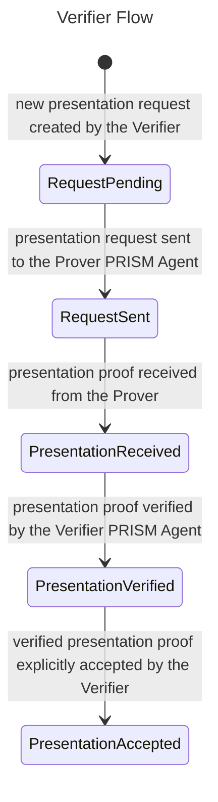
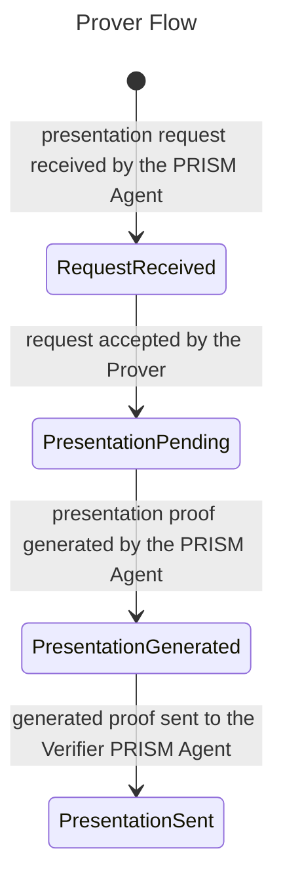
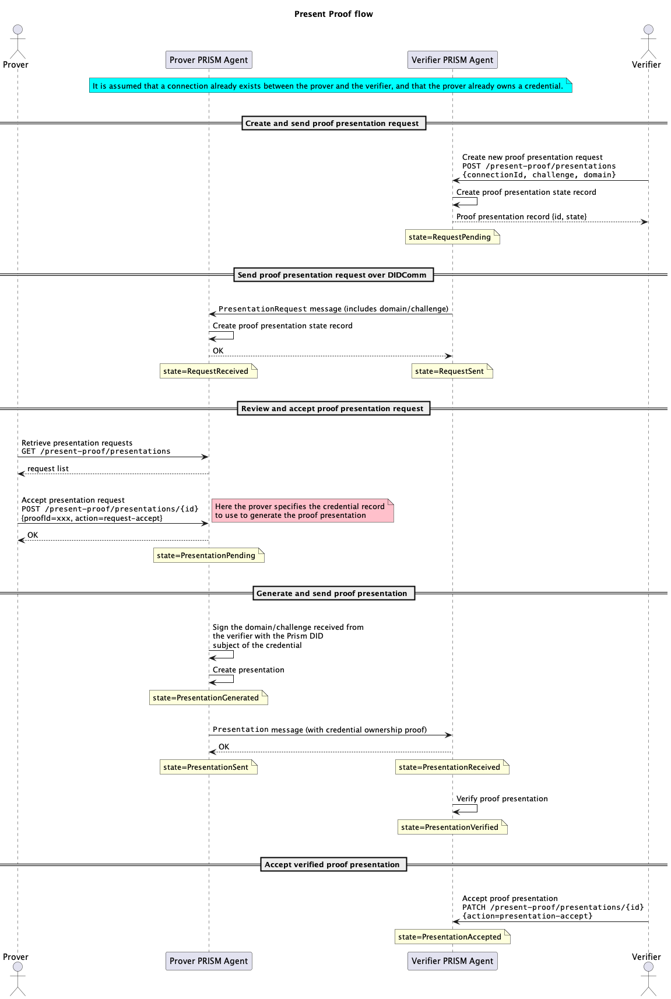

# Present proof

The **Present Proof Protocol** allows:
- a **Verifier** to request a verifiable credential presentation from a **Prover**
- a **Prover** to respond by presenting a proof to the **Verifier**

The protocol provides endpoints for a **Verifier** to request new proof presentations from provers, and for a **Prover** to respond to the presentation request using a specific verifiable credential he owns.

## Roles

The present proof protocol has two roles:

1.  **Verifier**: A subject that requests the presentation of a proof by sending a *request presentation* message, and then verifies the presentation.
2.  **Prover**: A subject that receives a proof presentation request, prepares a proof and sends it to the verifier by sending a *proof presentation* message.

## Prerequisites

Before using the **Proof Presentation protocol**, the following conditions must be present:

1. **Prover** and **Verifier** PRISM Agents must be up and running
2. A connection must be established between the **Prover** and **Verifier** PRISM Agents (see [Connections](../connections/connection.md))
3. The **Prover** should hold a verifiable credential (VC) received from an **Issuer** (see [Issue](./issue.md))

## Overview

This protocol supports the presentation of verifiable claims between two Atala PRISM Agents, the **Prover** and the **Verifier**.

The protocol consists of the following main parts:

1. The **Verifier** creates a new proof presentation request using the [`/present-proof/presentations`](/agent-api/#tag/Present-Proof/operation/requestPresentation) endpoint. It includes the identifier of an existing `connection` between both parties as well as a `domain` and `challenge` to protect from potential replay attacks.
2. The **Prover** receives the presentation request from the **Verifier** and can retrieve the list of existing requests using the [`/present-proof/presentations`](/agent-api/#tag/Present-Proof/operation/getAllPresentation) endpoint.
3. The **Prover** can then review and accept a specific request using the [`/present-proof/presentations/{presentationId}`](/agent-api/#tag/Present-Proof/operation/updatePresentation) endpoint, providing the identifier of the `credential` record to use in the proof presentation.
4. The **Verifier** receives the proof presentation from the **Prover** and can accept it using the [`/present-proof/presentations/{presentationId}`](/agent-api/#tag/Present-Proof/operation/updatePresentation) endpoint, specifying `presentation-accept` as action type.

## Endpoints

| Endpoint | Method | Description | Role |
| --- | --- | --- | --- |
| [`/present-proof/presentations`](/agent-api/#tag/Present-Proof/operation/requestPresentation) | POST | Creates and sends a new proof presentation request.  | Verifier |
| [`/present-proof/presentations`](/agent-api/#tag/Present-Proof/operation/getAllPresentation) | GET | Retrieves the collection of all the existing presentation proof records - sent or received. | Verifier, Prover |
| [`/present-proof/presentations/{id}`](/agent-api/#tag/Present-Proof/operation/getPresentation) | GET | Retrieves a specific presentation proof record by `id`. | Verifier, Prover |
| [`/present-proof/presentations/{id}`](/agent-api/#tag/Present-Proof/operation/updatePresentation) | PATCH | Updates an existing presentation proof record to e.g. accept the request on **Prover** side, or accept the presentation on **Verifier** side. | Verifier, Prover |

:::info
For more detailed information, please, check the full **[PRISM Agent API](/agent-api).**
:::

## Verifier interactions

This section describes the interactions available to the **Verifier** with his PRISM Agent.

### Creating and sending a Presentation Request

To start the process, the verifier needs to create a proof presentation request.
To do this, he makes a `POST` request to the [`/present-proof/presentations`](/agent-api/#tag/Present-Proof/operation/requestPresentation) endpoint with a JSON payload that includes the following information:

1. `connectionId`: This field represents the unique identifier of an existing connection between the verifier and the prover. This connection will be used to exchange messages related to the protocol flow execution.
2. `challenge` and `domain`: The random seed challenge and operational domain are provided by the **Verifier** and must be signed by the **Prover** in the generated proof in order to protect from replay attacks.

```bash
curl -X 'POST' 'http://localhost:8070/prism-agent/present-proof/presentations' \
  -H 'accept: application/json' \
  -H 'Content-Type: application/json' \
  -d '{
        "connectionId": "872ddfa9-4115-46c2-8a1b-22c24c7431d7",
        "proofs":[],
        "options": {
          "challenge": "11c91493-01b3-4c4d-ac36-b336bab5bddf",
          "domain": "https://prism-verifier.com"
        }
      }'
```

Upon execution, a new presentation request record will be created with an initial state of `RequestPending`. The **Verifier** PRISM Agent will take care of sending the presentation request message to the PRISM Agent of the **Prover** through the specified DIDComm connection. The record state will then be moved to `RequestSent`.

The **Verifier** can retrieve the list of presentation records making a `GET` request to the [`/present-proof/presentations`](/agent-api/#tag/Present-Proof/operation/getAllPresentation) endpoint:
```bash
curl -X 'GET' 'http://localhost:8070/prism-agent/present-proof/presentations' \
  -H 'accept: application/json'
```

### Accept presentation proof received from the prover
Once the **Prover** has received a proof presentation request, he can accept it using an appropriate verifiable credential. The PRISM Agent of the **Verifier** will receive that proof and verify it. Upon successful verification, the presentation record state will be moved to `PresentationVerified`.

The **Verifier** can then explicitly accept the specific verified proof presentation to move the record state to `PresentationAccepted`. This can be achieved by making a `PATCH` request to the [`/present-proof/presentations/{id}`](/agent-api/#tag/Present-Proof/operation/updatePresentation) endpoint:

```bash
curl -X 'PATCH' 'http://localhost:8070/prism-agent/present-proof/presentations/{PRESENTATION_ID}' \
  -H 'Content-Type: application/json' \
  -d '{
        "action": "presentation-accept"
      }'
```



## Prover
This section describes the interactions available to the **Prover** with his PRISM Agent.

### Reviewing and accepting a received presentation request
The **Prover** can retrieve the list of presentation requests received by its PRISM Agent from different **Verifiers** making a `GET` request to the [`/present-proof/presentations`](/agent-api/#tag/Present-Proof/operation/getAllPresentation) endpoint:

```bash
curl -X 'GET' 'http://localhost:8090/prism-agent/present-proof/presentations' \
  -H 'accept: application/json'
```

The **Prover** can then accept a specific request, generate the proof, and send it to the **Verifier** PRISM Agent by making a `PATCH` request to the [`/present-proof/presentations/{id}`](/agent-api/#tag/Present-Proof/operation/updatePresentation) endpoint:

```bash
curl -X 'PATCH' 'http://localhost:8090/prism-agent/present-proof/presentations/{PRESENTATION_ID}' \
  -H 'Content-Type: application/json' \
  -d '{
        "action": "request-accept",
        "proofId": ["{CRED_RECORD_ID}"]
      }'
```

He will have to provide the following information:
1. `presentationId`: The unique identifier of the presentation record to accept.
2. `proofId`: The unique identifier of the verifiable credential record to use as proof. 

Doing so, the record state will be moved to `PresentationPending` and processed by the Prover PRISM Agent. The agent will automatically generate the proof presentation - and move the state to `PresentationGenerated` - and will eventually send it to the Verifier Agent - and move the state to `PresentationSent`.



## Sequence diagram

The following diagram shows the end-to-end flow for a verifier to request and verify a proof presentation from a prover. 

