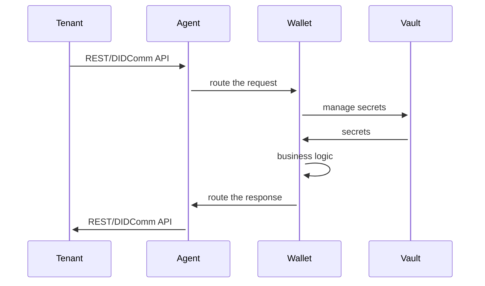

# Secret storage

**Status**: draft

**Date**: 2021-06-02

**NOTE**: this document is a draft and is not implemented yet. Statement in this document might be changed in the future.


## Introduction

Secrets are sensitive data that should be stored securely.
There are following types of the secrets in the Identus Platform:
- seed: a secret used to derive cryptographic keys
- private key: a secret used to sign data
- any other entities that contain sensitive data (for instance, `credential-definition` and the `link-secret` used by the AnonCreds)

**NOTE**: public keys are not considered as secrets and can be stored in the same of other storage depending on the needs

The Identus Platform provides a secure storage for secrets.
Hashicorp Vault is used as a secret storage service and provides a REST API, Web UI and command client to interact with the service.

**NOTE:** The Identus Platform uses a single Vault instance for all tenants per environment. Logical data separation is achieved by using Vault namespaces and policies applied to the tenant.

## Terminology

### Vault
Vault is a secrets management service developed by HashiCorp.
It can be used as the default secret storage for the Identus Platform as well as for authentication and account management.

**NOTE**: The Identus Platform must not be dependent on the Vault service and must be able to use other services for the same purposes

### Agent
The Cloud Agent is a service that provides an APIs to interact with the Identus Platform and use the SSI capabilities.

### Wallet
Logical component of the Agent that holds secrets and provides the logical or physical isolation of the data.

## Technical Overview

### The Cloud Agent Logical Isolation
Each instance of the Cloud Agent needs to have access to the secrets but must be isolated from other agents at the same environment.
For horizontal scalability the group of agents can be configured to share the same namespace, so they can access the same secrets, but they still need to use different Vault account to authenticate themselves to the Vault service.

### The Cloud Agent Authentication
Each instance of the Cloud Agent needs to authenticate itself to the Vault service.
The Vault service uses a token-based authentication mechanism.
The Cloud Agent uses a Vault [AppRole](https://developer.hashicorp.com/vault/docs/auth/approle) authentication method to authenticate itself to the Vault service.
The token issued to the agent has the expiration time set in the application configuration.
After the token expires, the agent needs to re-authenticate itself to the Vault service.

### Wallet Authentication
Each instance of the Wallet needs to authenticate itself to the Vault service.
The Cloud Agent issues the authentication token to the Wallet based on the tenant ID.

### Secrets Engine Configuration
The Vault service uses a secrets engine to store secrets.
KV2 secrets engine is used to store secrets in the Vault service and provides the following features:
- secrets are encrypted at rest
- secrets are encrypted in transit
- secrets are versioned
- secrets can be deleted, restored and rolled back to a previous version
- secrets are available via REST API, WEB UI, and command client
- secrets are logically separated by tenants

### Single and Multi-Tenant Configuration
The Identus Platform supports single and multi-tenant configurations.
In the single-tenant configuration, the Cloud Agent uses a single Wallet and a single Vault account to authenticate itself to the Vault service.
In the multi-tenant configuration, the Cloud Agent manages multiple Wallets, each Wallet is associated with a single tenant.
Multi-tenant configuration is used to achieve logical data separation between tenants, so each Wallet can access only its own secrets.
The Wallet is identified by the tenant ID and represented by the account in the Vault service.

The common sequence diagram for the single and multi-tenant configurations is shown below:



### Key Derivation

The Identus Platform uses HD key derivation to derive cryptographic keys from the seed.
The Wallet is initialized with the seed and uses it to derive cryptographic keys for managed DIDs.
Key derivation path is conventional and is defined as follows:
```
m / wallet-purpose / DID-index / key-purpose / key-index
```

### Naming Convention

To store the assets in the Vault service each asset is assigned a unique name.
The Vault is a key/value store with metadata attached to the key and versioning.

The naming convention for the Vault assets is a matter of the implementation, but for the multi-tenant configuration all the assets of the Wallet must be stored under the path that contains the `tenant-id`.

For example, the `seed` can be stored by the following path:

```
<tenant-id>/seed value=<base64-encoded-value> <metadata>
```

The private keys for the DID can be stored by the following path:

```
<tenant-id>/dids/prism/<did-ref>/keys/<key-purpose>/<key-index>/<operation-hash> value=<base64-encoded-value> <metadata>
```

where:
- `tenant-id` is the tenant ID assigned to the Wallet
- `did-ref` is the DID ref
- `key-purpose` is the key purpose according to the PRISM DID Method specification
- `key-index` is the key index. Starts from 0 and grows incrementally after each key rotation
- `operation-hash` is the reference to the update DID document operation
- `base64-encoded-value` is the base64-encoded value of the key
- `metadata` is the key/value metadata attached the key that can be used to store additional information about the key such as `seed` or `key-derivation-path`

The keys material of the DID peer can be stored by the following path:

```
<tenant-id>/dids/peer/<did-ref>/keys/<key-purpose> value=<base64-encoded-value> <metadata>
```

Links:
- [PRISM DID Method Specification](https://github.com/input-output-hk/prism-did-method-spec)
- [Vault Secrets Engine API](https://www.vaultproject.io/api/secret/kv/kv-v2)
- [Vault Namespaces](https://www.vaultproject.io/docs/concepts/namespaces)
- [HD Key Derivation ADR](https://github.com/input-output-hk/atala-prism-building-blocks/blob/main/docs/decisions/20230516-hierarchical-deterministic-key-generation-algorithm.md)
- [Vault AppRole Authentication](https://www.vaultproject.io/docs/auth/approle)
- [Vault Token Authentication](https://www.vaultproject.io/docs/auth/token)
- [Vault KV Secrets Engine](https://www.vaultproject.io/docs/secrets/kv/kv-v2)
- [Vault Entities](https://www.vaultproject.io/docs/concepts/entities)