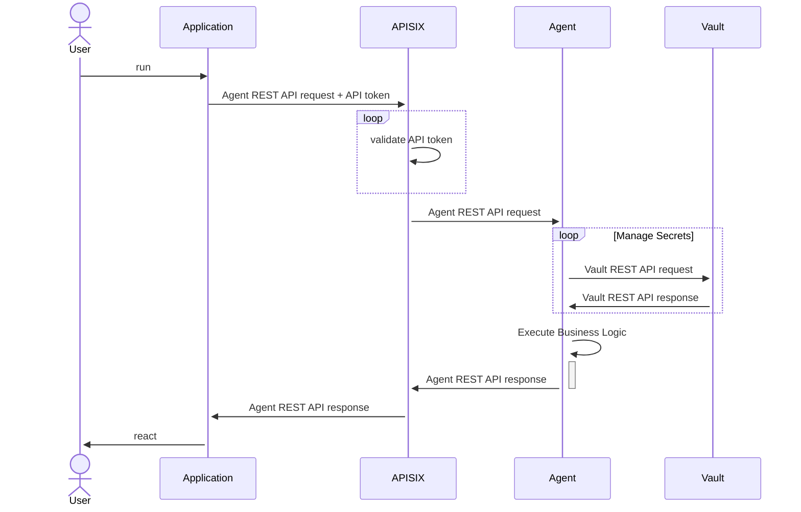
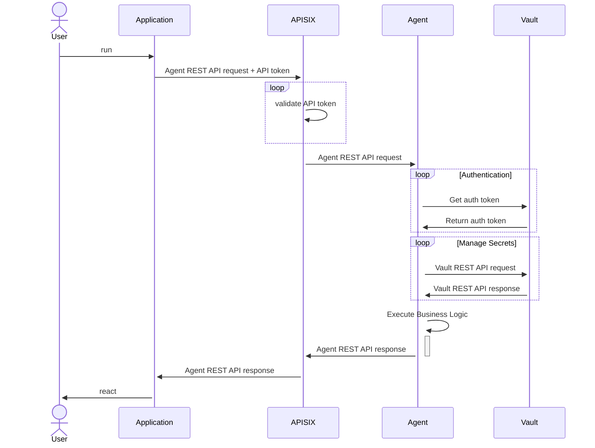
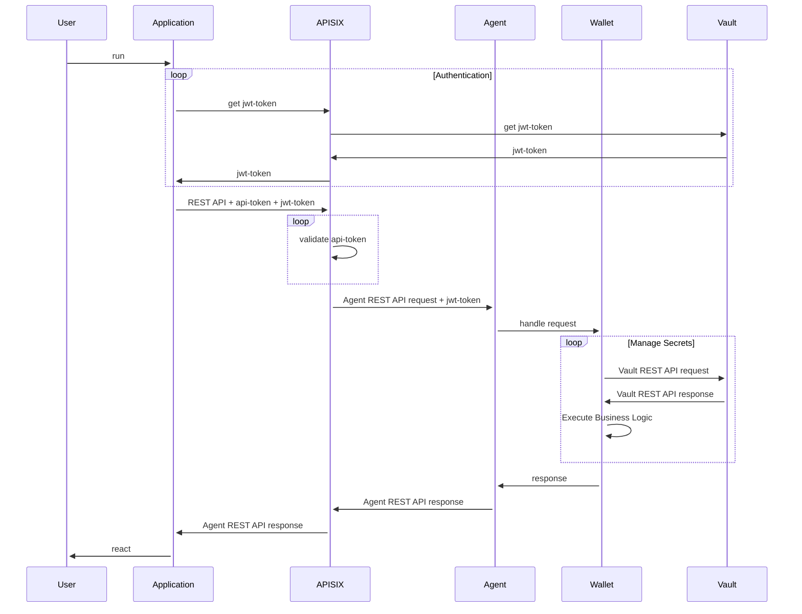

# Secret Storage Flows

**Status**: draft

**Date**: 2021-06-02

**NOTE**: this document is a draft and is not implemented yet. Statement in this document might be changed in the future.

## Introduction

The current document describes the sequence diagrams of the Identus Platform components: APISIX, Cloud Agent, Wallet, Vault, Tenant.
The diagrams are stated from the simplest scenarios to the more complex ones to enforce the security and privacy of the data.

## Sequence Diagrams

### Phase #1: Basic Flow for Secret Management

This diagram describes the basic flow for the secret management.

Goal : the Agent stores the secrets using the `root` token to access the Vault service

Context:
- Tenant uses the access token to access the REST API via APISIX.
- The Agent uses root Vault token to communicate with the Vault.
- Tenant represented by any REST API client, Web or Mobile application.

### Phase #2: Single Tenant Flow for Secret Management

This diagram describes the flow for the secret management for the single tenant.

Goal: AppRole authentication method is used to authenticate the Agent to the Vault service.

Context:
- The Agent is authenticated to the Vault using the AppRole authentication method.
- Tenant uses the access token to access the REST API via APISIX.
- Tenant represented by any REST API client, Web or Mobile application.

### Phase #3: Single Tenant Flow for Secret Management with Wallet

This diagram describes the flow for the secret management for the single tenant with the Wallet.

Goal: Tenant uses JWT token to authenticate to the Identus Platform.

Context:
- The Agent is authenticated to the Vault using the AppRole authentication method.
- Tenant uses the access token to access the REST API via APISIX (probably this might be removed, we need to decide what to do with the `api-token`)
- Tenant represented by any REST API client, Web or Mobile application authenticated to the Identus Platform using JWT token.
- Tenant uses the Wallet to communicate with the Vault

### Phase #4: Multi Tenant Flow for Secret Management

This diagram describes the flow for the secret management for the multi tenant.

//TBD