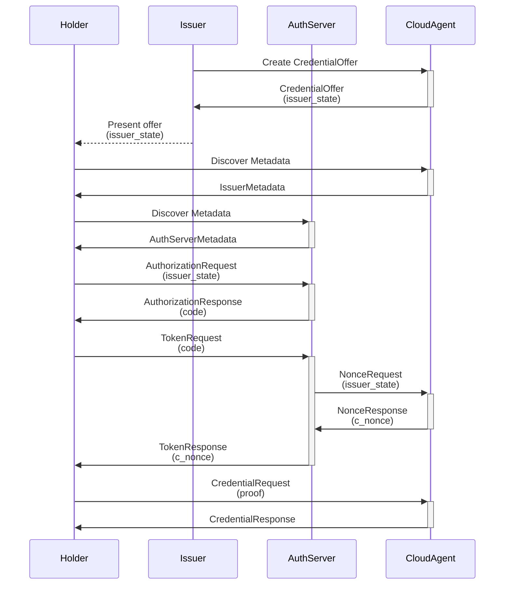

# OID4VCI Authorization Server contract

Identus Cloud Agent supports OID4VCI while allowing users to plug-in their authorization server.
The agent provides a credential endpoint, while the authorization server handles the authorization and token endpoints.
This flexibility enables integration with any existing authorization server potentially containing the holder user base.
The issuance flow implementation requires the authorization server to adhere to the contract, ensuring the agent can manage the issuance session and coordinate the process.

The Identus platform also provides the [Keycloak plugin reference implementation](https://github.com/hyperledger/identus-keycloak-plugins) showcasing the agent capability.
However, the authorization server is not limited to only Keycloak.

## Contract for Authorization Code issuance flow

The sequence diagram is largely based on [OID4VCI spec](https://openid.net/specs/openid-4-verifiable-credential-issuance-1_0.html#name-authorization-code-flow)
with slight modification to the __TokenEndpoint__.




### Authorization Endpoint

1. Authorization `scope` MUST be configured in the Authorization Server to the same value as in Credential Issuer Metadata
2. The endpoint MUST accept the parameter `issuer_state` in the [__AuthorizationRequest__](https://openid.net/specs/openid-4-verifiable-credential-issuance-1_0.html#section-5.1.3-2.3) and recall this value in the subsequent call on the __TokenEndpoint__

### Token Endpoint

1. When the holder makes a __TokenRequest__ to the __TokenEndpoint__, the __AuthorizationServer__ MUST recall the `issuer_state` parameter and make an HTTP call to the `/oid4vci/nonces` endpoint in the Cloud Agent using the following format.

__NonceRequest__

```
POST /oid4vci/nonces
Authorization: Bearer <JWT_TOKEN>

{
  "issuerState": "<ISSUER_STATE>"
}
```
Where `JWT_TOKEN` is a valid token issued by the __AuthorizationServer__.

__NonceResponse__

```
{
  "nonce": "<NONCE>",
  "nonceExpiresIn": <NONCE_EXPIRES_IN>
}
```

2. The [__TokenResponse__](https://openid.net/specs/openid-4-verifiable-credential-issuance-1_0.html#name-successful-token-response) must include `c_nonce` and `c_nonce_expires_in` parameter in the __TokenResponse__

