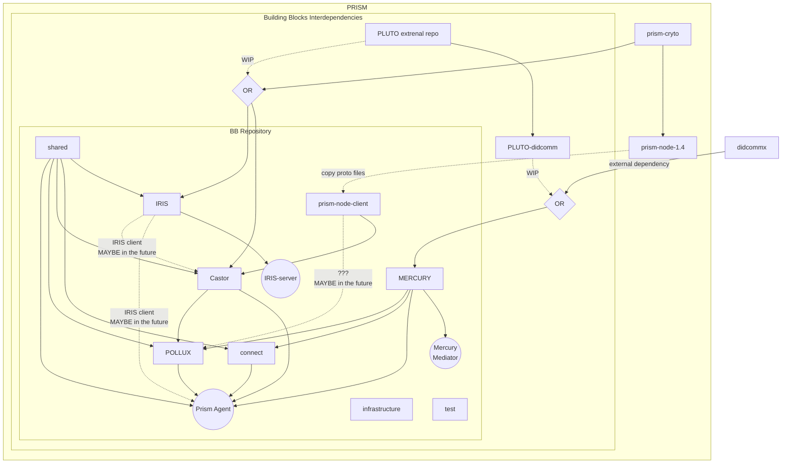

# Interdependencies

This document describes the interdependencies between the different Building Blocks.

**Note:**
- The **Mercury Libraries** collect all dependencies with the single cross version.
We will represent it as a single box here. But the actual dependencies can be of a subset of the Mercury Libraries.
For more information about the Mercury Modules Interdependencies, see [HERE](./mercury/mercury-library/README.md).
- The **Pollux Libraries** collect all dependencies with the single cross version.