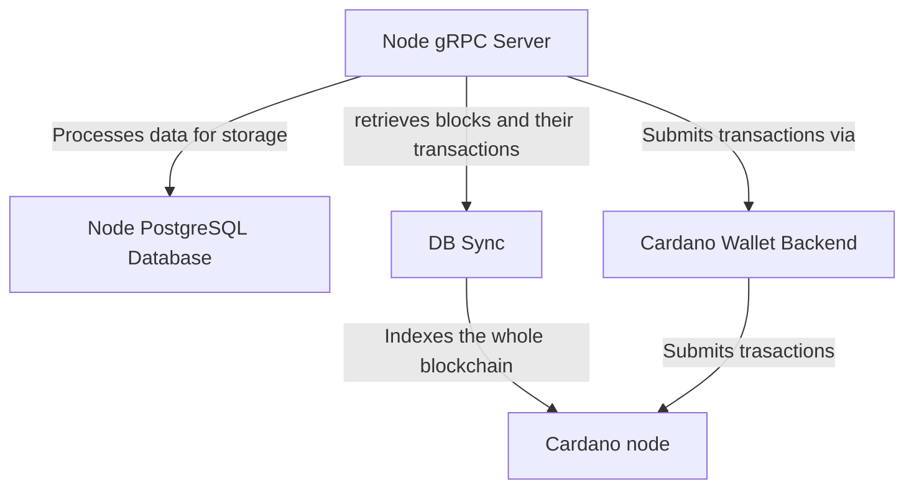

# Overview

The Node is a level 2 proxy on top of the Cardano blockchain responsible for publishing, resolving, updating, and deactivating DIDs. It exposes a gRPC API to perform all the operations above. 

:::note
This documentation will not describe the gRPC API itself.
:::

The Open Enterprise Agent communicates with the Node, with all operations conducted through it. The following documentation will provide a high-level overview of how the Node functions and explain its usage, including the environment variables required and how to deploy it to the Cardano mainnet and testnet.

# Node components

The Node consists of four separate executables:

1. Node gRPC server
2. Node PostgreSQL database
3. Cardano wallet backend
4. DB sync

#### Node gRPC server

The Node gRPC is a service responsible for submitting transactions to the Cardano network with a configurable frequency, retrieving blocks, and processing the data for storage in a database.


#### Node PostgreSQL database

The database used by the Node to store processed data, namely DID documents and their respective states.


#### Cardano wallet backend

An interface enables the Node to submit transactions to the Cardano node.

#### DB sync.

The Node uses an indexed version of the Cardano blockchain to access and parse minted blocks.




### Node environment variables


| Environment Variable                    | Description                                                                           | Default Value   |  Data Type                       |
|-----------------------------------------|---------------------------------------------------------------------------------------|-----------------|----------------------------------|
| NODE_PSQL_HOST                          | Host and port of Node PostgreSQL database                                             | localhost:5432  | String                           |
| NODE_PSQL_DATABASE                      | Name of the database to connect to                                                    | node_db         | String                           |
| NODE_PSQL_USERNAME                      | Username for database authentication                                                  | postgres        | String                           |
| NODE_PSQL_PASSWORD                      | Password for database authentication                                                  | postgres        | String                           |
| NODE_PSQL_AWAIT_CONNECTION_THREADS      | Maximum amount of database connections                                                | 8               | Int                              |
| NODE_LEDGER                             | Ledger which will be used for txs and blocks                                          | in-memory       | Enum(in-memory, cardano)         |
| NODE_REFRESH_AND_SUBMIT_PERIOD          | Time period between refreshing transaction statuses and submitting pending operations | 20s             | String                           |
| NODE_MOVE_SCHEDULED_TO_PENDING_PERIOD   | Time period between making scheduled operations ready for submissions                 | 15s             | String                           |
| NODE_WALLET_MAX_TPS                     | Maximum number of transactions cardano-wallet can work with                           | 10              | Int                              |
| NODE_DID_PUBLIC_KEYS_LIMIT              | Maximum number of public keys Node API can create/update/get per request to a DID     | 50              | Int                              |
| NODE_DID_SERVICES_LIMIT                 | Maximum number of services Node API can create/update/get per request to a DID        | 50              | Int                              |
| NODE_SERVICE_ENDPOINT_CHAR_LIMIT        | Maximum number of characters every DID service endpoint can have                      | 300             | Int                              |
| NODE_SERVICE_TYPE_CHAR_LIMIT            | Maximum number of characters every DID type can have                                  | 100             | Int                              |
| NODE_CONTEXT_STRING_CHAR_LIMIT          | Maximum number of characters every context string of a DID can have                   | 100             | Int                              |
| NODE_ID_CHAR_LIMIT                      | Maximum number of characters id field of pk and service can have                      | 50              | Int                              |
| NODE_CARDANO_NETWORK                    | Cardano network node should operate on                                                | testnet         | Enum(testnet, mainnet)           |
| NODE_CARDANO_WALLET_ID                  | ID (hex encoded) of the wallet to use for payments                                    |                 | String                           |
| NODE_CARDANO_WALLET_PASSPHRASE          | Spending passphrase of NODE_CARDANO_WALLET_ID                                         |                 | String                           |
| NODE_CARDANO_PAYMENT_ADDRESS            | Address (hex encoded) to make payments to, can be NODE_CARDANO_WALLET_ID itself       |                 | String                           |
| NODE_CARDANO_WALLET_API_HOST            | Cardano wallet backend API host                                                       | localhost       | String                           |
| NODE_CARDANO_WALLET_API_PORT            | Cardano wallet backend API port                                                       | 8090            | Int                              |
| NODE_CARDANO_WALLET_ROUTING_HEADER_NAME | Cardano wallet backend routing header name                                            |                 | String                           |
| NODE_CARDANO_PRISM_GENESIS_BLOCK        | Index of the first block from which node should start syncing from                    | 1868381         | Int                              |
| NODE_CARDANO_CONFIRMATION_BLOCKS        | Number of blocks to wait before transaction is considered to be confirmed             | 112             | Int                              |
| NODE_CARDANO_DB_SYNC_HOST               | Db sync database host and port                                                        | localhost:5433  | String                           |
| NODE_CARDANO_DB_SYNC_DATABASE           | database name in DB sync PostgreSQL database                                            | cexplorer       | String                           |
| NODE_CARDANO_DB_SYNC_USERNAME           | Username for db sync database authentication                                          | postgres        | String                           |
| NODE_CARDANO_DB_SYNC_PASSWORD           | Password for db sync database authentication                                          | password        | String                           |


#### Running node

Node docker image is available on GitHub, accessible here:

```bash
docker pull ghcr.io/input-output-hk/prism-node:2.2.1
```

By default, Node will run with an `in-memory` ledger, ideal for development purposes. To run it on Cardano, you must set the `NODE_LEDGER` environment variable to `cardano`. If you do this, Node will utilize the Cardano wallet backend and DB-sync to query for blocks and submit transactions. It is crucial to have the Cardano wallet backend and DB-sync running before running the Node with `NODE_LEDGER` set to `cardano`.

Most up-to-date instructions on how to run the Cardano wallet backend and DB-sync are available in their respective repositories:

* [Cardano wallet backend](https://github.com/cardano-foundation/cardano-wallet)
* [DB-sync](https://github.com/IntersectMBO/cardano-db-sync)

Once you have these services up and running, specify their respective URLs in the environment variables of the Node:

* Cardano wallet backend
    - `NODE_CARDANO_WALLET_API_HOST` for wallet server host
    - `NODE_CARDANO_WALLET_API_PORT` for wallet server port
    - `NODE_CARDANO_WALLET_ROUTING_HEADER_NAME` for wallet routing header name
* DB-sync
    - `NODE_CARDANO_DB_SYNC_HOST` for DB-sync host and port in a format `host:port`
    - `NODE_CARDANO_DB_SYNC_DATABASE` the database name in DB-sync postgres database
    - `NODE_CARDANO_DB_SYNC_USERNAME` DB-sync Database username
    - `NODE_CARDANO_DB_SYNC_PASSWORD` DB-sync Database password

When running the Node with Cardano ledger, you must specify which network to use, either `mainnet` or `testnet`, using the `NODE_CARDANO_NETWORK` environment variable. While this environment variable is essential for the correct operation of the Node, it does not define the usable network. As mentioned earlier, the interface communicates with the Cardano node; subsequently, the network is DB-sync and Cardano wallet backend. Therefore, when configuring those services, you must specify the network used in their respective configurations. It is possible to run DB-sync on testnet, and Cardano wallet backend on mainnet, and select either one via `NODE_CARDANO_NETWORK`. The Node won't report any errors, but this configuration would be incorrect and won't work correctly. You are responsible for syncing these three components. If you intend to use the testnet, set `NODE_CARDANO_NETWORK` to the testnet, but also run Cardano wallet backend connected to the testnet and start DB-sync to sync from the Node that is also running on the testnet as well. The same goes with mainnet.

Apart from that, you must also provide the Wallet ID and its spending password as environment variables as well:

* `NODE_CARDANO_WALLET_ID` - The wallet ID must be in hex-encoded format, and the wallet must belong to the network you are running the Node on, which can be either testnet or mainnet     
* `NODE_CARDANO_WALLET_PASSPHRAS` - Spending password or wallet above

The Node utilizes Cardano as a decentralized open database, and its implementation is similar to the DIF Sidetree Protocol. In short, the Node stores all relevant information in a Cardano transaction metadata and sends 1 ADA (minimum allowed amount) to another address, which you must provide via the `NODE_CARDANO_PAYMENT_ADDRESS` environment variable, which will store arbitrary information on the blockchain. In most cases, you don't need to specify a particular address for sending transactions as long as the transaction gets recorded. In this case, you should set NODE_CARDANO_PAYMENT_ADDRESS to the same address you are sending transactions from, `NODE_CARDANO_WALLET_ID`. In this configuration, you are not spending any ADA other than the transaction fee for every transaction. Suppose your wallet does not have enough ADA to cover the transaction fee (plus 1 ADA to send to yourself). In that case, the transaction won't get recorded, and your operation, which includes any DID-related action, won't be submitted.

The last component is the database that the Node uses internally to index Open Enterprise Agent (OAE) related Cardano transactions and maintain the state of DID documents. It is a simple PostgreSQL version 13 database, and you can use the Docker image `postgres:13` to run it.

When running the Node, you must specify the host, database name, username, and password of this database via environment variables.

* `NODE_PSQL_HOST` - host with a port, in a format `host:port`
* `NODE_PSQL_DATABASE` - database name
* `NODE_PSQL_USERNAME` - username
* `NODE_PSQL_PASSWORD` - password


The Node gRPC server has three dependencies: Node DB, Cardano wallet, and DB-sync. You need to run these three services before starting the Node.

Node DB is a simple PostgreSQL database. 

Cardano wallet is an application that communicates with the Cardano network; it functions as a server that you can start and connect to either the mainnet or testnet. You must provide the Node runnable's host and port as environment variables.

DB-sync is an application responsible for syncing the Cardano blockchain with a PostgreSQL database. It would help if you used it to sync with either the mainnet or testnet and must provide the database host with port, database name, and credentials as environment variables to the Node runnable.
