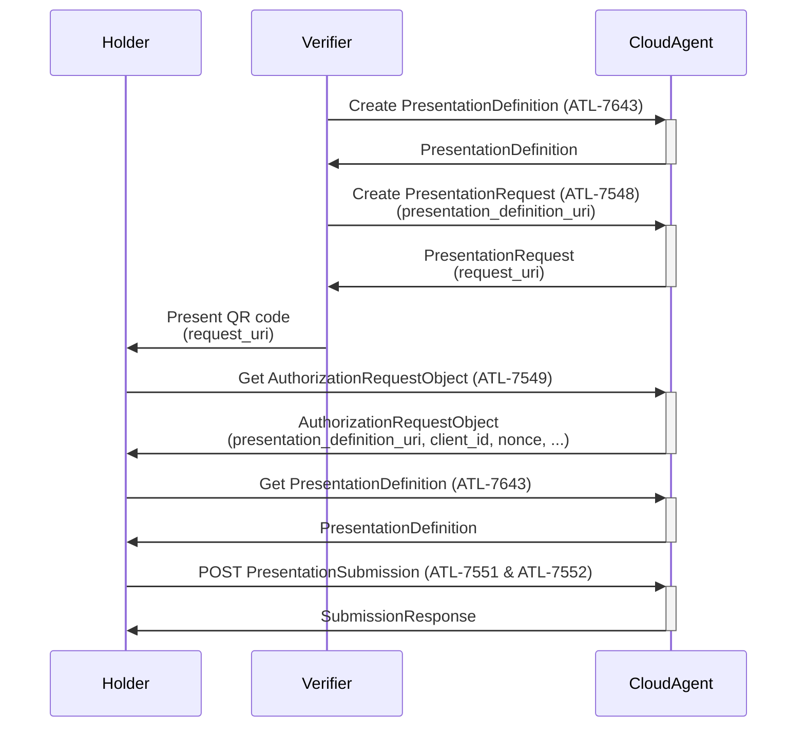

# How to run verification flow

TODO

# Sequence diagram

```mermaid
sequenceDiagram
  participant Holder
  participant Verifier
  participant CloudAgent

  Verifier ->>+ CloudAgent: Create PresentationDefinition (ATL-7643)
  CloudAgent ->>- Verifier: PresentationDefinition
  
  Verifier ->>+ CloudAgent: Create PresentationRequest (ATL-7548)<br>(presentation_definition_uri)
  CloudAgent ->>- Verifier: PresentationRequest<br>(request_uri)
  
  Verifier ->> Holder: Present QR code<br>(request_uri)
  
  Holder ->>+ CloudAgent: Get AuthorizationRequestObject (ATL-7549)
  CloudAgent ->>- Holder: AuthorizationRequestObject<br>(presentation_definition_uri, client_id, nonce, ...)

  Holder ->>+ CloudAgent: Get PresentationDefinition (ATL-7643)
  CloudAgent ->>- Holder: PresentationDefinition

  Holder ->>+ CloudAgent: POST PresentationSubmission (ATL-7551 & ATL-7552)
  CloudAgent ->>- Holder: SubmissionResponse
```
