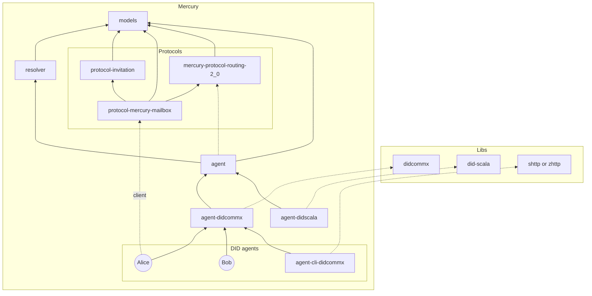

# Mercury

## Index

- [Mediator (Mailbox)](./Mercury-Mailbox-Mediator.md)
- Protocols:
  - [Invitation-Protocol](./protocol-invitation/Invitation-Protocol.md)
  - [Mercury-Mailbox-Protocol](./protocol-mercury-mailbox/Mercury-Mailbox-Protocol.md)
  - [Report-Problem-Protocol](protocol-report-problem/Report-Problem-Protocol.md)
  - [Routing-Protocol](./protocol-routing/Routing-Protocol.md)
- [Quick start](./QuickStart.md)
- [UseCases](./UseCases.md)

## Project structure

Dependencies:



## Quick Reference Guide

```shell
# Alice Agent (send messagem to Bob's Mediator)
sbt "agentDidcommx/runMain org.hyperledger.identus.AgentClientAlice"

# Bob Agent (fetch his message from Mediator)
sbt "agentDidcommx/runMain org.hyperledger.identus.AgentClientBob"
```
