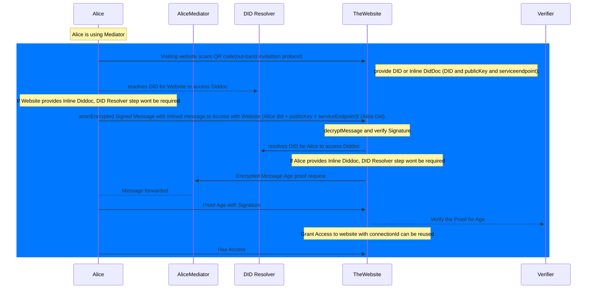

# Use Cases

## Age Verification (Flow Diagram) - Login use case

```mermaid
sequenceDiagram
  participant Alice
  participant AliceMediator
  participant DID Resolver
  participant TheWebsite
  participant Verifier

  note over Alice: Alice is using Mediator

  rect rgb(0, 120, 255)
  Alice ->>+ TheWebsite: Visiting website scans QR code(out-band invitattion protocol)
  note right of TheWebsite:  provide DID or Inline DidDoc (DID and publicKey and serviceendpoint).
  Alice -->>+DID Resolver: resolves DID for Website to access Diddoc
  note over Alice: If Website provides Inline Diddoc, DID Resolver step wont be required
  Alice->>+ TheWebsite: anonEncrypted Signed Message with Inlined message to Access with Website (Alice did + publicKey + serviceEndpoint)/ (Alice Did)
  note over TheWebsite: decryptMessage and verify Signature
  TheWebsite ->>+DID Resolver: resolves DID for Alice to access Diddoc
  note over TheWebsite: If Alice provides Inline Diddoc, DID Resolver step wont be required
  TheWebsite ->>+ AliceMediator : Encrypted Message Age proof request
  AliceMediator --> Alice: Message forwarded
  Alice ->>+ TheWebsite:Proof Age with Signature
  TheWebsite -->>+ Verifier : Verify the Proof for Age
  note over TheWebsite: Grant Access to website with connectionId can be reused
  Alice ->>+ TheWebsite: Has Access
  end
```
