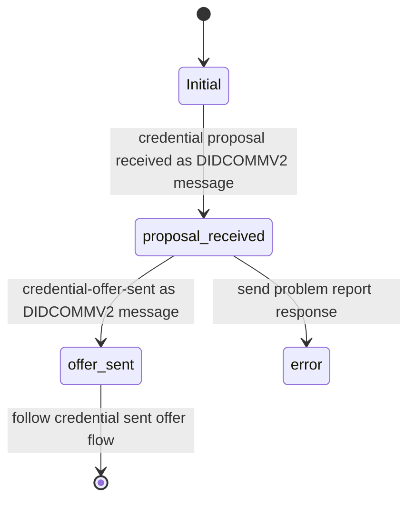
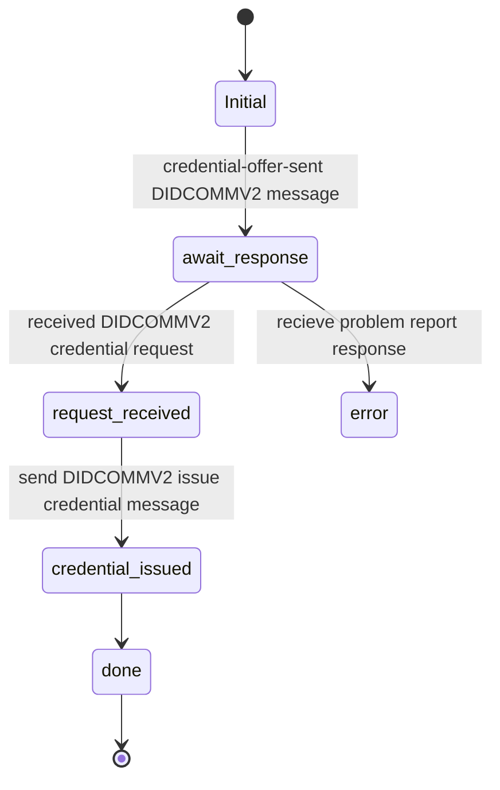
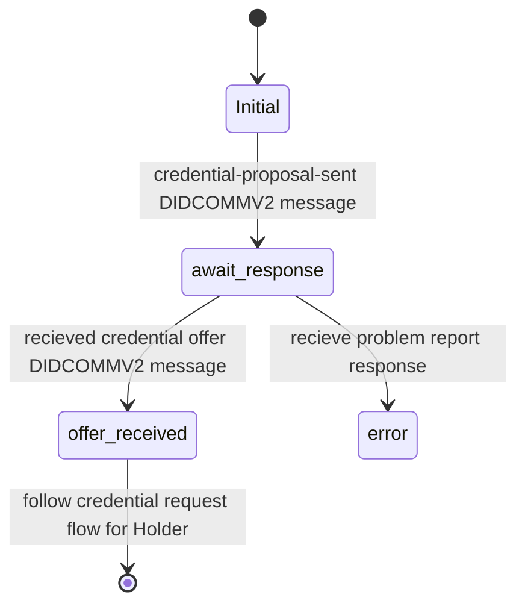
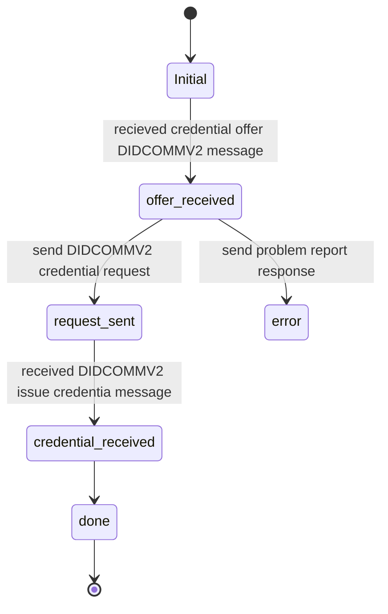
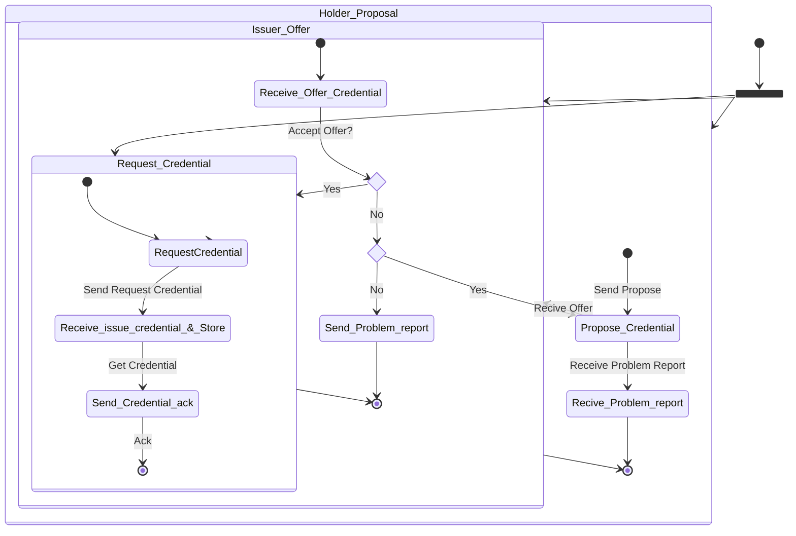

# Issue Credential Protocol

This Protocol is part of the **DIDComm Messaging Specification** but also **0453-issue-credential-v2**

Its a Issue Credential protocol based on DIDCOMMv2 message format.

A standard protocol for issuing credentials. This is the basis of interoperability between Issuers and Holders.

- See [https://identity.foundation/didcomm-messaging/spec]
- See [https://github.com/hyperledger/aries-rfcs/tree/main/features/0453-issue-credential-v2]

Others: 
- See [https://didcomm.org/issue-credential/3.0]
- See [https://github.com/decentralized-identity/waci-didcomm/tree/main/issue_credential]

## PIURI

Version 1.0: `https://didcomm.org/issue-credential/1.0/propose-credential`

### Roles

- Issuer
  - Begin with a offer credential
- Holder
  - Begin with a proposal credential
  - Begin with a request credential

### Issuer received credential proposal (Flow Diagram)

### Issuer Send offer credential  (Flow Diagram)

### Holder proposal credential (Flow Diagram)

### Holder request credential (Flow Diagram)

### Issuer State Machine

TODO See <https://github.com/hyperledger/aries-rfcs/blob/main/features/0453-issue-credential-v2/README.md>

### Holder State Machine

