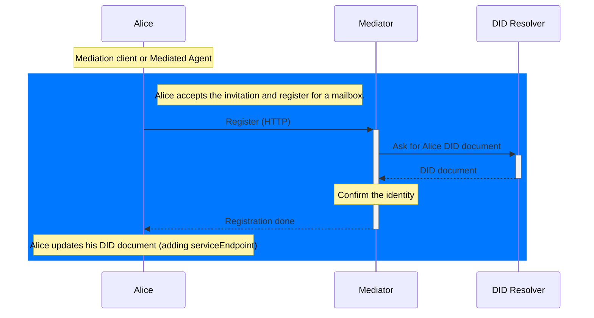
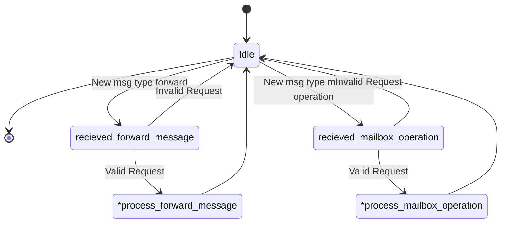
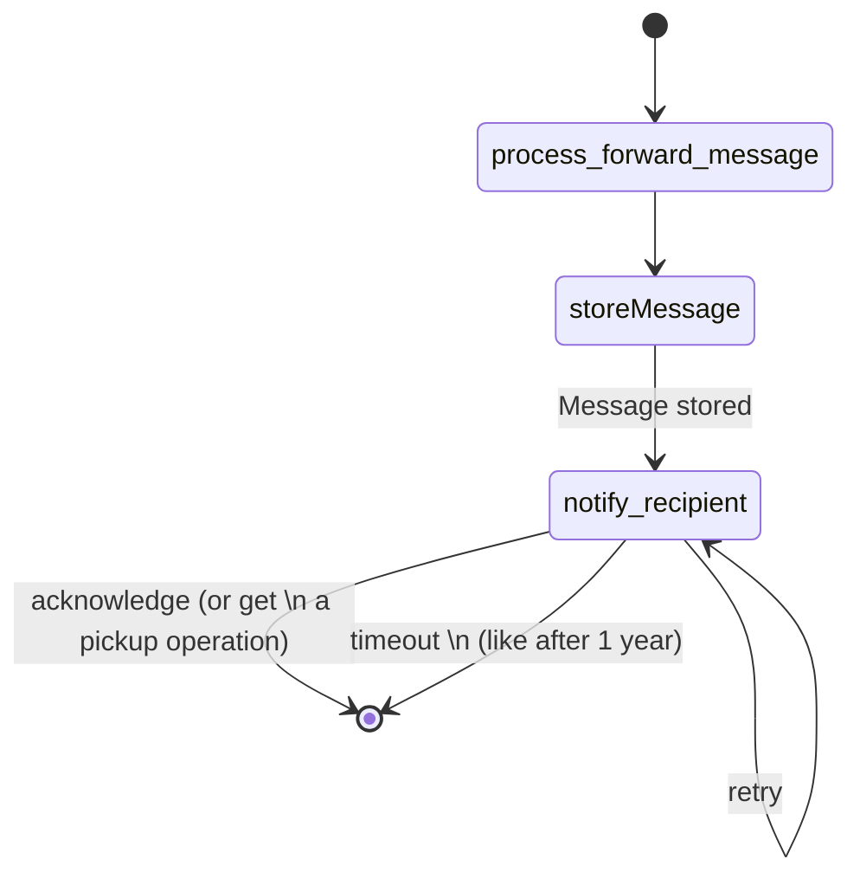
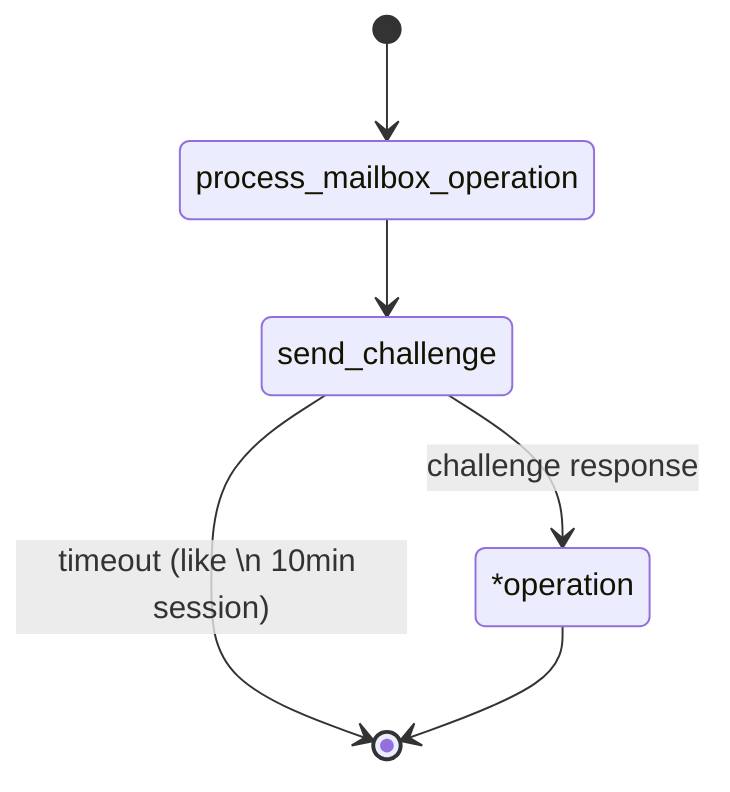
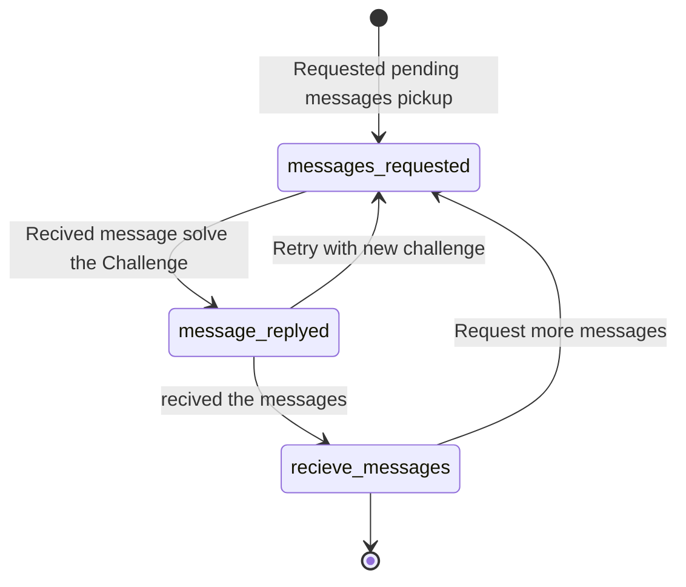

# [WIP] Mercury Mailbox Protocol

## PIURI

TODO maybe ??? `https://atalaprism.io/mercury/mailbox/1.0`

## Diagrams (Mailbox Operations)

### Flow Diagram

### Service State Machine - Mediator POV

NOTE: message_sent is just a operation type!!

FIXME replace "pickup" with "operation"

TODO: the last diagram is maybe its on protocol.
(Does a challenge protocol already exists) ???

---

### Service State Machine - Alice Agent POV

**Pickup Operation:**

