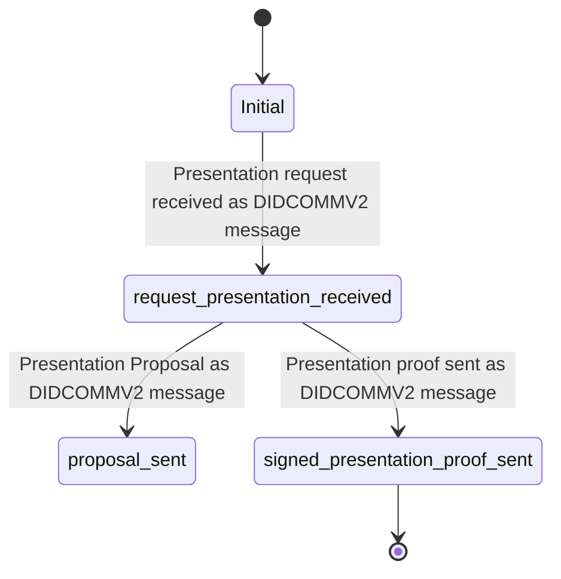
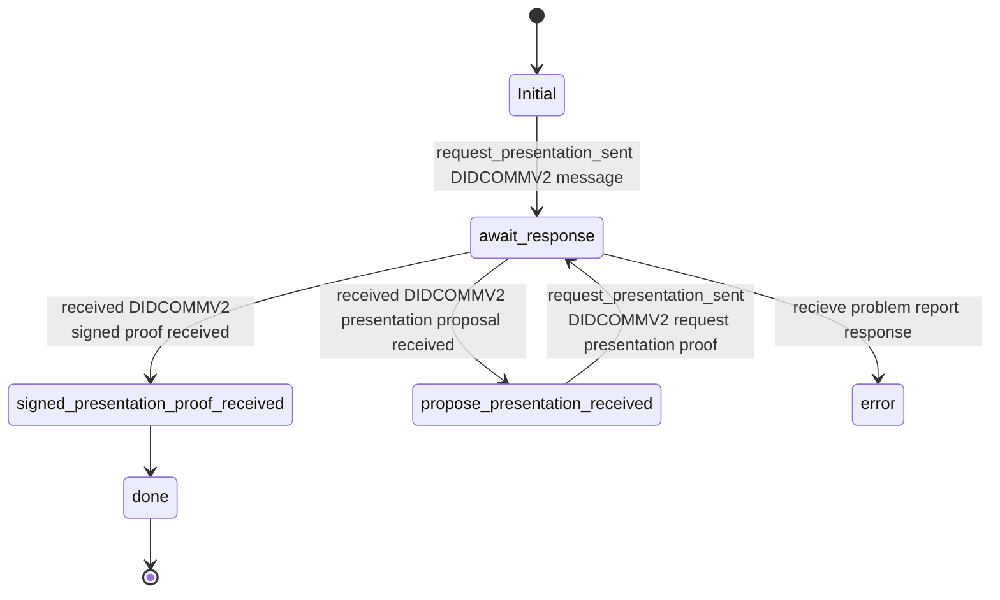
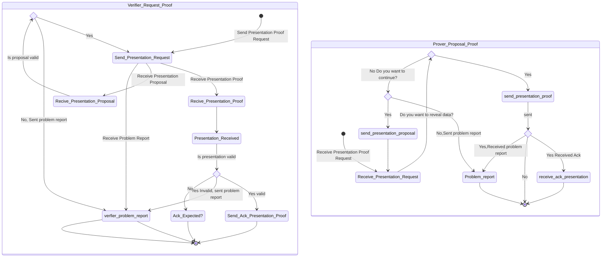

# Present Proof Protocol

This Protocol is part of the **DIDComm Messaging Specification** but also **00454-present-proof-v2**

Its a Present Proof protocol based on DIDCOMMv2 message format.

A protocol supporting a general purpose verifiable presentation exchange regardless of the specifics of the underlying verifiable presentation request and verifiable presentation format

See [https://identity.foundation/didcomm-messaging/spec]
See [https://github.com/hyperledger/aries-rfcs/tree/main/features/0454-present-proof-v2]

## PIURI

Version 2.0: `https://didcomm.org/present-proof/3.0/propose-presentation`

Version .0: `https://didcomm.org/present-proof/3.0/request-presentation`

Version 3.0: `https://didcomm.org/present-proof/3.0/presentation`

### Roles

- Prover
  - Begin with a Propose Presentation Proof
- Verifier
  - Begin with a Request Presentation

### Prover received request presentation (Flow Diagram)

### Verifier request presentation sent  (Flow Diagram)

TODO See <https://github.com/hyperledger/aries-rfcs/blob/main/features/0453-issue-credential-v2/README.md>

### Holder State Machine

