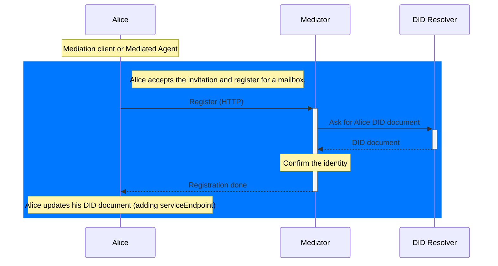

# [WIP] Mercury Mailbox Mediator

## Flow Diagram

```mermaid
sequenceDiagram
  participant Alice
  participant Mediator
  participant DID Resolver

  note over Alice: Mediation client or Mediated Agent

  rect rgb(0, 120, 255)
    note right of Alice: Alice accepts the invitation and register for a mailbox.
    Alice->>+Mediator: Register (HTTP)
    Mediator->>+DID Resolver: Ask for Alice DID document
    DID Resolver-->>-Mediator: DID document 
    note over Mediator: Confirm the identity
    Mediator-->>-Alice: Registration done
    note over Alice: Alice updates his DID document (adding serviceEndpoint)
  end
```
