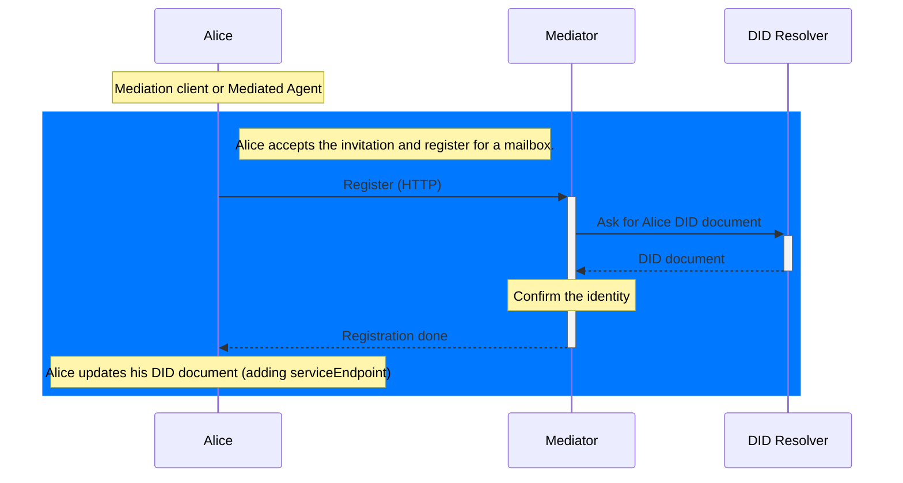
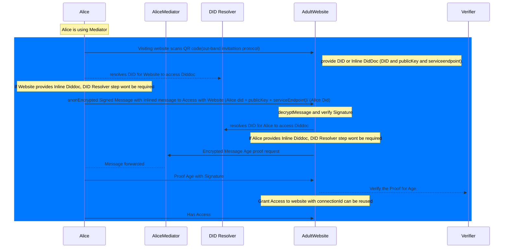

# [WIP] Mercury Mailbox Mediator

## Flow Diagram

```mermaid
sequenceDiagram
  participant Alice
  participant Mediator
  participant DID Resolver

  note over Alice: Mediation client or Mediated Agent

  rect rgb(0, 120, 255)
    note right of Alice: Alice accepts the invitation and register for a mailbox.
    Alice->>+Mediator: Register (HTTP)
    Mediator->>+DID Resolver: Ask for Alice DID document
    DID Resolver-->>-Mediator: DID document 
    note over Mediator: Confirm the identity
    Mediator-->>-Alice: Registration done
    note over Alice: Alice updates his DID document (adding serviceEndpoint)
  end
```

## Use Case Flow Diagram 

```mermaid
sequenceDiagram
  participant Alice
  participant AliceMediator
  participant DID Resolver
  participant AdultWebsite
  participant Verifier

  note over Alice: Alice is using Mediator

  rect rgb(0, 120, 255)
  Alice ->>+ AdultWebsite: Visiting website scans QR code(out-band invitattion protocol)
  note right of AdultWebsite:  provide DID or Inline DidDoc (DID and publicKey and serviceendpoint).
  Alice -->>+DID Resolver: resolves DID for Website to access Diddoc
  note over Alice: If Website provides Inline Diddoc, DID Resolver step wont be required
  Alice->>+ AdultWebsite: anonEncrypted Signed Message with Inlined message to Access with Website (Alice did + publicKey + serviceEndpoint)/ (Alice Did)
  note over AdultWebsite: decryptMessage and verify Signature
  AdultWebsite ->>+DID Resolver: resolves DID for Alice to access Diddoc
  note over AdultWebsite: If Alice provides Inline Diddoc, DID Resolver step wont be required
  AdultWebsite ->>+ AliceMediator : Encrypted Message Age proof request
  AliceMediator --> Alice: Message forwarded
  Alice ->>+ AdultWebsite:Proof Age with Signature
  AdultWebsite -->>+ Verifier : Verify the Proof for Age
  note over AdultWebsite: Grant Access to website with connectionId can be reused
  Alice ->>+ AdultWebsite: Has Access
  end
```