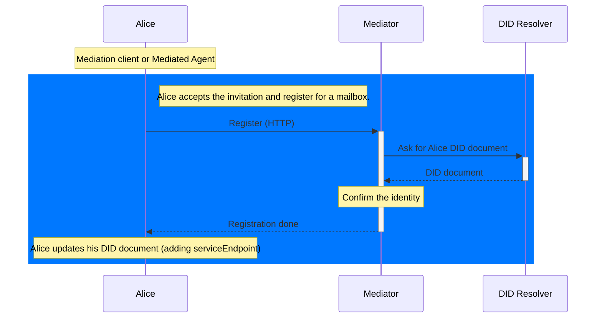
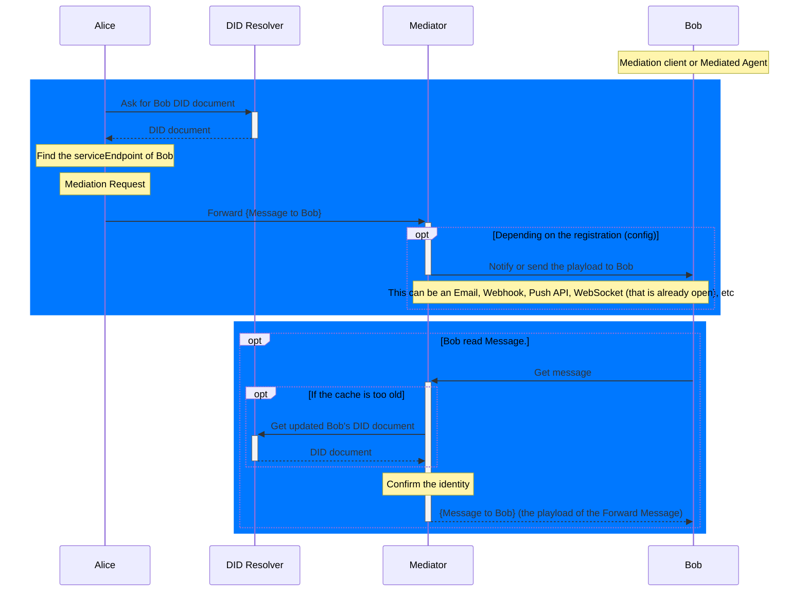

# Mercury Mailbox Mediator

## Accept Invitation for Mailbox (Flow Diagram)

```mermaid
sequenceDiagram
  participant Alice
  participant Mediator
  participant DID Resolver

  note over Alice: Mediation client or Mediated Agent

  rect rgb(0, 120, 255)
    note right of Alice: Alice accepts the invitation and register for a mailbox.
    Alice->>+Mediator: Register (HTTP)
    Mediator->>+DID Resolver: Ask for Alice DID document
    DID Resolver-->>-Mediator: DID document 
    note over Mediator: Confirm the identity
    Mediator-->>-Alice: Registration done
    note over Alice: Alice updates his DID document (adding serviceEndpoint)
  end
```

---

## Send message through the mediator (Flow Diagram)

**Alice wants to send a message to Bob:**

```mermaid
sequenceDiagram
  participant Alice
  participant DID Resolver
  participant Mediator
  participant Bob

  note over Bob: Mediation client or Mediated Agent

  rect rgb(0, 120, 255)
    Alice->>+DID Resolver: Ask for Bob DID document
    DID Resolver-->>-Alice: DID document
    note over Alice: Find the serviceEndpoint of Bob
    note over Alice: Mediation Request
    Alice->>+Mediator: Forward {Message to Bob}

    opt Depending on the registration (config)
      Mediator->>-Bob: Notify or send the playload to Bob
      note over Mediator,Bob: This can be an Email, Webhook, Push API, WebSocket (that is already open), etc
    end
  end

  rect rgb(0, 120, 255)
    opt Bob read Message.
      Bob->>+Mediator: Get message
      opt If the cache is too old
        Mediator->>+DID Resolver: Get updated Bob's DID document
        DID Resolver-->>-Mediator: DID document
      end
      note over Mediator: Confirm the identity
      Mediator-->>-Bob: {Message to Bob} (the playload of the Forward Message)
    end
  end
```
