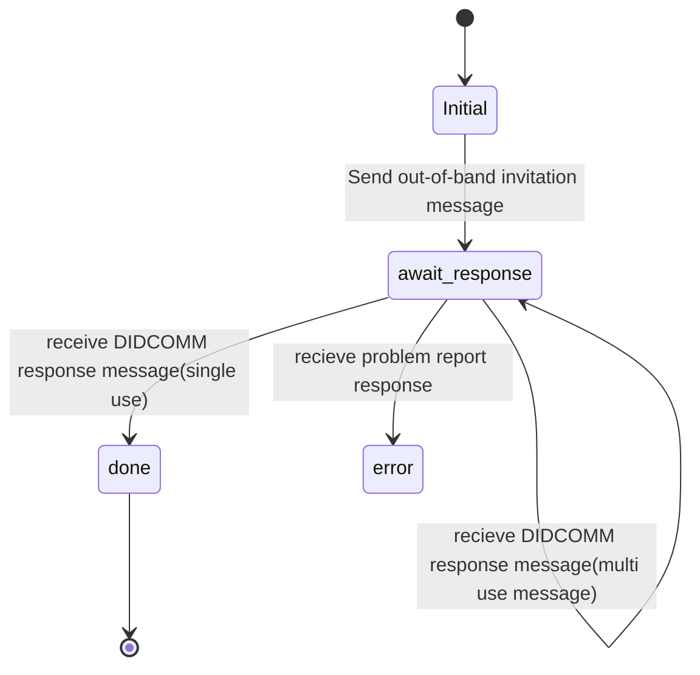
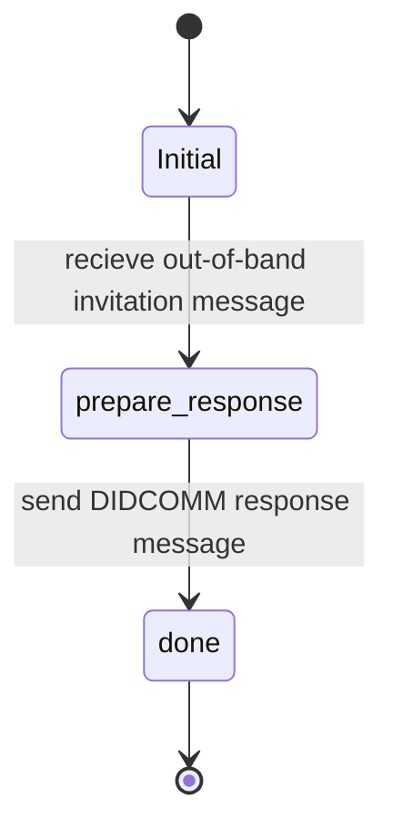

# Invitation Protocol

This Protocol is part of the DIDComm Messaging Specification.

Its a out-of-band style protocol.

See [https://identity.foundation/didcomm-messaging/spec/#invitation]
See [https://github.com/hyperledger/aries-rfcs/blob/main/features/0434-outofband/README.md]

## PIURI

`https://didcomm.org/out-of-band/2.0/invitation`

### Roles

- Sender
  - Will create the message `https://didcomm.org/out-of-band/2.0/invitation`
- Receiver
  - Will accept the invitation

### Notes

- Invitation has expiry date

### Sender create invitation message  (Flow Diagram)

### Receiver accepting invitation (Flow Diagram)

