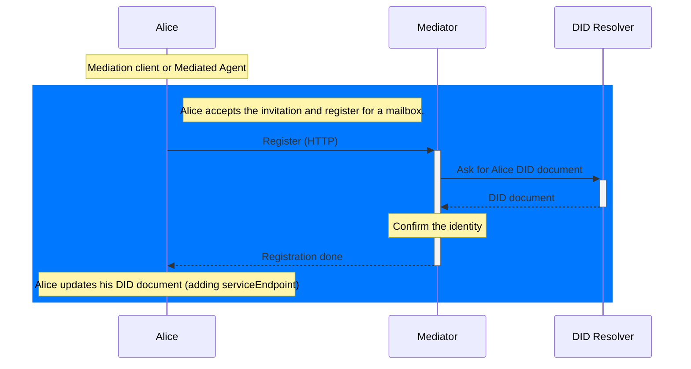
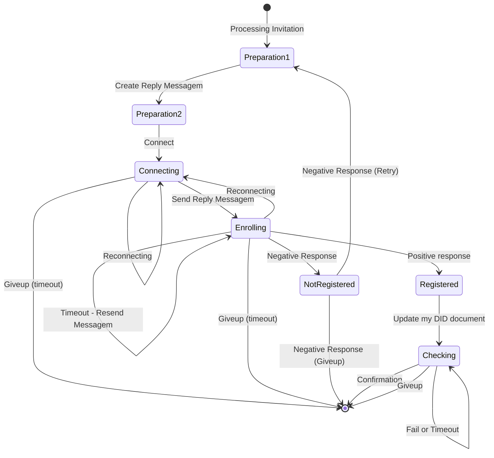
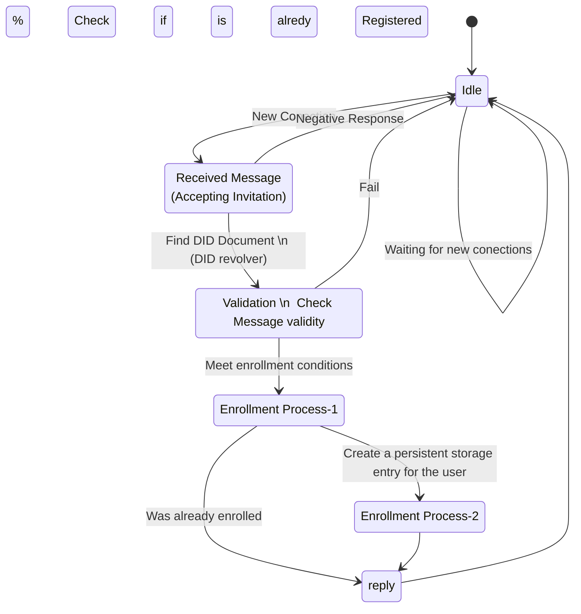

# [WIP] Invitation Protocol

This Protocol is parte of the DIDComm Messaging Specification.

Its a out-of-band style protocol.

See [https://identity.foundation/didcomm-messaging/spec/#invitation]

## PIURI

`https://didcomm.org/out-of-band/2.0/invitation`

## Diagrams (Accept Invitation)

FIXME: Strip the diagrams of logic not included on Invitation Protocol!!!

### Flow Diagram

---

### Client State Machine - Alice POV

After reading the out-of-band invitation from the Mediator

---

### Service State Machine - Mediator POV

