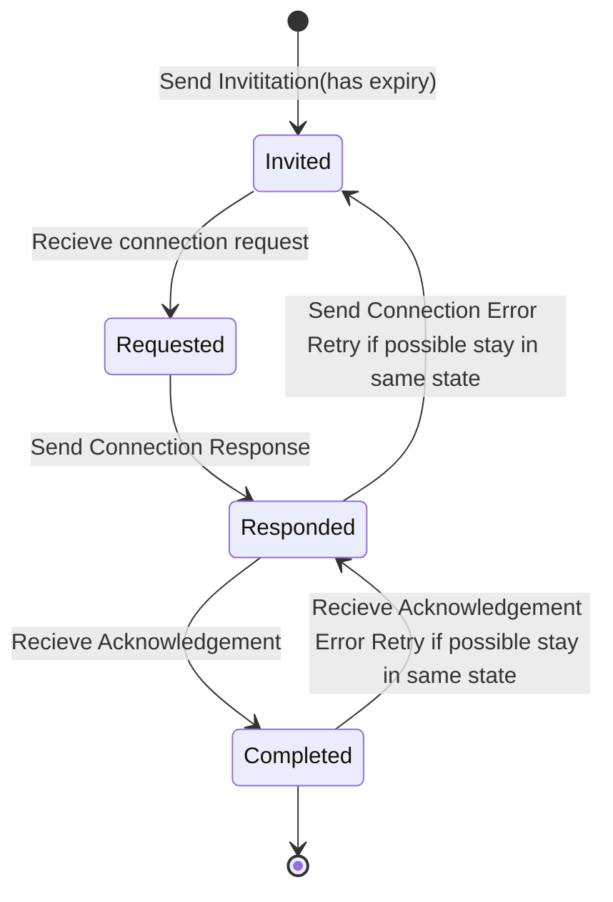
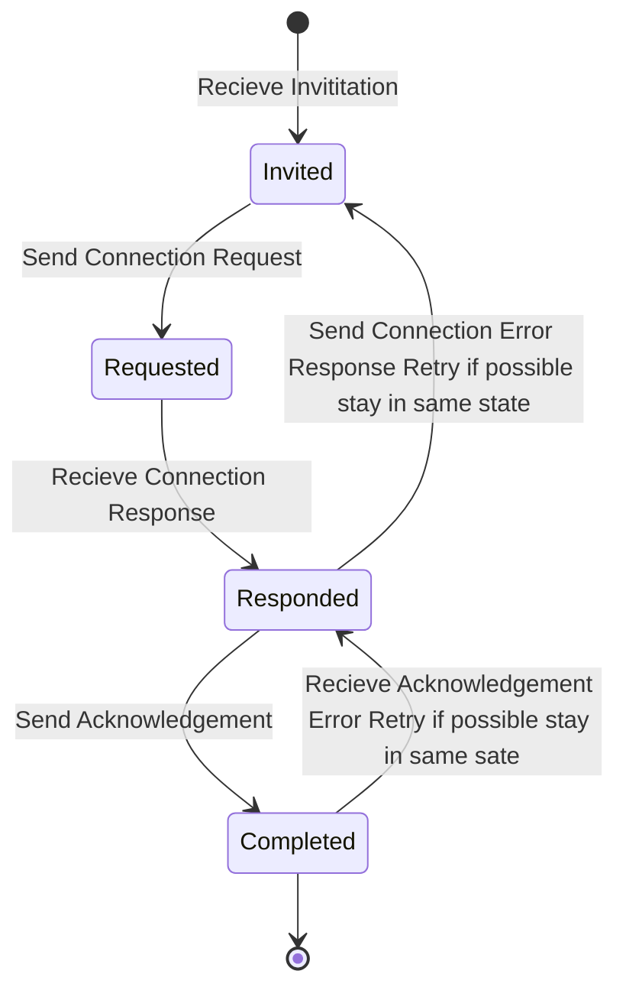

# Invitation Protocol

This Protocol is parte of the DIDComm Messaging Specification.

Its a out-of-band style protocol.

See [https://identity.foundation/didcomm-messaging/spec/#invitation]

## PIURI

`https://didcomm.org/out-of-band/2.0/invitation`

### Flow Diagram TODO

