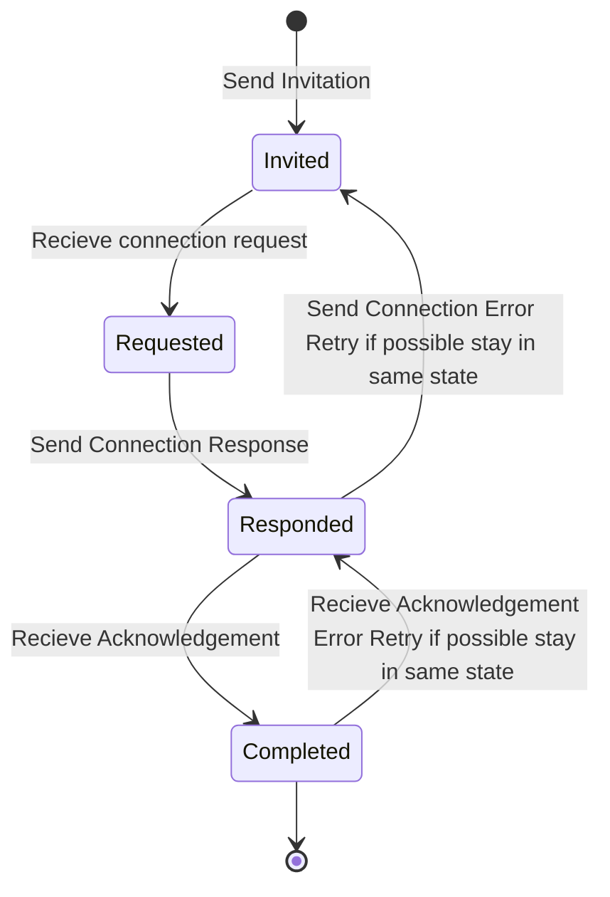
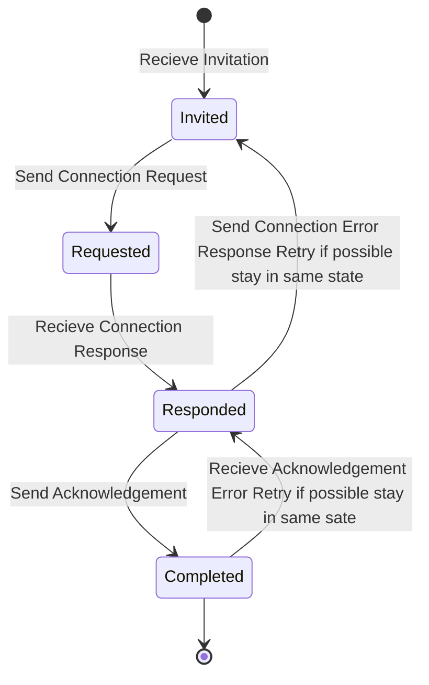

# Invitation Protocol

This Protocol is parte of the **DIDComm Messaging Specification** but also **Aries RFC 0434: Out-of-Band Protocol 1.1**

Its a out-of-band style protocol.

The out-of-band protocol is used when you wish to engage with another agent and you don't have a DIDComm connection to use for the interaction.

See [https://identity.foundation/didcomm-messaging/spec/#invitation]
See [https://github.com/hyperledger/aries-rfcs/blob/main/features/0434-outofband/README.md]

## PIURI

`https://didcomm.org/out-of-band/2.0/invitation`

### Roles

- Invitee
  - Will create the message `https://didcomm.org/out-of-band/2.0/invitation`
- Inviter
  - Will accept the invitation

### Notes

- Invitation has expiry date

### Invitee create invitation message

### Inviter accepting invitation (Flow Diagram)

---

### Invitee Confirming (Flow Diagram)

