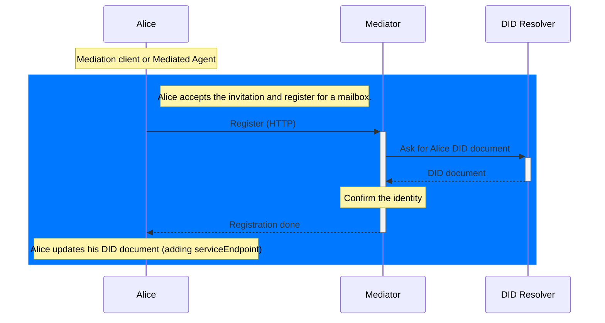
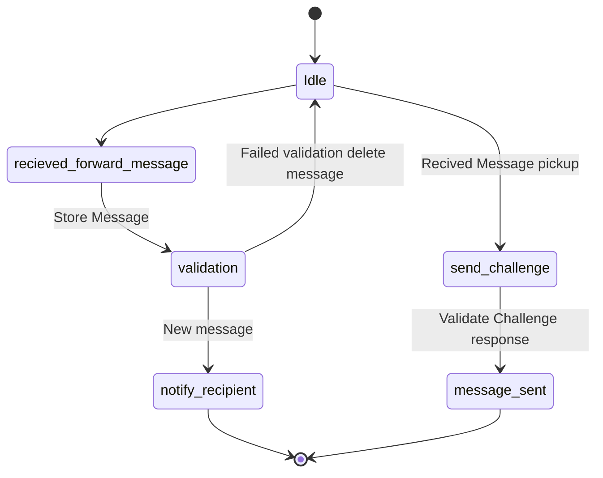
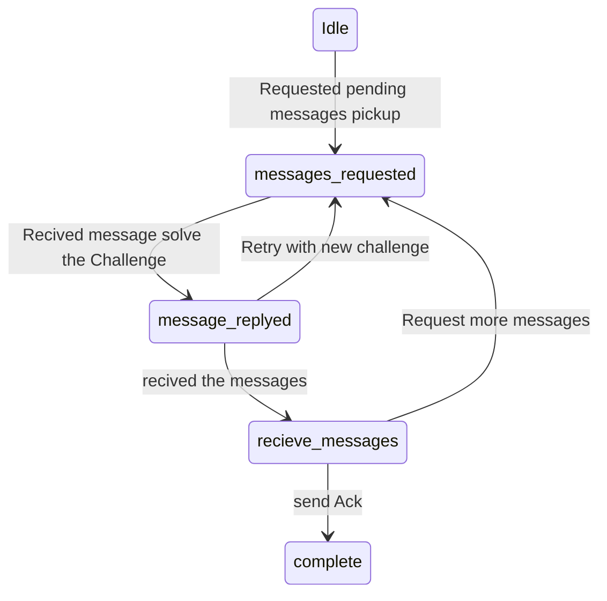

# [WIP] Mercury Mailbox Protocol

## PIURI

TODO maybe ??? `https://atalaprism.io/mercury/mailbox/1.0`

## Diagrams (Mailbox Enrollment)

### Flow Diagram

### Service State Machine - Mediator POV

### Service State Machine - Alice Agent POV
