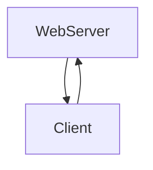

# [WIP] OutOfBand Login Protocol

## PIURI

- `https://atalaprism.io/mercury/outofband-login/1.0/invitation`
  **- Invitation to login**
- `https://atalaprism.io/mercury/outofband-login/1.0/reply`
  **- Mediate Reply**

### Roles

- WebServer
  - The DID Comm agent (server) that invite to create a session
- Client
  - The DID Comm agent that want to start the session (by login with is DID).

### Messagem Flow Diagram

