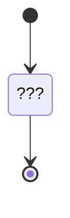

# Report Problem Protocol 1.0

This Protocol is parte of Aries (RFC 0035).
Describes how to report errors and warnings in a powerful, interoperable way.

See [https://github.com/hyperledger/aries-rfcs/tree/main/features/0035-report-problem]

NOTE: In this context never reference to `Error` or `Warning`. Always reference as `Problem`.

TODO: Support [l10n](https://github.com/hyperledger/aries-rfcs/blob/main/features/0043-l10n/README.md) in the Future.

## PIURI

`https://didcomm.org/report-problem/1.0`

## Notes

The protocol is one-way, a simple one-step notification protocol:

## Roles

- `notifier` - Who sends notification.
- `notified` - Who receive notification.

## Diagrams

TODO

### Notifier state machine

---

### Notified state machine

