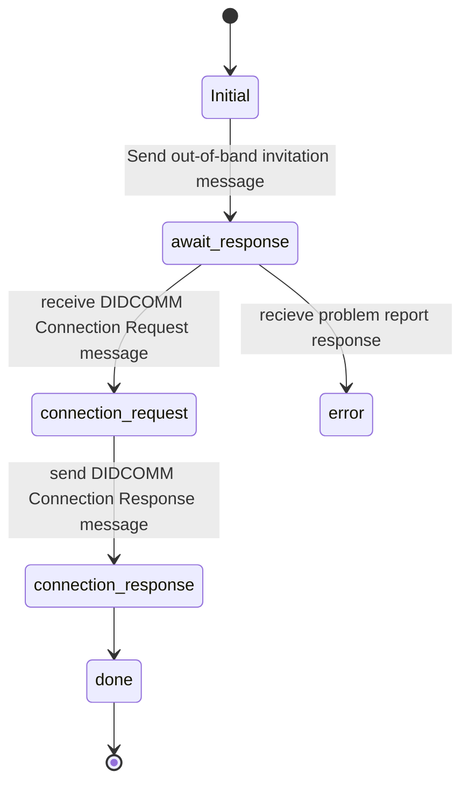
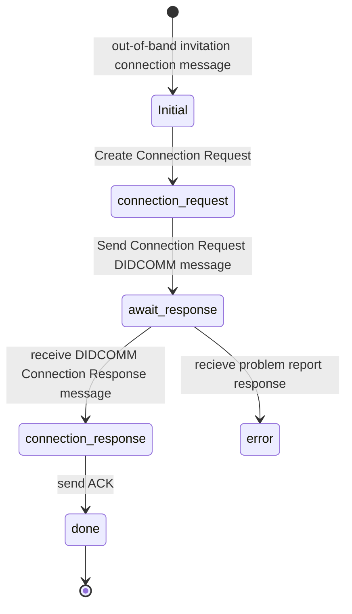

# Connection Protocol

This Protocol is for DID base connection 

The protocol is used when you wish to create a connection with another agent.

## PIURI

Version 1.0:
 - `https://atalaprism.io/mercury/connections/1.0/request`
 - `https://atalaprism.io/mercury/connections/1.0/response`

### Roles

- Inviter
  - Will create the message `https://didcomm.org/out-of-band/2.0/invitation`
  - Will accept the Connection request and reply Connection Response `https://atalaprism.io/mercury/connections/1.0/response`
- Invitee
  - Will accept the invitation by sending a Connection Request `https://atalaprism.io/mercury/connections/1.0/request`

### Notes

### Inviter create invitation message for connection  (Flow Diagram)

### Invitee accepting invitation message for connection (Flow Diagram)

