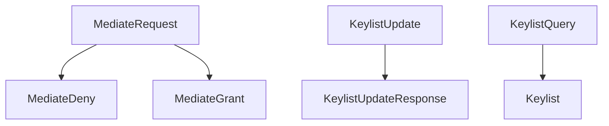
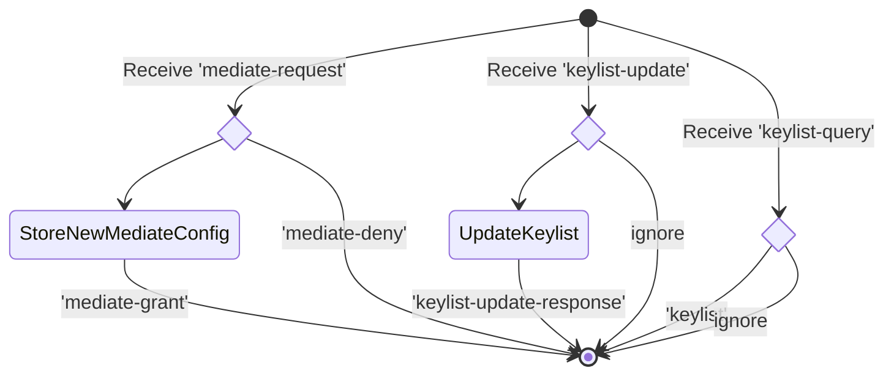
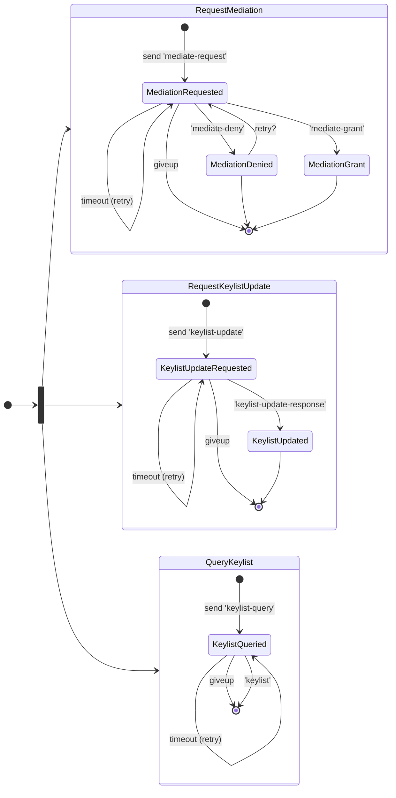

# Coordinate Mediation Protocol

This Protocol is part of the **DIDComm.org**

Is a protocol to coordinate mediation configuration between a mediating agent and the recipient.

This protocol follows the request-response message exchange pattern, and only requerires the simple state of waiting for a response or to produce a response.

See [https://didcomm.org/mediator-coordination/2.0/]

## PIURI

- `https://didcomm.org/coordinate-mediation/2.0/mediate-request`
  **- Mediate Request**
- `https://didcomm.org/coordinate-mediation/2.0/mediate-deny`
  **- Mediate Deny** (possible response to deny mediate-request)
- `https://didcomm.org/coordinate-mediation/2.0/mediate-grant`
  **- Mediate Grant** (possible response to grant mediate-request)

- `https://didcomm.org/coordinate-mediation/2.0/keylist-update`
  **- Keylist Update**
- `https://didcomm.org/coordinate-mediation/2.0/keylist-update-response`
  **- Keylist Response** (response to keylist-update)

- `https://didcomm.org/coordinate-mediation/2.0/keylist-query`
  **- Keylist Query**
- `https://didcomm.org/coordinate-mediation/2.0/keylist`
  **- Keylist** (response to keylist-query)

### Roles

- mediator
  - The agent that will be receiving forward messages on behalf of the recipient.
- recipient
  - The agent for whom the forward message payload is intended.

### Messagem Flow Diagram

### Mediator state machine

### Recipient state machine

