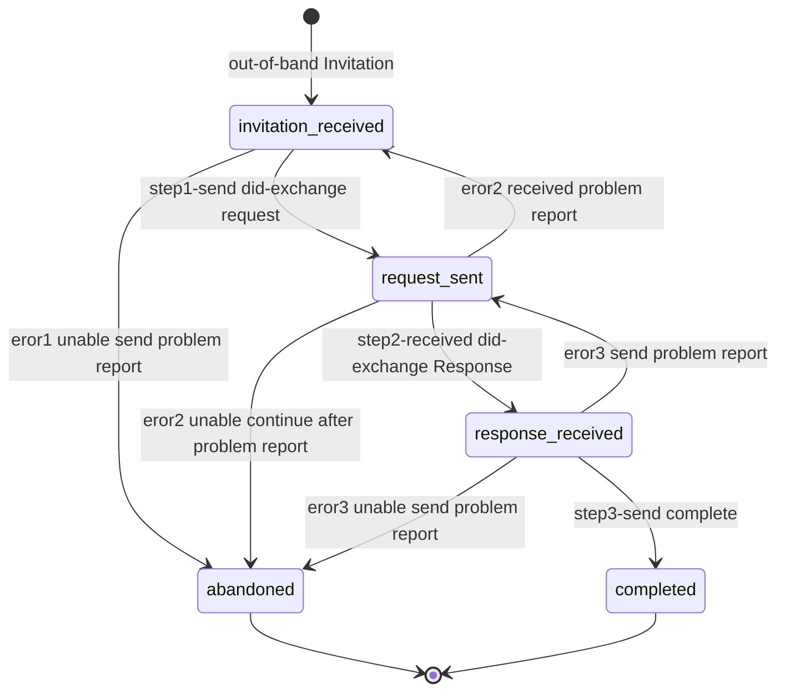
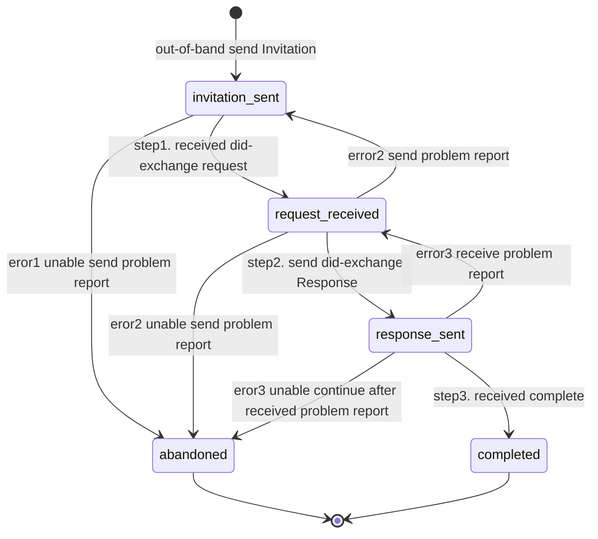

# DidExchange Protocol

This Protocol is part of the DIDComm Messaging Specification.

Protocol to exchange DIDs between agents when establishing a DID-based relationship

See [https://github.com/hyperledger/aries-rfcs/tree/main/features/0023-did-exchange]

## PIURI

`https://didcomm.org/didexchange/1.0/request`
`https://didcomm.org/didexchange/1.0/problem_report`
`https://didcomm.org/didexchange/1.0/response`
`https://didcomm.org/didexchange/1.0/complete`

### Roles

- Requester(Is the receiver in out-of-band protocol)
  - Will initiate the did-exchange 
- Responder (Is the invitation sender in out-of-band protocol)
  - Will respond to did exchange

  

### Requester request did-exchange
step1-->step2-->step3 Is a happy path flow

error - error received or sent and state transition

### Responder responds to did-exchange
step1-->step2-->step3 Is a happy path flow

error received or sent and state transition

