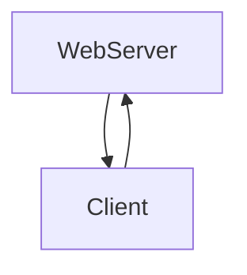
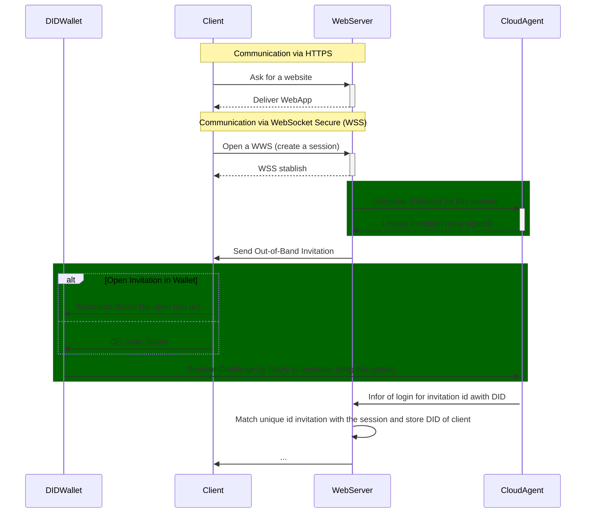

# OutOfBand Login Protocol

Its a out-of-band style protocol.

## PIURI

- `https://atalaprism.io/mercury/outofband-login/1.0/invitation`
  **- Invitation to login**
- `https://atalaprism.io/mercury/outofband-login/1.0/reply`
  **- Mediate Reply**

### Roles

- WebServer
  - The DID Comm agent (server) that invite to create a session
- Client
  - The DID Comm agent that want to start the session (by login with is DID).

### Messagem Flow Diagram

### Example of Sequence Diagram

In the following we use 4 participant, but you can view the `DIDWallet` and `Client` as being one and same for `WebServer` and `CloudAgent`.

