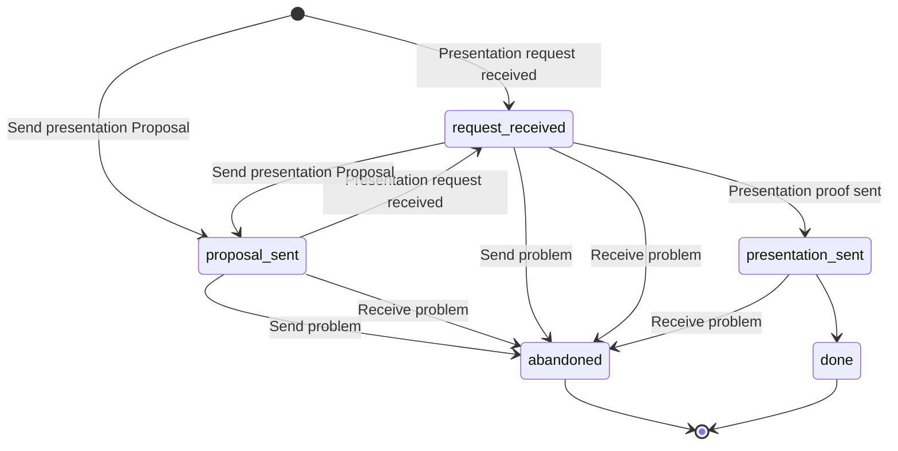
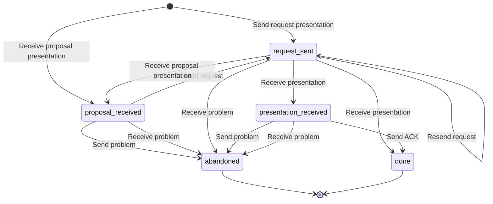
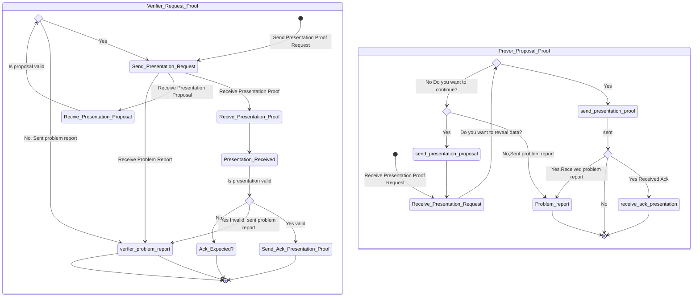

# Present Proof Protocol

This Protocol is part of the **WACI-DIDComm Interop Profile v1.0**
- See [https://github.com/decentralized-identity/waci-didcomm/blob/main/present_proof/present-proof-v3.md]

Its a Present Proof protocol based on DIDCOMMv2 message format.

A protocol supporting a general purpose verifiable presentation exchange regardless of the specifics of the underlying verifiable presentation request and verifiable presentation format

More Info:
- See [https://didcomm.org/present-proof/3.0/]
- Its base on **DIDComm Messaging Specification** - [https://identity.foundation/didcomm-messaging/spec]
- Its similar to **00454-present-proof-v2** - [Hyperledger present-proof-v2](https://github.com/hyperledger/aries-rfcs/tree/main/features/0454-present-proof-v2) also see
[Hyperledger 0453-issue-credential-v2](https://github.com/hyperledger/aries-rfcs/blob/main/features/0453-issue-credential-v2/README.md)

## PIURI

Version 3.0:
- `https://didcomm.atalaprism.io/present-proof/3.0/propose-presentation`
- `https://didcomm.atalaprism.io/present-proof/3.0/request-presentation`
- `https://didcomm.atalaprism.io/present-proof/3.0/presentation`

Note: `https://didcomm.atalaprism.io/present-proof/3.0` is equivalent to `https://didcomm.org/present-proof/3.0` with the different of how to specific types of proofs.

### Roles

- Prover
  - Begin with a Propose Presentation Proof
- Verifier
  - Begin with a Request Presentation

### Prover received request presentation (Flow Diagram)

### Verifier request presentation sent  (Flow Diagram)

### Holder State Machine (TODO update this)

