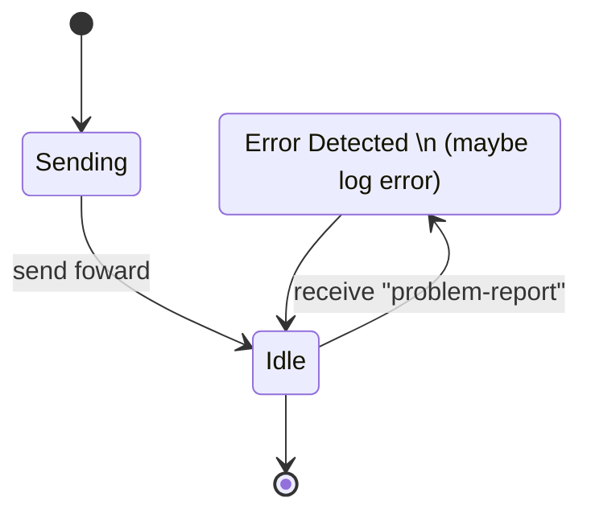
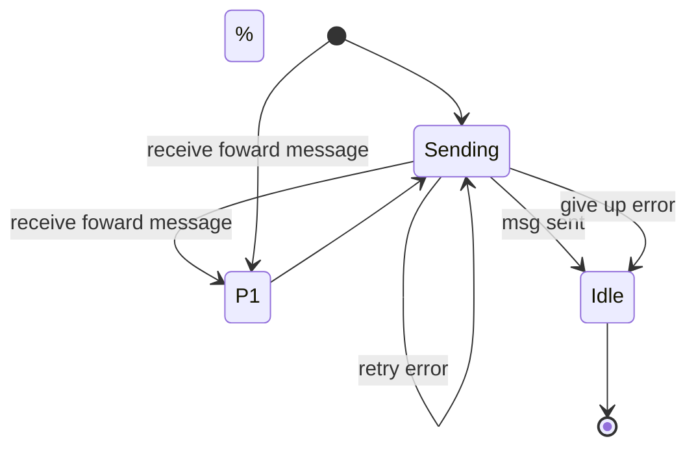
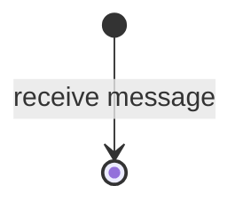

# Routing Protocol 2.0

This Protocol is part of the DIDComm Messaging Specification.

See [https://identity.foundation/didcomm-messaging/spec/#routing-protocol-20]

## PIURI

`https://didcomm.org/routing/2.0`

## Notes

The protocol is one-way:

- `sender -> mediator* -> recipient`

Optional: The mediator can use the "Problem Reports Protocol" to return a problem-report to the sender identifying the unsupported feature.

## Roles

- `sender` - The sender emits messages of type forward to the mediator.
**[See Sender Process here](https://identity.foundation/didcomm-messaging/spec/#sender-process-to-enable-forwarding)**

- `mediator` - The mediator unpacks (decrypts) the payload of an encrypted forward message and passes on the result (a blob that probably contains a differently encrypted payload) to the recipient.
**[See Sender Mediator here](https://identity.foundation/didcomm-messaging/spec/#mediator-process)**

- `recipient` - The intended recipient of the sender.

## Diagrams

### Sender state machine

---

### Mediator state machine

**NOTE:** The state P1 is protocol composition!
In our case is the Mercury Mailbox protocol.

---

### Receiver state machine

