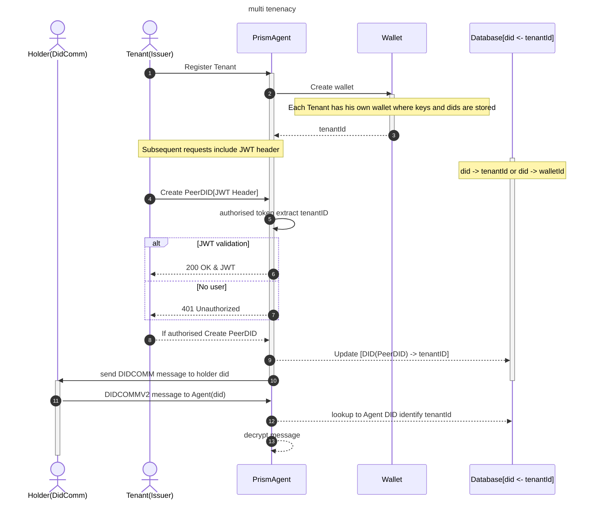

```mermaid
---
title: multi tenenacy
---
 sequenceDiagram
    autonumber
    actor H as Holder(DidComm)
    actor T as Tenant(Issuer)
    participant A as PrismAgent
    participant W as Wallet
    participant DB as Database[did <- tenantId]
    T->>A: Register Tenant
    activate A
    A->>W: Create wallet
            activate W
                note over W: Each Tenant has his own wallet where keys and dids are stored
                W-->>A: tenantId
            deactivate W
            note over T, A: Subsequent requests include JWT header
            activate DB
                note over DB: did -> tenantId or did -> walletId
                T->>A: Create PeerDID[JWT Header]
                A->>A: authorised token extract tenantID
                alt JWT validation
                    A-->>T: 200 OK & JWT
                else No user
                    A-->>T: 401 Unauthorized
                end
                T-->>A: If authorised Create PeerDID
                A-->>DB: Update [DID(PeerDID) -> tenantID]
                A->>H: send DIDCOMM message to holder did
            deactivate DB
    deactivate A
    activate H
        H->>A: DIDCOMMV2 message to Agent(did)
        A-->>DB:lookup to Agent DID identify tenantId
        A-->>A:decrypt message
    deactivate H
```
   