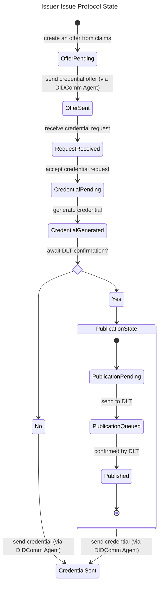
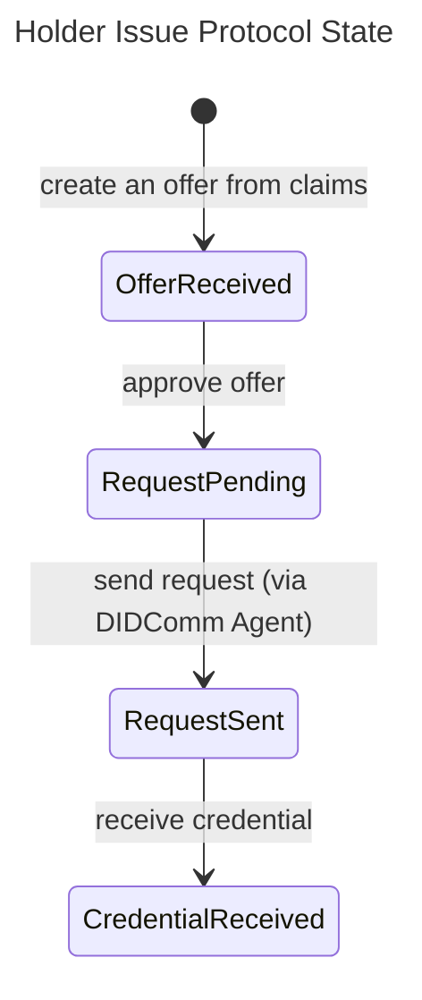

```mermaid
---
title: Issuer Issue Protocol State
---
stateDiagram-v2
  [*] --> OfferPending: create an offer from claims
  OfferPending --> OfferSent: send credential offer (via DIDComm Agent)
  OfferSent --> RequestReceived: receive credential request
  RequestReceived --> CredentialPending: accept credential request
  CredentialPending --> CredentialGenerated: generate credential
  %%CredentialGenerated --> CredentialSent: send credential (via DIDComm Agent)
  %% If await_confirmation => PublicationPending -> Queued -> Published -> CredentialSent
  %% Else fork => CredentialSent
  state await_confirmation <<choice>>
  CredentialGenerated --> await_confirmation: await DLT confirmation?
  await_confirmation --> No
  No --> CredentialSent: send credential (via DIDComm Agent)
  await_confirmation --> Yes
  Yes --> PublicationState
  state PublicationState {
    [*] --> PublicationPending
    PublicationPending --> PublicationQueued: send to DLT
    PublicationQueued --> Published: confirmed by DLT
    Published --> [*]
  }
  PublicationState --> CredentialSent: send credential (via DIDComm Agent)
  
```
---

```mermaid
---
title: Holder Issue Protocol State
---
stateDiagram-v2
  [*] --> OfferReceived: create an offer from claims
  OfferReceived --> RequestPending: approve offer
  RequestPending --> RequestSent: send request (via DIDComm Agent)
  RequestSent --> CredentialReceived: receive credential
```