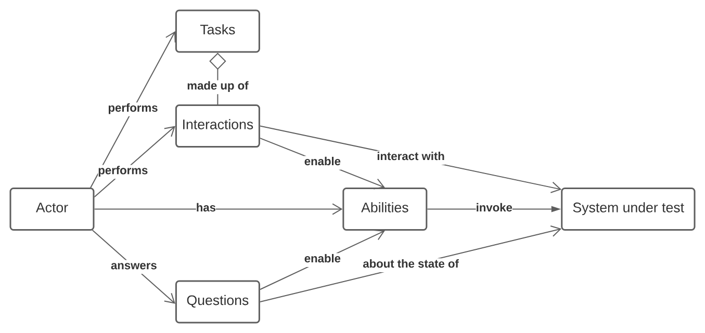
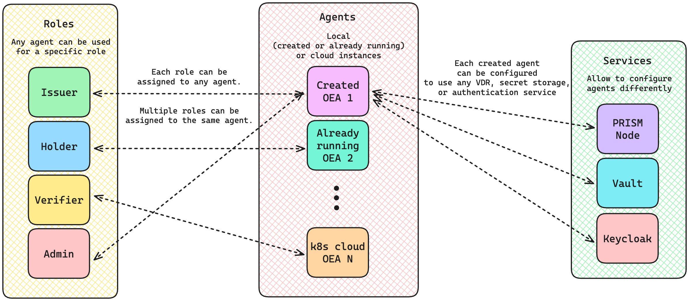
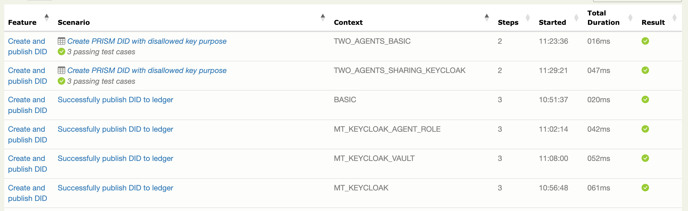
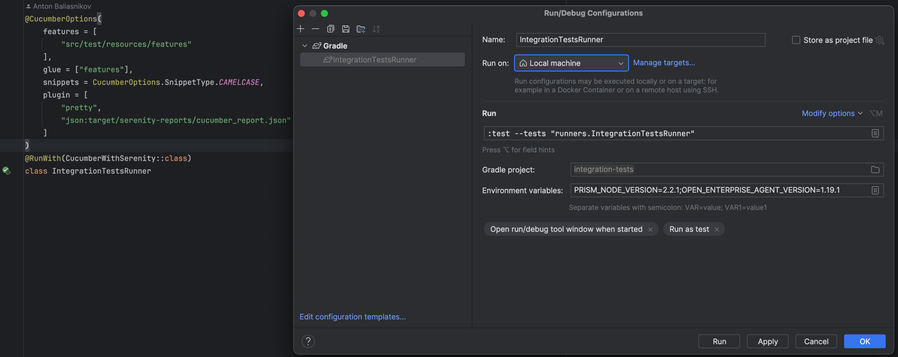
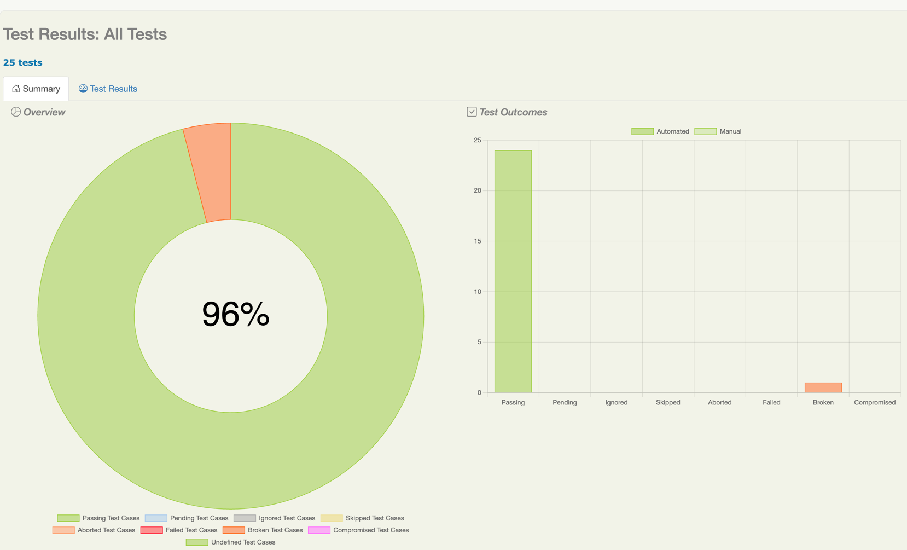
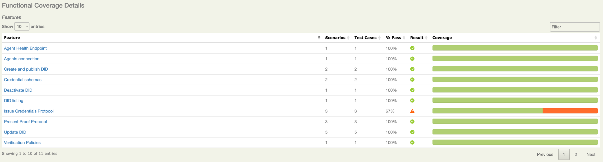
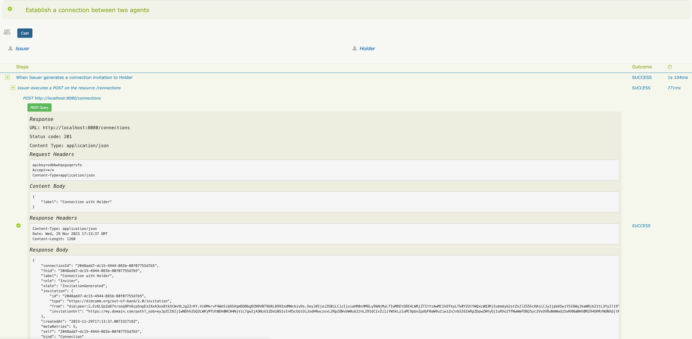
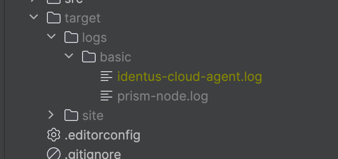

# Integration Tests

This directory contains the integration tests for the Identus Cloud Agent (ICA).

## Main concepts

The integration tests are written in Kotlin, and use the following tools and libraries:

1. [Serenity BDD](https://serenity-bdd.github.io/) for test execution engine
2. [Hoplite](https://github.com/sksamuel/hoplite) for configuration management
3. [Ktor](https://ktor.io/) for HTTP listener (async receiver for webhook messages)
4. [Identus Cloud Agent Client Kotlin](https://github.com/hyperledger/identus-cloud-agent/packages/2135556) for ICA API models.
5. [Atala Automation](https://github.com/input-output-hk/atala-automation/) for general testing helpers.
6. [Awaitility](http://www.awaitility.org/) for asynchronous operations waiting.
7. [TestContainers](https://www.testcontainers.org/) for Docker containers management.

The project uses Behavior Driven Development (BDD) approach, and the tests are written with the help of Gherkin language.
The key benefits of the BDD approach are:

* BDD encourages collaboration between developers, testers, and non-technical stakeholders (such as business analysts or product owners).
* In BDD, requirements and specifications are expressed in natural language, often using a specific format called "Given-When-Then." This format structures the description of the expected behavior of a system in a way that is easy to understand.
* BDD tools, such as Cucumber and Serenity, help translate these specifications into executable tests. These tests serve as living documentation, ensuring that the software behaves as expected based on the agreed-upon specifications.

The Screenplay pattern is used to write the tests. The pattern is described in detail in the
[Serenity BDD documentation](https://serenity-bdd.github.io/docs/screenplay/screenplay_fundamentals). The main advantages of the Screenplay pattern are:

* The Screenplay Pattern aims to improve the readability, maintainability, and reusability of test automation code.
* In the Screenplay Pattern, test are written from the perspective of actors who interact with the system. Actors represent the different roles or personas in the system, such as users or components.
* Each actor has their own abilities (actions they can perform) and interactions (tasks they can carry out). These interactions encapsulate the steps required to achieve a certain goal in the system.
* The Screenplay Pattern promotes the use of high-level, business-oriented language in test scripts, making them more understandable to non-technical stakeholders.

<p align="center">
    <picture>
        
    </picture><br>
    <em>Screenplay pattern overview</em>
</p>

## Project structure

The project structure is represented below:
```text
├── main
│   └── kotlin
│       └── models -> contains the data models used in the tests (in addition to the PRISM models from client library)
└── test
    ├── kotlin
    │   ├── abilities -> contains the abilities of the actors
    │   ├── common -> contains the common classes (test constants and helper functions)
    │   ├── config -> contains the configuration classes (Hoplite)
    │   ├── interactions -> contains the interactions of the actors
    │   ├── models -> contains the models
    │   ├── steps -> contains the features implementation steps
    └── resources -> contains the test resources
        ├── configs -> contains the test configuration files
        ├── containers -> contains the Docker Compose files to start the test environment
        └── features -> contains the Gherkin feature files
```

Here are some rules to follow when writing the tests:
1. Do not mix steps from different features in the same step definition class. Always create a separate class for each feature.
2. Do not duplicate configurations, check if the configuration you need already exists in the `test/resources/configs` directory.
3. Combine scenarios into features based on the functionality they test.

## System under test

The main idea of the framework is to test the ICA as a black box.

The tests interact with the ICA through the API and webhook messages.

<p align="center">
    <picture>
        
    </picture><br>
    <em>Overview of the system under test. Roles, Agents and Services communication.</em>
</p>

### ICA Roles in Tests

| Role     | Description                                           |
|----------|-------------------------------------------------------|
| Issuer   | Issues credentials to the holder.                     |
| Holder   | Stores credentials and presents them to the verifier. |
| Verifier | Verifies the credentials presented by the holder.     |
| Admin    | Performs specific administrative tasks                |

- Each ICA can play multiple roles simultaneously after multitenancy is implemented.
- ICAs can be created on-the-fly or use existing ones, regardless of their origin (local or cloud).

### ICA Configurations

Each ICA can use different configurations for:

| Configuration  | Options                                                               |
|----------------|-----------------------------------------------------------------------|
| Secret Storage | Vault, PostgreSQL                                                     |
| Authentication | ApiKey, JWT Bearer tokens from Keycloak                               |
| VDR            | PRISM Node in different configs (in-memory, preview/preprod, mainnet) |

The framework allows testing all possible combinations of the above roles and configurations.

## Configuring the tests

Configuration files are located in the `test/resources/configs` directory.
They are written in [HOCON format](https://github.com/lightbend/config/blob/main/HOCON.md#hocon-human-optimized-config-object-notation).

[Hoplite](https://github.com/sksamuel/hoplite) library is used to parse the configuration files and map them to configuration classes.
These classes are located in the `test/kotlin/config` directory.

In this section, we will describe the configuration options and their purpose.

### Overview

The configuration files are divided into the following sections:
* `services`: contains the configuration for the services (PRISM Node, Keycloak, Vault) that will be started and can be consumed by `agents` if specified.
* `agents`: contains the configuration for the agents (ICA) that will be started. By default, all agents will be destroyed after the test run is finished.
* `roles`: contains the configuration for the roles (Issuer, Holder, Verifier, Admin). A role can be assigned to one or more agents that we set in `agents` section or already running locally or in the cloud.

Please, check [test/resources/configs/basic.conf](./src/test/resources/configs/basic.conf) for a quick example of a basic configuration.

You could explore the `configs` directory for more complex examples.

### Configuring services

There are three services that can be configured:
* `prism_node`: PRISM Node as VDR
* `keycloak`: Keycloak for authentication
* `vault`: Vault for secret storage management

> In the current version `v1.20.0` (by the time of writing this documentation), we can start only once instance of each service that can be shared between agents.
> If required, later, we add the ability to start multiple instances of the same service.

#### Configuring PRISM Node

To configure PRISM Node, you need to specify the following options:
* `http_port`: [MANDATORY] the port to expose for the HTTP API.
* `version`: [MANDATORY] the version of the PRISM Node docker image to use.
* `keep_running`: [OPTIONAL] whether to keep the service running after the test run is finished.

#### Configuring Keycloak

To configure Keycloak, you need to specify the following options:
* `http_port`: [MANDATORY] the port to expose for the HTTP API.
* `realm`: [OPTIONAL] the name of the realm to use. Default: `atala-demo`
* `client_id`: [OPTIONAL] the client ID to use. Default: `prism-agent`
* `client_secret`: [OPTIONAL] the client secret to use. Default: `prism-agent-demo-secret`
* `keep_running`: [OPTIONAL] whether to keep the service running after the test run is finished.

#### Configuring Vault

To configure Vault, you need to specify the following options:
* `http_port`: [MANDATORY] the port to expose for the HTTP API.
* `keep_running`: [OPTIONAL] whether to keep the service running after the test run is finished.

Here is a complete example of the `services` section, including minimal configuration for all services:
```yaml
# Specify shared services that are used by all agents (if any)
services = {
    prism_node = {
        http_port = 50053
        version = "${PRISM_NODE_VERSION}"
    }
    keycloak = {
        http_port = 9980
    }
    vault = {
        http_port = 8200
    }
}
```

**Please note: all services are optional. If you do not specify any service, agents will be started in the default configuration.**

> Please note: if you start local agents, you need to specify at least the `prism_node` for the tests to pass.
> Otherwise, all scenarios that require ledger operation will fail.

### Configuring agents

There is a special `agents` section in the configuration file to specify the agents that will be started on-the-fly for this test run.
`TestContainers` are in use for this purpose.

To configure the agent, you need to specify the following options:
* `version`: the version of the ICA docker image to use.
* `http_port`: the port to expose for the HTTP API.
* `didcomm_port`: the port to expose for the DIDComm API.
* `auth_enabled`: whether API key authentication is enabled for this agent.
* `prism_node`: the PRISM Node service to use for this agent.
* `keycloak`: the Keycloak service to use for this agent.
* `vault`: the Vault service to use for this agent.
* `keep_running`: whether to keep the agent running after the test run is finished.

> Please note: if you start local agents, you need to specify at least the `prism_node` for the tests to pass.

**CAUTION: when defining the `agents` section, please, make sure you're using free ports for each agent and they don't overlap.**

Here is an example of the `agents` section that configures two agents, one with PRISM Node service, and another with PRISM Node, Keycloak, and Vault services:
```yaml
# Specify agents that are required to be created before running tests
agents = [
    {
        version = "${AGENT_VERSION}"
        http_port = 8080
        didcomm_port = 7080
        auth_enabled = true
        prism_node = ${services.prism_node}
    },
    {
        version = "${AGENT_VERSION}"
        http_port = 8090
        didcomm_port = 7090
        auth_enabled = true
        prism_node = ${services.prism_node}
        keycloak = ${services.keycloak}
        vault = ${services.vault}
        keep_running = true
    }
]
```

**Please note: `agents` section is OPTIONAL. If you do not specify any agent, then you should configure roles to use already running agents.**

> By manually changing the configuration file, you can create as many agents as you need with any combination of services, or docker image versions.

### Configuring roles

To configure the roles, you need to specify the following options:
* `name`: [MANDATORY] the name of the role. Possible values: `Issuer`, `Holder`, `Verifier`, `Admin`. You MUST configure these roles to execute the tests. Although, if you run only connection or credential issuance scenarios, you can specify only `Issuer` and `Holder`.
* `webhook`: [MANDATORY] the webhook object to use for this role. If not specified, the default webhook URL will be used.
* `url`: [MANDATORY] the REST API URL of the agent to use for this role.
* `apikey`: [OPTIONAL] the API key to use for this role. If not specified, the default API key will be used. API key authentication can also be disabled.
* `token`: [OPTIONAL] the JWT token to use for this role. To be used only for pre-configured remote instances of the agents with Keycloak authentication enabled.
* `auth_header`: [OPTIONAL] the authentication header to use for this role. If not specified, the default authentication header will be used.
* `agent_role`: [OPTIONAL] the role that is assigned to the user and appears in the JWT. Possible values: `Admin` and `Tenant`.

`webhook` is a special object that contains the following options:
* `url`: [MANDATORY] the webhook URL to use for this role.
* `local_port`: [OPTIONAL] the local port to use for the webhook. If not specified, the port from `url` will be taken. It is useful when you test remote agents and your local listener is different from the remote URL you specify, e.g. when using `ngrok` to open the port to the world.
* `init_required`: [OPTIONAL] whether the webhook should be initialized before the test run. If not specified, the default value is `true`.

Here is an example of the `roles` section for basic multi-tenancy configuration:
```yaml
roles = [
    {
        name = "Admin"
        url = "${ADMIN_AGENT_URL:-http://localhost:8080}"
        apikey = "${ADMIN_API_KEY:-admin}"
        auth_header = "x-admin-api-key"
    }
    {
        name = "Issuer"
        url = "${ISSUER_AGENT_URL:-http://localhost:8080}"
        apikey = "${ISSUER_API_KEY:-${random.string(16)}}"
        webhook = {
            url = "${ISSUER_WEBHOOK_URL:-http://host.docker.internal:9955}"
            init_required = true
        }
    },
    {
        name = "Holder"
        url = "${HOLDER_AGENT_URL:-http://localhost:8080}"
        apikey = "${HOLDER_API_KEY:-${random.string(16)}}"
        webhook = {
            url = "${HOLDER_WEBHOOK_URL:-http://host.docker.internal:9956}"
            init_required = true
        }
    },
    {
        name = "Verifier"
        url = "${VERIFIER_AGENT_URL:-http://localhost:8080}"
        apikey = "${VERIFIER_API_KEY:-${random.string(16)}}"
        webhook = {
            url = "${VERIFIER_WEBHOOK_URL:-http://host.docker.internal:9957}"
            init_required = true
        }
    }
]
```

Important notes:
1. For `Admin` role, we have to specify `auth_header = "x-admin-api-key"` to give this actor admin permissions to work with the agents.
2. When specifying `apikey`, make sure you're using unique values for each role. You can use `random.string(16)` to generate a random string.
3. When specifying `webhook`, make sure you're using unique values for each role and ports are not overlapping.

#### Configuring roles for remote agents

To work with remote agents, you need to specify the following options:
1. Remote `url` of the agent.
2. Remote `apikey` of the agent (if configured)
3. Webhook configuration with the remote `url` (to be registered on the agent side) and `local_port` that will be opened locally. You have to use `ngrok` or similar tool to open the local port to the world and get the remote URL.

When we would like to test local agent VS remote agents, we need to open the local ports to the world.
We need to open 3 things:
1. REST service URL should be available to fetch credential definitions and credential schemas
2. DIDComm service URL should be available to send and receive DIDComm messages
3. Webhook URL should be available to receive webhook messages

Here is an example ngrok configuration to open 3 ports:
```yaml
version: "2"
authtoken: ...

tunnels:
  rest_service7080:
    proto: http
    addr: 7080
  didcomm_service7070:
    proto: http
    addr: 7070
  webhook9999:
    proto: http
    addr: 9999
```

Then, run `ngrok` as follows:
```shell
ngrok start --all
```

And you should see something like this:
```text
Session Status                online                                                                                                                            
Account                       antonbaliasnikov@gmail.com (Plan: Free)                                                                                           
Update                        update available (version 3.5.0, Ctrl-U to update)                                                                                
Version                       3.4.0                                                                                                                             
Region                        Europe (eu)                                                                                                                       
Latency                       -                                                                                                                                 
Web Interface                 http://127.0.0.1:4040                                                                                                             
Forwarding                    https://5c0b-2001-818-dce2-c000-9c53-d0a3-15f2-ca59.ngrok-free.app -> http://localhost:7080                                       
Forwarding                    https://6908-2001-818-dce2-c000-9c53-d0a3-15f2-ca59.ngrok-free.app -> http://localhost:7070                                       
Forwarding                    https://90e7-2001-818-dce2-c000-9c53-d0a3-15f2-ca59.ngrok-free.app -> http://localhost:9999
```

After that, you could configure your local agent as follows to provide the required URLs:
```yaml
    {
        version = "${AGENT_VERSION}"
        http_port = 7080
        didcomm_port = 7070
        didcomm_service_url = "https://6908-2001-818-dce2-c000-9c53-d0a3-15f2-ca59.ngrok-free.app"
        rest_service_url = "https://5c0b-2001-818-dce2-c000-9c53-d0a3-15f2-ca59.ngrok-free.app"
        auth_enabled = true
        prism_node = ${services.prism_node}
    }
```

**Make sure `http_port` and `didcomm_port` are the same as in the `ngrok` configuration!**

Next, you are able to configure your roles to use remote agents.
Here is an example of the agent configuration for SIT environment:
```yaml
    {
        name = "Holder"
        url = "https://sit-prism-agent-issuer.atalaprism.io/prism-agent"
        apikey = "SIT_ENVIRONMENT_API_KEY_FOR_ISSUER"
        webhook = {
            url = "https://90e7-2001-818-dce2-c000-9c53-d0a3-15f2-ca59.ngrok-free.app"
            init_required = true
            local_port = 9999
        }
    }
```

There is also an option to use JWT token instead of API key for authentication if the remote agent is configured to use Keycloak authentication.
Here is an example of the agent configuration for sandbox environment:
```yaml
    {
        name = "Issuer"
        url = "https://sandbox-issuer.atalaprism.io/prism-agent"
        token = "SANDBOX_ENVIRONMENT_BEARER_TOKEN_FOR_ISSUER"
        webhook = {
            url = "https://5868-2001-818-dce2-c000-9c53-d0a3-15f2-ca59.ngrok-free.app"
            local_port = 9999
            init_required = true
        }
    }
```

**Please note: `roles` section is MANDATORY. If you do not specify any role, then the tests will fail.**

## Running the tests

### Prerequisites and recommended tooling

1. Docker and Docker Compose are installed.
2. JDK >=17.
3. IntelliJ IDEA with Kotlin and Cucumber plugins.
4. `GITHUB_ACTOR` and `GITHUB_TOKEN` environment variables are set to download dependencies.

> If you have troubles with JDK version incompatibilities in IntelliJ IDEA,
> make sure JDK is set not only for the project itself, but also for the Gradle daemon.

### Running the tests locally

The following variables must be set before running the tests:
* `TESTS_CONFIG`: path to the configuration file to use, relative to `resources` directory. Default to `/configs/basic.conf`.
* `PRISM_NODE_VERSION`: version of the PRISM Node docker image to use.
* `AGENT_VERSION`: version of the ICA docker image to use.

```shell
TESTS_CONFIG=/configs/basic.conf PRISM_NODE_VERSION=2.3.0 AGENT_VERSION=1.36.1 ./gradlew test
```

> Please note: there is no need to pass environment variables if you're using already running agents.

Additional `-Dcucumber.filter.tags` option can be used to specify the tags to include or exclude scenarios:
```shell
TESTS_CONFIG=/configs/mt_keycloak.conf ./gradlew test -Dcucumber.filter.tags="@connection and @credentials"
```

### Gradle task

To simplify the execution, each configuration file creates a new `gradle` task. The naming rule is `test_{fileName}`.

It's possible to execute the configuration file as

```shell
PRISM_NODE_VERSION=2.3.0 AGENT_VERSION=1.36.1 ./gradlew test_basic
```

Also, it's possible to execute the integration tests to all configurations files. The task is named `regression`, it should take a long time to execute.

```shell
PRISM_NODE_VERSION=2.3.0 AGENT_VERSION=1.36.1 ./gradlew regression
```

#### Regression report

Running the regression tasks implies running the same features multiple times.
To enable a full report of the regression execution, `context` variable was introduced to the report.

To run all scenarios, even if there's a failure, it's required to add `--continue` to the execution

Example
```bash
AGENT_VERSION=v1.36.1 PRISM_NODE_VERSION=v2.3.0 ./gradlew regression --continue
```

Each `context` is based on the configuration used for the current execution and will be displayed in the
Serenity report:

<p align="center">
    <picture>
        
    </picture><br>
    <em>Serenity Regression report with contexts</em>
</p>

### Running scenarios in IntelliJ IDEA

To run the scenarios in IntelliJ IDEA, you need to create a new run configuration.

It is easy to do by executing `IntegrationTestsRunner` class and selecting the required scenarios in the dialog.

The required configuration will be created, but you have to edit it to set the environment variables.

<p align="center">
    <picture>
        
    </picture><br>
    <em>Running tests through IntelliJ IDEA.</em>
</p>

You could edit `@CucumberOptions` annotation to specify the features to run, as well as specify tags to include or exclude:

For example, here is how you can run only connection scenarios:
```kotlin
@CucumberOptions(
    features = ["src/test/resources/features/connection"],
    // ...
)
class IntegrationTestsRunner
```

If you would like to run only particular scenarios from the feature or combine multiple scenarios from different feature file,
you could use tags:
```kotlin
@CucumberOptions(
    features = ["src/test/resources/features"],
    tags = ["@connection and @credentials"],
    // ...
)
class IntegrationTestsRunner
```

> Please note: if you use custom tags, you need to specify them in the feature files as well.
> Please, check Cucumber documentation for more details.

### Running individual scenarios through IntelliJ IDEA

There is also an option to install IntelliJ Plugins:
* Cucumber for Kotlin
* Cucumber+

After that, follow the next steps:

1. Click on the feature file you want to run
2. In the Run menu Select Run...
3. In the contextual menu, select the feature, then "Edit..."
4. You should now see the 'Edit Configuration Settings' window. Set the main class to 'net.serenitybdd.cucumber.cli.Main'
5. Change the Glue field to the root package of your project (or of your step definitions)
6. Click Apply

> Please note: you still need to set the `PRISM_NODE_VERSION` and `AGENT_VERSION`
> environment variables for this option to work if you don't use already running agents!

## Analysing reports

### Full HTML-report ("living documentation")

After test execution, full HTML reports are available in `./target/site/serenity` folder.
You could start by opening `index.html` file in your browser.

On the main report page you could see the summary of the test run as well as the functional coverage table:

<p align="center">
    <picture>
        
    </picture><br>
    <em>HTML-report summary example.</em>
</p>

<p align="center">
    <picture>
        
    </picture><br>
    <em>Functional coverage example.</em>
</p>

Then, you can go deeper to each scenario and open each step to see the details of the test execution:

<p align="center">
    <picture>
        
    </picture><br>
    <em>REST requests analysis example.</em>
</p>

### Summary reports

In addition to the full HTML report, Serenity BDD generates summary reports in JSON and HTML formats.

To do so, execute the following command from the top-level directory:

```shell
./gradlew reports
```

After the command is finished, you will see the following output:
```text
> Task :reports
Generating Additional Serenity Reports to directory ./integration-tests/target/site/serenity
  - Single Page HTML Summary: file:///integration-tests/target/site/serenity/serenity-summary.html
  - JSON Summary: file:///integration-tests/target/site/serenity/serenity-summary.json
```

And summary reports themselves will be available in `./target/site/serenity` folder.

### JUnit XML report

JUnit XML reports are also generated under `./target/site/serenity` folder with names `SERENITY-JUNIT-*.xml`.

> For more information about the reports, please refer to [Serenity BDD reports documentation](https://serenity-bdd.github.io/docs/reporting/the_serenity_reports).

### Docker logs

Docker logs are now redirected to `target/logs` folder.

If you're running the test using the custom config goals  it will have the context added
to the path as `target/logs/basic`.

Example
```bash
AGENT_VERSION=v1.36.1 PRISM_NODE_VERSION=v2.3.0 ./gradlew test_basic
```

Will have the logs output as such:

<p align="center">
    <picture>
        
    </picture><br>
    <em>Docker logs directory</em>
</p>
